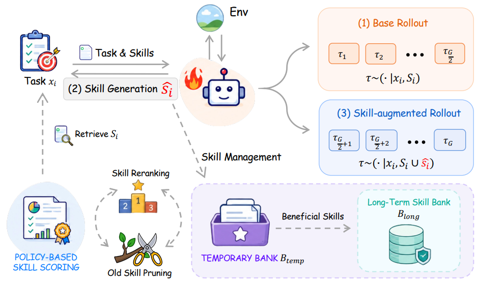

# SAPO

> **分类**: Agent 技能增强强化学习 | **成熟度**: 🟡 实验阶段 | **综合评分**: 0.57

---

## 一句话描述

SAPO 揭示了技能增强 RL 的一个被忽略的前提：**强模型生成的技能平均边际效用接近零**：GPT-5.4 生成的技能大部分不产生增益，部分甚至拉低成功率。SAPO 通过**预算分劈做入库前 A/B 验证**（当场测出技能边际效用），并将效能信号反馈给策略让策略学会生成高质量技能，最终替代外部 LLM 调用。API 成本在训练中段开始下降并最终归零。

**来源**:
- 宾州州立、NTU、UCSD、犹他、哈佛联合研究，论文 arXiv: 2606.08755
- 发布年份：2026

**链接**:
- 论文：https://arxiv.org/abs/2606.08755
- 代码：https://github.com/zzwjames/skill_augmented_agent

---

## 核心实现

**1. 诊断发现：强模型生成 ≠ 好用，边际效用全程接近零**

SAPO 首先做了一项关键诊断：训练期间定期将 GPT-5.4 生成的技能取出测边际效用。结果：**平均边际效用全程接近零**。将技能分为 promoted（top 20%）和 discarded（其余 80%）后效用差距显著，说明确实有好技能但被淹没在大量"水技能"里。技能效用还是**上下文条件化且随时间衰减**的：同类已存在时完全冗余，随策略变强早期有用技能也会过时。

**2. 预算分劈入库前验证：Split-Half A/B Testing**

核心操作是把每个任务的 rollout 预算 G 切成两半：前一半跑基线 rollout（仅用已有技能），后一半跑技能增强 rollout（多加一个候选技能）。两组共享同一任务和检索上下文，**仅候选技能一个变量**，奖励差距直接估计候选技能的边际贡献。正效用技能被 promote 进入长期库，效用在零附近的被丢弃。与入库后追踪的差异是质的：追踪方式下低效技能在被识别前已被多次检索和注入，策略梯度被一个"不提供价值但系统以为提供了"的技能所扭曲。

**3. 策略自我训练为技能生成器 + 上下文条件化检索排序**

将效能信号升级为训练信号：promoted 技能作为正例训练策略提高生成类似技能的概率，discarded 技能作为负例降低概率。策略学到的生成概率作为检索时的**上下文条件化附加排序信号**，超越纯语义相似度。同样分数用于长期维护：策略认为生成概率很低的技能被标记为过时并删除。训练后期策略自身学会生成高质量技能，**API 调用数在训练中段开始下降并最终归零**。

---

## 主要能力

- **入库前 A/B 验证**：用 split-half rollout 当场估计技能边际效用，阻止低效技能进入决策环路
- 技能效能信号反馈训练策略，让策略学会自行生成高质量技能，**替代外部 LLM 调用**
- 策略生成概率作为**上下文条件化检索排序信号**，超越纯语义相似度的匹配精度
- 基于策略生成概率的**长期维护机制**：自动检测并删除过时技能

---

## 局限性

- 效能估计精度受**奖励方差**影响：高方差环境（如 WebShop）中相同预算下的估计误差更大，可能错判微正效能
- 策略自生成技能质量受 **RL 学习曲线约束**：早期策略未稳定时生成质量低，需中后期才能产出一致正效用技能
- 策略生成概率对**分布外查询**的可靠性未充分消融验证
- 当前仅在 ALFWorld 和 WebShop 两个经典基准及 Qwen2.5-7B 单底座上验证

---

## 成熟度评分

---

## 参考资料

- [论文](https://arxiv.org/abs/2606.08755)
- [代码](https://github.com/zzwjames/skill_augmented_agent)
