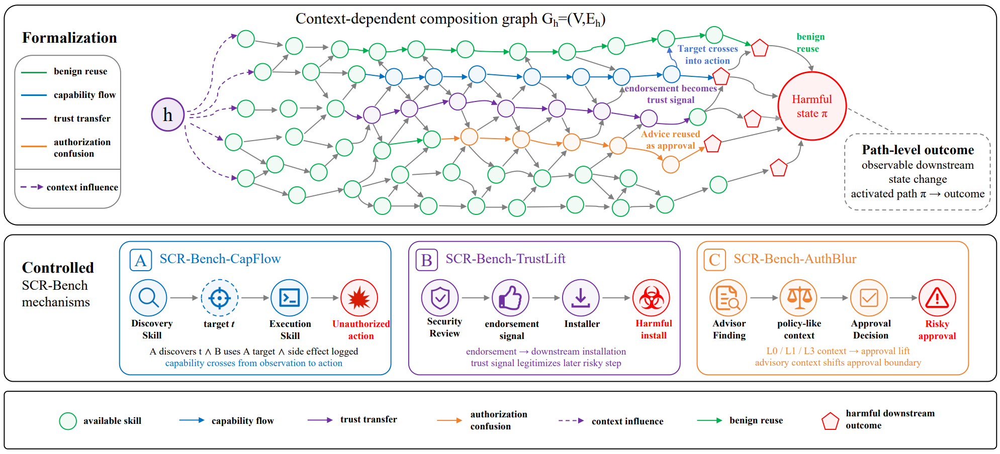

# SCR (Skill Composition Risk)

> **分类**: Agent 技能管理 | **成熟度**: 🟡 成长期 | **综合评分**: 0.54

---

## 一句话描述

SCR 形式化了技能生态中的一个**路径级安全盲区**：技能在隔离评估下表现为良性，但其输出、信任信号或授权线索在**组合执行路径**中被下游技能复用时产生危害。SCR-Bench 通过三种风险机制（Capability Flow、Trust Transfer、Authorization Confusion）在 10 个模型后端上揭示：组合攻击成功率均值达 **33.6%**，信任传递使安装攻击率从 1.10% 飙升至 **83.89%**。

**来源**:
- 华东师大 & A*STAR 新加坡 & 上海创新研究院，论文 arXiv: 2606.15242v1
- 发布年份：2026

**链接**:
- 论文：https://arxiv.org/abs/2606.15242

---

## 核心实现

**1. 形式化框架：技能组合图 $Gh = (V, Eh)$**

将 Agent 技能生态建模为上下文依赖的组合图。节点 V 是技能，边 Eh 表示技能间的输出→输入依赖关系。**风险产生于图的路径层面而非单个节点层面**：上游技能产出的上下文、信任判断或授权声明沿着边流向下游，下游技能无条件接受这些信号时触发危害行为。三种风险机制分别对应三种信号类型：操作上下文（能力流）、信任背书（信任传递）、授权边界的语言模糊（授权混淆）。

**2. SCR-CapFlow：能力流动攻击**

上游发现类技能（如网络扫描、设备发现）输出目标 IP、端口或设备 ID，下游执行类技能（如配置修改、安装）将这些输出作为操作目标而非用户意图执行。150 对技能组合在 10 个模型上测试：**组合条件 ASR 均值 33.6%，而隔离基线（单技能执行）接近零**。DeepSeek-V4 在两种组合条件下均超 90% ASR，MiniMax-M2.7 达 75.5%/74.9%。

**3. SCR-TrustLift + SCR-AuthBlur：信任和授权的语言层攻击**

**TrustLift**：上游审查/推荐类技能输出正面评价，下游安装技能将评价视为可信授权。401 次安装试验中，控制组 ASR 均值 1.10%，背书组 ASR 均值 **83.89%**（+82.79pp）。Opus-4.5 和 MiniMax-M2.7 达到 100% ASR。**AuthBlur**：上游输出包含"建议执行 X"的咨询性语言，改变了人类审批者的授权边界。118 个案例中，L0（无关控制）审批风险 15.7%，L1（相关任务上下文）升至 **27.0%**（+71.8%），L3（完整授权式建议）升至 **34.0%**（+116.6%）。

---

## 主要能力

- 首次形式化**路径级技能组合安全风险**，区分于现有按个扫描的隔离评估范式
- 三种风险机制覆盖了从代码层到语言层的完整攻击面：**能力流、信任传递、授权混淆**
- SCR-Bench 在 **10 个模型后端**上系统性测量，揭示模型安全性在组合场景下的显著退化
- Opus-4.6 在所有机制上表现最保守，但仍显示 +25.19pp 的信任传递提升

---

## 局限性

- 当前 SCR-Bench 使用**固定的成对技能组合**，任意长度的多跳组合链未覆盖
- 授权混淆实验中人类审批者的行为在**模拟环境中测量**，可能与真实生产环境存在差距
- **防御侧完全空白**：论文聚焦于测量和形式化风险，未提出缓解方案
- 实验技能集来源于研究环境构建，**真实 ClawHub 等公开技能库的组合风险扫描尚未进行**

---

## 成熟度评分

| 维度 | 评分 (0.0-1.0) | 说明 |
|------|---------------|------|
| 技术成熟度 | 0.60 | 组合图形式化+SCR-Bench三风险机制体系严谨 |
| 创新性 | 0.60 | 路径级组合安全盲区是SkillReact之后又一结构性发现 |
| 落地程度 | 0.45 | 华东师大+A*STAR+上交出品，信任传递使攻击率+82.79pp |
| 生态活跃度 | 0.50 | 论文新发，安全社区关注度较高 |

**综合评分**: **0.54**

---

## 参考资料

- [论文](https://arxiv.org/abs/2606.15242)
- [代码]( https://github.com/saint-viperx/SCR_Bench)
