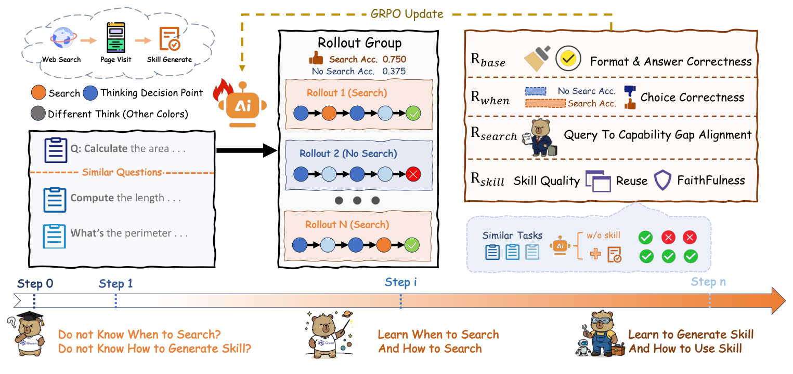

# Search2Skill

> **分类**: Skill生成 | **成熟度**: 🟡 成长期 | **综合评分**: 0.56

---

## 一句话描述

Search2Skill 是一个**搜索驱动的 skill 获取框架**，让 agent 识别能力缺口、外部搜索补证据、蒸馏成持久可复用 skill 以**突破模型知识边界**；核心用 **rubric-based RL 联合优化**"何时搜/怎么搜/怎么蒸馏"三决策，streaming +8.3/+9.3%、held-out +5.1/+6.6%，增益来自 skill 抽象而非原始证据（+4.5%）。

**来源**:
- Search2Skill: Skill Distillation Beyond Knowledge Boundaries Via Rubric-Based Reinforcement Learning（Muyang Ye 等，浙大/阿里/厦大/浙工商）
- 发布年份：2026

**链接**:
- https://arxiv.org/abs/2608.05245
- https://github.com/ATH-MaaS/Marco-DeepResearch（论文标注将发布）

---

## 核心实现

Search2Skill 闭环：能力缺口识别 → 外部搜索 → 证据蒸馏成 skill 写回库。下面按"任务建模—奖励设计—gated 组合"思路展开。

**1. 任务层：把搜索、蒸馏、答题统一成一个动作空间**

agent 配持久 skill 库 M，每步在三个动作里选一：**搜索动作**（web search / page visit）、**skill 生成动作**（把证据蒸馏成结构化 skill 并更新库）、**最终答动作**。相关 skill 在执行前被检索注入 prompt。这把"何时搜、怎么搜、怎么生成 skill"三决策变成同一轨迹里的可学习动作，便于 RL 联合优化。

**2. 奖励层：rubric RL 给三决策各配一个监督信号**

主流 GRPO 只给一个 outcome reward，credit assignment 混乱。Search2Skill 在 base 正确性奖励 $R_{base}$ 之上加三个 rubric 奖励：
- $R_{when}$ 判探索是否必要——**不用固定 bonus**，而在 rollout group 内相对判：只在探索组均值高于直答组 $\Delta>\tau_0$ 时才给探索发质量 bonus，避免无差别探索；
- $R_{search}$ 由 rubric judge 评查询的抽象度（针对可复用原则还是实例细节）和证据增益（是否补上关键不确定点），差查询扣罚 $p_q\in[0,0.3]$；
- $R_{skill}$ 用执行测的 $s_{reuse}$（相似题执行增益）加 judge 评的 $s_{ground}$（是否忠实于证据而非模型自造）。

**3. 组合层：gated 结构让信用分配干净拆开**

三奖励不是简单相加，而是**门控组合**：先由 $R_{when}$ 决定该不该探索（拿到门控信号 $sc(\tau)$），再由查询质量、skill 质量**决定 bonus 大小**。质量 bonus 取 reuse 和 ground 均值再扣查询罚：$q(\tau)=\max(0,\tfrac12(s_{reuse}+s_{ground})-p_q)$。最终奖励 $R=\text{clip}(\lambda_a R_{base}+\lambda_c sc)$，权重 $\lambda=(0.7,0.3)$。相对判 + 门控把三决策的信用分配干净分开。

控制要点：增益来自 skill 抽象而非原始证据（消融 reuse 抽象 skill +6.3% vs 缓存原始证据 +1.8%，**+4.5% 抽象红利**）；skill 跨规模迁移（8B 挖的库给 4B +4.1%、14B +3.5%，都超基线）；held-out 仍涨证明真泛化而非流式投机。

---

## 主要能力

- **突破知识边界**：outward 搜索补 inward 蒸馏够不着的领域知识，14.3% gap 可补
- **联合优化三决策**：rubric RL 把何时搜/怎么搜/怎么蒸馏拆开奖，解决 credit assignment
- **skill 抽象驱动增益**：复用抽象 skill 比缓存原始检索证据高 4.5%，证明增益在抽象非搜索
- **跨规模迁移**：8B 挖的 skill 库给 4B/14B 用都超基线，outward skill 规模无关
- **流式+held-out 双协议**：streaming 测持续积累，held-out 剥流式投机测真泛化，都涨

---

## 局限性

- **法律域弱**：Law 绝对值仍低（45.4），条文需精确引用易幻觉，是当前短板
- **依赖外部搜索质量**：增益受 web 检索证据质量约束，冷门领域检索不到则补不了
- **RL 训练成本**：GRPO+rubric judge 多奖励，训练比单 outcome reward 重
- **代码未开源**：论文标注将发布，复现验证待
- **SFT 冷启动依赖 teacher**：8K 轨迹由 DeepSeek-V3.2/GLM-5 生成，teacher 质量影响起点

---

## 成熟度评分

| 维度 | 评分 (0.0-1.0) | 说明 |
|------|---------------|------|
| 技术成熟度 | 0.58 | rubric RL 三决策联合优化框架清晰，代码标注将发布未开源 |
| 创新性 | 0.74 | rubric RL 联合优化何时搜/怎么搜/怎么蒸馏 + 门控信用分配 |
| 落地程度 | 0.48 | streaming+held-out 多基准验证，增益来自 skill 抽象 +4.5% |
| 生态活跃度 | 0.42 | 单篇论文，代码未开源，Marco-DeepResearch 仓库 |

**综合评分**: 0.56

---

## 参考资料

- [Search2Skill: Skill Distillation Beyond Knowledge Boundaries Via Rubric-Based Reinforcement Learning](https://arxiv.org/abs/2608.05245)
- [Marco-DeepResearch 代码（论文标注将发布）](https://github.com/ATH-MaaS/Marco-DeepResearch)
