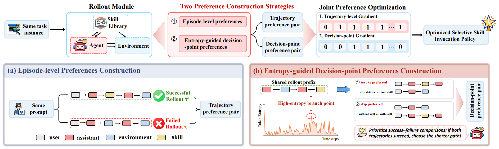

# SelSkill

> **分类**: Agent 技能优化 | **成熟度**: 🟡 成长期 | **综合评分**: 0.53

---

## 一句话描述

SelSkill 将"技能该不该调用"从一个被忽略的隐式默认重新定义为一个**独立的优化目标**：通过**双粒度偏好学习**（轨迹级整体效用 + 决策点级 invoke/skip 因果对比），让 Agent 学会在不确定性低时跳过技能依赖自身推理，在不确定性高时精准调用技能。ALFWorld 成功率提升 **+10.9 个百分点**，选择性调用策略可**跨领域零样本迁移**。

**来源**:
- 美团 & 复旦、上海交大、南大、北大联合研究，论文 arXiv: 2606.00510
- 发布年份：2026

**链接**:
- 论文：https://arxiv.org/abs/2606.00510
- 代码：https://github.com/Meituan-Dianping/SelSkill

---

## 核心实现

**1. 问题诊断：相关不等于必要，轨迹级信号信噪比太低**

反事实分析揭示：启用技能访问仅在约 **14%** 的配对轨迹中提升了最终结果，**78%** 轨迹无明显变化，约 **8%** 轨迹调用技能反而让结果变差。技能价值极度集中，只在特定状态窗口有效。轨迹级成败标签对局部 invoke/skip 决策的归因分辨力不够。

**2. 决策点级偏好：通过预测熵筛选高价值分叉，构造因果对比信号**

记录每个 token 的 log-probability，计算每个技能决策点上的**预测熵**。高熵点表示模型不确定下一步，是最值得做 invoke/skip 对比的岔路口。在选定分叉点同时跑两条路径：一条强制调用技能，一条强制跳过，共享完全相同的前缀轨迹。两条路径的**唯一差异是局部 invoke/skip 决策**，效果差异可干净地因果归因。

**3. 轨迹级偏好 + 局部窗口掩码：双粒度联合 DPO 优化**

轨迹级偏好将成功轨迹与失败轨迹组成偏好对，提供全局行为序列约束。决策点级偏好提供局部 invoke/skip 因果信号。两种偏好合并进同一个 DPO 目标联合优化，并施加**局部窗口掩码**：损失仅在分叉点后 n 个 assistant turn 上计算，不让下游无关环境动态稀释梯度。

---

## 主要能力

- **熵引导的决策点筛选**：用预测熵定位模型不确定的决策点，优先做 invoke/skip 对比，比全量分叉有显著增益
- invoke/skip 因果对比构造：共享前缀的两路径仅在一个决策上不同，干净归因调用因果效应
- **双粒度联合 DPO**：轨迹级管整体效用，决策点级管局部必要性，联合训练同时提升调用质量和频率合理性
- 选择性调用策略**跨领域零样本迁移**：在 ALFWorld 上训练后直接部署到 Tau-bench 和 PopQA 有效

---

## 局限性

- 固定技能库假设：**不涉及技能内容本身**的构建、维护或改进优化
- 实验仅在 Qwen3-4B/8B 上验证，更广泛模型族的泛化性有待确认
- 决策点级偏好构造依赖 rollout 采样和熵计算，**训练数据采集成本**较高
- 当前为单技能决策场景，多技能同时调用的交互效应尚未建模

---

## 成熟度评分

| 维度 | 评分 (0.0-1.0) | 说明 |
|------|---------------|------|
| 技术成熟度 | 0.55 | 双粒度偏好学习方案设计合理 |
| 创新性 | 0.60 | 将技能调用确立为独立优化目标的角度新颖 |
| 落地程度 | 0.45 | 美团+多高校联合出品，ALFWorld +10.9pp |
| 生态活跃度 | 0.50 | 有GitHub开源代码，社区关注度待积累 |

**综合评分**: **0.53**

---

## 参考资料

- [论文](https://arxiv.org/abs/2606.00510)
- [代码](https://github.com/Meituan-Dianping/SelSkill)
