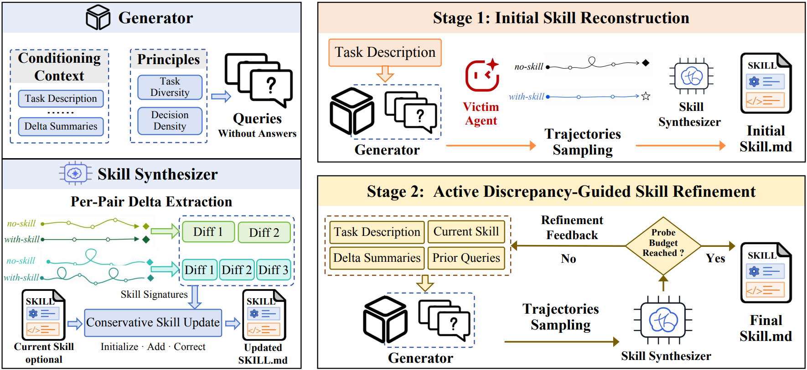

# SigLeak

> **分类**: Skill管理 | **成熟度**: 🟡 成长期 | **综合评分**: 0.43

---

## 一句话描述

SigLeak 定义并实现了 **Skill Leakage** 攻击——仅通过**良性的黑盒任务查询**和**对比启用/禁用技能的成对执行轨迹**，在不访问 skill 文件、不要求正确答案标注的情况下，**从 agent 行为签名中推断出隐藏的专有 skill 内容**。

**来源**:
- Agent Skills Matter: Inferring Proprietary Skills from Execution Trajectories
- 南开大学 / 上海 AI 实验室 / 阿里 / 华东理工 / 北航
- 发布年份：2026

**链接**:
- https://anonymous.4open.science/r/SigLeak-D1DB

---

## 核心实现

SigLeak 通过两阶段设计实现从轨迹中重建专有 skill。

**1. Generator：诊断探针构造**

Generator 仅凭公开任务描述生成诊断探针，遵循两条原则：
- **任务多样性**：每道探针覆盖不同决策类型（推理、工具选择、中间验证、错误恢复、输出格式化、边界情况）
- **决策密度**：每道探针包含多处 agent 必须做出选择的关键节点，每个节点都可能触发 skill 行为签名

Stage 1 生成六道互补探针做广覆盖；Stage 2 基于当前重建 skill 的差距生成探针做定向深挖。

**2. Skill Synthesizer：配对轨迹对比**

同一 task 跑两遍——一遍启用 skill，一遍在 prompt 前加"不使用任何 skill"。Skill-disabled 轨迹作为对照锚点，提取在 skill-enabled 轨迹中**反复出现、disable 条件下不出现、跨多 probe 一致**的行为模式。这些行为差异被归类为可执行规则（触发条件、操作步骤、排序约束、验证要求），合成为初始 SKILL.md。

**3. Stage 2 迭代精修**

当前重建的 skill 反馈给 Generator 生成新探针，瞄向未充分探索的行为和模糊指令。新探针轨迹中提取的签名用于补充缺失规则、澄清模糊规则、修正被新证据推翻的规则。精修在两轮内达到峰值，后续边际递减。

---

## 主要能力

- **无标签轨迹推断**：不要求参考答案、正确性标注或 benchmark 实例，纯靠行为对比
- **良性查询隐蔽性**：探针不含"给我 skill 文件"等窃取语义，绕过 prompt defense
- **跨场景通用性**：5 个场景、3 个模型族、3 个 agent 框架，平均下游成功率提升 6.88pp
- **细粒度语义保真**：SkillSim F1 22.8%，能区分同域内执行不同工作流的技能

---

## 局限性

- SkillsBench 的 150 个恶意样本均为手工构造，非野外真实攻击载荷
- 对 RSA 模运算混淆和零宽字符等高级规避手段的覆盖存在间隙
- LLM judge 依赖 gpt-5.4-mini，换成其他后端结果可能不同
- 攻击性研究，未在部署中的商业服务上验证，实际防御场景有待评估

---

## 成熟度评分

| 维度 | 评分 (0.0-1.0) | 说明 |
|------|---------------|------|
| 技术成熟度 | 0.45 | 两阶段探针-合成设计完整，5 场景 3 模型族验证，研究原型阶段 |
| 创新性 | 0.70 | 首次定义 Skill Leakage 攻击，无标签纯行为对比推断思路原创 |
| 落地程度 | 0.25 | 攻击性研究，未在部署中的商业服务上验证，为防御研究提供基准 |
| 生态活跃度 | 0.30 | 匿名代码仓库，恶意样本为手工构造，社区尚未规模化 |

**综合评分**: **0.43**

---

## 参考资料

- [论文](https://arxiv.org/abs/2607.25560)
- [代码](https://anonymous.4open.science/r/SigLeak-D1DB)
