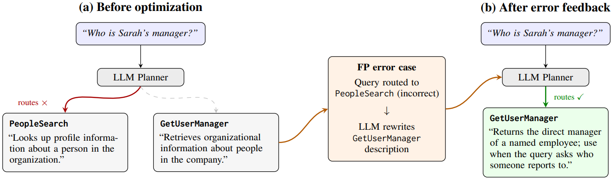

# 技能碰撞描述优化

> **分类**: Skill召回 | **成熟度**: 🟡 研究验证阶段 | **综合评分**: 0.58

---

## 一句话描述

**微软**在生产环境中发现，当 Agent 技能数量膨胀到几十个时，**技能描述的语义重叠**会导致路由决策混乱，即 **Skill Collision（技能碰撞）**。他们提出了一套基于 **LLM 单次重写**的自动化描述优化流水线，将人工调优一个技能所需的 **120 分钟**压缩到 **3.8 分钟**，提速 **32 倍**，而路由 F1 仅比人工基线低 **0.12%**。

**来源**:
- A Single Rewrite Suffices: Empirical Lessons from Production Skill Description Optimization
- 发布年份：2026 年 6 月

**链接**:
- https://arxiv.org/abs/2606.30775v1

---

## 核心实现

将技能描述优化视为一个**基于错误反馈的 LLM 改写任务**，分为两步：

**1. LLM 初始化**
给定技能名称，由 LLM 直接生成候选路由描述，无需复杂 prompt engineering。

**2. 错误反馈精炼**
将初始描述在标注训练查询上做路由评估，收集三类信号：
- **FP（误路由）**：不该路由到此技能的查询被错误路由过来
- **FN（漏路由）**：应该路由到此技能的查询被漏掉
- **TP（正确路由）**：正确路由的查询，用于平衡 prompt 中的正负例

将当前描述、最多 5 个 FP 和 5 个 FN 案例、等量 TP 案例一并喂给 LLM，让其分析路由失败模式并重写描述。论文对比了两种模式：

- **单次重写（Single-Shot）**：将所有 FP/FN 案例一次性输入，LLM 直接产出一版改写描述
- **迭代精炼**：重复评估-反馈-改写循环最多 N 次

**3. 实验数据**
消融实验的关键发现：**三种反馈信号（FP+FN+TP 全集 vs 仅 FP vs 仅 FN）之间的 F1 差距全在 0.1% 以内**；迭代 vs 单次的差距约 0.2%；训练集大小（5/10/20 例）差距不超过 0.5%。**真正驱动优化的是错误反馈信号本身**，而非其形式或轮次。

实操层面给出两个关键诊断指标：
- **iter-0 训练 F1**：低于 **65%** 的技能才是描述优化的主战场，优化增益平均 **+6.27%**；高于 65% 的技能优化空间仅 **+0.63%**
- **训练/验证 F1 差距**：差距大说明是**技能功能范围本身重叠**（真性碰撞），需架构调整而非继续修改描述

---

## 主要能力

- **自动化描述优化**：替代人工逐技能调优，将 120 分钟的工程工作压缩到 3.8 分钟
- **单次重写即达可用水平**：在所有反馈信号中，单次 LLM 重写是性价比最高的选项，迭代收益边际递减
- **区分真假碰撞**：通过 iter-0 训练 F1 和训练/验证 F1 差距两个指标，快速判断问题是措辞层面的还是架构层面的
- **生产环境验证**：在微软企业群聊 Agent（9 技能、372 回归用例）和 ToolBench（约 16000 工具）上完成了系统性消融

---

## 局限性

- **仅针对路由描述优化**，无法解决技能功能范围本身重叠导致的真性碰撞——这类问题需要技能边界重构或架构调整
- **closed-world 与 open-world 路由优化不可混用**：LLM 初始化在 open-world 中有帮助（+1.5-2.1% F1），在 closed-world 中反而有害（-0.8-1.4% F1），两个 regime 需分开处理
- 实验规模有限：生产环境中仅 9 个技能，更大规模技能库下的表现尚待验证

---

## 成熟度评分

| 维度 | 评分 (0.0-1.0) | 说明 |
|------|---------------|------|
| 技术成熟度 | 0.65 | 微软生产环境验证，方法简单可靠，单次重写即可达到可用水平 |
| 创新性 | 0.60 | 将技能碰撞问题形式化为错误反馈驱动的描述重写，思路务实而非颠覆性 |
| 落地程度 | 0.60 | 已在微软企业群聊Agent（9技能）生产环境中实际应用 |
| 生态活跃度 | 0.40 | 论文来自微软团队，未开源工具或代码 |

**综合评分**: 0.58

---

## 参考资料

- [论文](https://arxiv.org/abs/2606.30775v1)
