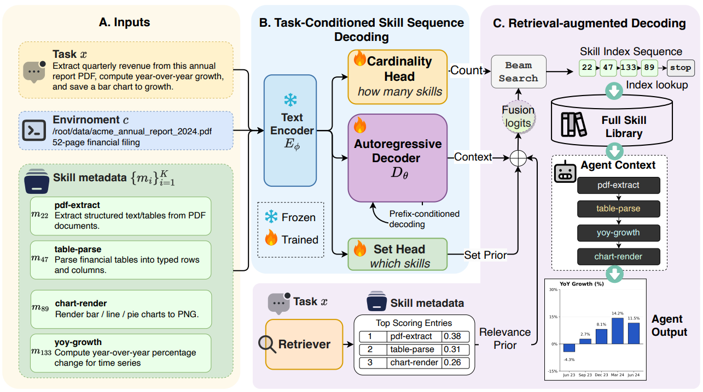

# SkillComposer：生成式技能组合预测

> **分类**: 技能召回 | **成熟度**: 🟡 研究验证阶段 | **综合评分**: 0.59

---

## 一句话描述

**SkillComposer** 是一个仅有约 **390 万可训练参数**的微型模型，将 LLM Agent 的技能组合问题：**选哪些技能、选几个、按什么顺序执行**，统一形式化为**任务条件的变长技能索引序列预测**，通过一次自回归解码同时解决子集选择、数量预测和顺序编排三个子问题，在分布外真实任务上的 Set F1 领先全量微调基线 **+19.3 个百分点**。

**来源**:
- Generative Skill Composition for LLM Agents
- 发布年份：2026 年 7 月

**链接**:
- https://arxiv.org/abs/2606.32025v1
- https://skill-composer.github.io/

---

## 核心实现

将技能组合形式化为序列预测问题。给定任务描述和固定的 **196 技能库**，模型预测变长索引序列 **$(z₁, z₂, ..., zₙ, STOP)$**，STOP 的位置决定技能数量，索引顺序决定执行顺序。

模型由三部分构成：

**1. 冻结编码器 + 轻量自回归解码器**
编码器使用 **Qwen3-Embedding-0.6B**（冻结），将任务+环境+196 个技能的压缩元数据映射为 256 维任务向量。解码器是一个 **3 层、256 维、4 头**的 mini Transformer，输出词汇表为 {1,...,196} ∪ {STOP}，技能间的转移依赖通过自回归自然捕捉。技能元数据的 embedding 通过交叉注意力输入解码器，使其通过自然语言描述区分每个技能。

**2. 两个辅助头：数量头与集合头**
自回归头管顺序，但技能数量（仅靠 STOP token）和相关技能集合（仅靠位置正确的步骤）的信号被稀释。因此额外挂载两个任务条件辅助头：
- **数量头**：线性分类器直接预测技能数量（1-8），提供独立于 STOP 的长度信号
- **集合头**：双 MLP 匹配器对每个技能独立打分，判断是否属于当前任务

训练时三头联合优化；推理时数量头可偏置解码长度，集合头分数作为 logit 融合先验。

**3. 检索增强解码（TF-IDF 优于稠密向量）**
解码时 logit = 上下文 logit（AR 解码器）+ **TF-IDF 检索先验** + 集合成员先验。反直觉的是，**稀疏检索（TF-IDF）比稠密向量高出 +2.5pp Set F1**——196 个短技能名的 token 级重叠区分精度更高。编码用稠密（Qwen3-Embedding），解码偏置用稀疏（TF-IDF），各取所长。

训练数据基于 65 个人工标注任务种子，利用技能依赖图（196 节点、924 条边）和 Gemini 分层合成生成 **9872 条训练记录**。

---

## 主要能力

- **统一序列预测**：将技能子集选择、数量预测、顺序编排三个子问题合并为一次自回归解码
- **分布外泛化**：在完全移除真实任务、仅用合成数据训练的设置下，分布外 Set F1 为 62.9%，领先 SFT 基线（43.6%）+19.3pp
- **极低推理成本**：仅 390 万可训练参数，token 消耗在各方案中最低（**1.03M**），下游任务通过率（45.3%/44.0%）超越所有非 oracle 基线
- **组合结构保真**：技能数量预测准确率显著高于检索式 top-k 方案，单技能任务上优势最大

---

## 局限性

- **封闭技能库假设**：当前设计依赖固定的 196 技能库，技能数量动态变化时需重新训练或适配
- **技能依赖图构建成本**：训练依赖于高质量的技能依赖图和合成数据，在技能元数据不完善的场景下数据构建困难
- **最大技能数量硬限制**：数量头仅预测 1-8 个技能，超过 8 个技能的任务需要修改输出头
- 下游任务评估仅覆盖软件工程领域，在其他 Agent 应用场景（如家务、导航）中的泛化性尚未验证

---

## 成熟度评分

| 维度 | 评分 (0.0-1.0) | 说明 |
|------|---------------|------|
| 技术成熟度 | 0.60 | 架构设计精巧，三头联合优化+检索增强解码，但仅在196技能库上验证 |
| 创新性 | 0.70 | 将技能组合三子问题统一为变长序列预测，TF-IDF优于稠密检索的反直觉发现 |
| 落地程度 | 0.50 | 学术验证阶段，仅覆盖软件工程领域，尚未在实际系统中部署 |
| 生态活跃度 | 0.55 | 开源代码+项目页面，社区关注度中等 |

**综合评分**: 0.59

---

## 参考资料

- [Generative Skill Composition for LLM Agents](https://arxiv.org/abs/2606.32025v1)
- [SkillComposer 项目页面](https://skill-composer.github.io/)
