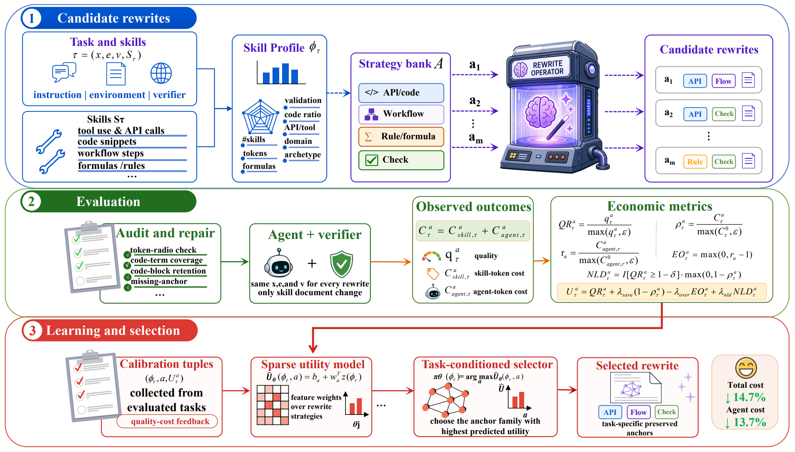

# SkillEE（cost-aware skill rewriting）

> **分类**: Agent 技能优化 | **成熟度**: 🟡 实验阶段 | **综合评分**: 0.55

---

## 一句话描述

SkillEE 把技能重写从**文本压缩**拉回到**成本感知的操作知识保存**。缩短技能可能误删了操作锚点（API 签名、命令行标志、验证阈值、恢复规则），反而**增加下游执行成本**。SkillEE 通过受控框架分析技能结构、按信息保持策略重写，学习到的策略在主要评估中减少**总执行成本 7.0%**、下游 Agent token 成本 **6.0%**，跨模型迁移平均达 **14.7%** 和 **13.7%**。

**来源**:
- 中科大 & 华为技术有限公司，论文 arXiv: 2606.09421v2
- 发布年份：2026

**链接**:
- 论文：https://arxiv.org/abs/2606.09421
- 资源：SkillEE

---

## 核心实现

**1. 问题诊断：技能缩短 ≠ 成本降低，可能适得其反**

实验给了一个反直觉的数据点：**均匀压缩缩短了技能文档，但下游 Agent token 使用量增至 1.14 倍原基线。** 技能的有效性依赖稀疏分布的操作锚点：API 构造器、命令行标志、验证阈值、文件格式约定、恢复规则。删除周围解释可以减少技能自身的 token 成本，但**误删了锚点会引发下游探索、调试、工具重试和恢复操作**，总成本反而更高。技能重写的本质问题不是"怎么更短"，而是"什么东西必须留下"。

**2. 受控评估框架：解耦技能、任务、环境和验证器**

SkillEE 构建了一个**四组件解耦框架**：(1) 技能结构分析器提取锚点类型和分布；(2) 多种信息保持重写策略（API/代码锚定、工作流守卫、规则/公式锚定等）；(3) 固定任务指令和环境保证可复现比较；(4) 独立验证器产出去耦的质量和成本信号。基于 SkillsBench 的实验揭示不同策略对**不同任务族有显著性差异**：实现密集型任务受益于 API/代码锚定，验证密集型任务需要工作流守卫，规则驱动任务依赖公式/阈值锚定。**不存在普适的最优重写模板。**

**3. 策略学习：任务-技能条件化的锚点选择器**

基于诊断发现，SkillEE 训练一个**任务-技能条件化选择器**决定每对 (task, skill) 应用哪种保持策略。该策略在主要 held-out 评估中减少总执行成本 **7.0%**。跨模型迁移实验中，冻结的策略在不同 Agent 栈上部署，减少总成本 **14.7%**、下游 token 成本 **13.7%**，同时验证器质量保持或略微提升。这说明学到的是"任务需要什么锚点"的知识，而非特定模型的行为模式。

---

## 主要能力

- 将技能重写从文本压缩**切换到成本感知的操作知识工程视角**，点出均匀压缩的陷阱
- 定义**经济指标体系**（技能 token 成本、下游 Agent token 成本、总执行成本、执行超支），超越仅关注技能长度的分析
- 多策略对比揭示**不同任务族需要不同的锚定策略**，不存在普适模板
- 任务-技能条件化的选择策略在跨模型迁移中表现**更强**（14.7%/13.7%），表明学到的是一般任务知识

---

## 局限性

- 实验仅在 **SkillsBench** 上验证，更广泛的任务类型和环境范围下的泛化性待确认
- 当前重写策略固定为**预定义的几类模板**，策略空间受限于人工设计的锚定类型
- **跨模型迁移中的泛化增益来源未充分解析**：是锚点选择的泛化还是迁移目标模型恰好兼容
- 成本计算聚焦于 token 层面的直接推理开销，**未包含技能开发和维护的人力成本**

---

## 成熟度评分

---

## 参考资料

- [论文](https://arxiv.org/abs/2606.09421)
- [代码](https://github.com/1Reminding/Skill_EE)
