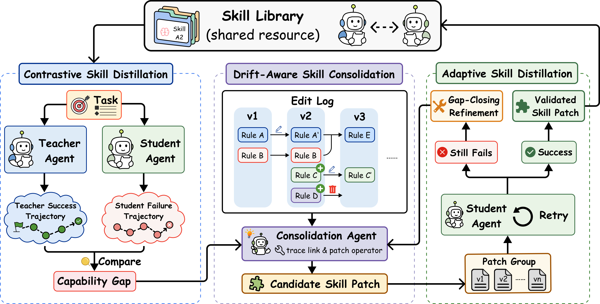

# SKILL-KD

> **分类**: Skill生成 | **成熟度**: 🟡 成长期 | **综合评分**: 0.45

---

## 一句话描述

SKILL-KD 是一个**对比技能蒸馏框架**，将教师和学生 agent 在同一任务上的**行为差距蒸馏为可验证的技能补丁**，通过**自适应学生重跑验证**和**漂移感知技能整合**，在不更新学生参数的情况下将强模型的经验**以可执行知识的形式注入弱模型的 prompt-time 技能库**。

**来源**:
- SKILL-KD: Contrastive Skill Distillation for LLM Agents
- 浙江大学 / 北京大学 / 阿里
- 发布年份：2026

**链接**:
- （开源信息见论文）

---

## 核心实现

SKILL-KD 的核心链路围绕**对比蒸馏 → 自适应验证 → 漂移感知整合**三个环节展开。

**1. 对比技能蒸馏**

学生 agent 在任务上失败后，教师 agent 在同一任务上运行。整合 agent 对比两条轨迹，识别**行为分叉点**，将差距转化为一条候选技能补丁。每条补丁携带四个字段：title（名称）、content（可执行指令）、why（审计理由）、trace（链接到源轨迹）。补丁被写入技能文件供学生下一次尝试使用。

**2. 自适应学生重跑验证**

补丁不是一次生成的。学生带补丁重跑，如果仍失败，新的失败轨迹和补丁一同反馈给整合 agent，**用"为什么上次没成功"的反面证据驱动补丁精修**。这个 revise-test 循环在文本技能空间中做迭代搜索，最多 3 轮。只有学生实际执行成功的补丁才被写入技能库——中间所有未成功的补丁版本全部丢弃。

与 Teacher-only 和 Student-only 变体对比：SKILL-KD 用 **38 条规则、3,010 词** 达到 66.8%，而 Student-only 用了 96 条规则、6,821 词仅达 60.1%。

**3. 漂移感知技能整合**

整合 agent 通过 trace-link 工具维护编辑历史中每条补丁的**原始轨迹链接**。在决定新增、修改、删除还是跳过补丁时，先检索已有技能的源轨迹，识别三种漂移：
- **案例特定漂移**：同一条规则在时间线上被来回修改，边界摆动
- **技能膨胀漂移**：硬编码了单元格坐标的局部修补堆积
- **破坏性更新漂移**：新补丁覆盖了早期补丁编码的算法细节

整合 agent 通过回溯轨迹区分冲突来源，必要时将一条规则拆分为多条独立稳定规则。

**4. 教师失败时的蒸馏**

教师平均只在 46.1% 的失败案例上成功，但教师失败的案例仍贡献了 38.5% 的接受补丁——**教师的局部正确决策即使没带来自我成功，对比学生的失败也能暴露缺失知识。**

---

## 主要能力

- **对比蒸馏**：不总结教师轨迹、不反思学生失败，而是对比两者差距并翻译为学生可执行的技能
- **行为验证而非语义验证**：只有学生实际执行成功才入库，中间失败版本全部丢弃
- **漂移感知整合**：trace-linked 编辑历史 + 原始轨迹回溯，防止技能库退化为互不兼容的修正集合
- **跨能力蒸馏**：同构（Qwen3.5→Qwen3.7）和异构（Qwen3.6→ChatGPT-5.5）蒸馏均有效

---

## 局限性

- 一次只处理一对轨迹，batch distillation 的质量-效率权衡未探索
- 技能库 per-benchmark 构建，跨任务域的迁移能力未评估
- 学生模型冻结是强假设，skill 蒸馏与参数更新协同的更大空间待探索
- 整合 agent 依赖同一位教师模型（蒸馏信号源与整合 agent 共用），可能引入一致性偏差

---

## 成熟度评分

| 维度 | 评分 (0.0-1.0) | 说明 |
|------|---------------|------|
| 技术成熟度 | 0.45 | 对比蒸馏→验证→整合闭环设计完整，已有跨能力蒸馏验证，仍为研究原型阶段 |
| 创新性 | 0.70 | 首次将行为差距蒸馏为可验证技能补丁，漂移感知整合机制原创 |
| 落地程度 | 0.30 | 学术论文成果，依赖特定 benchmark 构建技能库，未在产品中部署 |
| 生态活跃度 | 0.30 | 开源信息见论文，无公开代码仓库，社区尚未形成 |

**综合评分**: **0.45**

---

## 参考资料

- [SKILL-KD论文](https://arxiv.org/abs/2607.28048)
