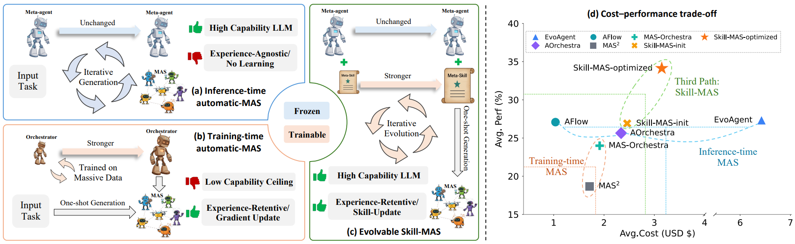
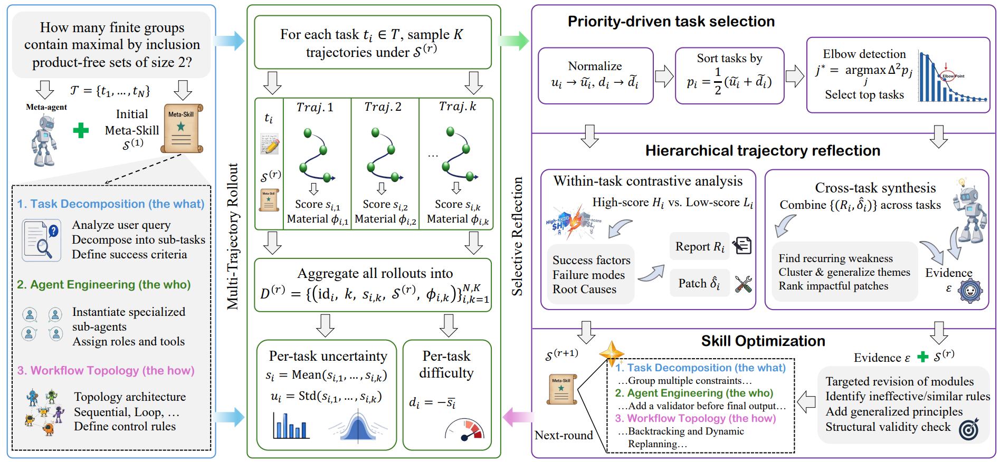

# Skill-MAS：进化式元技能驱动的自动多智能体系统

> **分类**: Skill优化 | **成熟度**: 🟡 成长期 | **综合评分**: 0.55

---

## 一句话描述

将Meta-agent的编排能力抽象为**可进化的Meta-Skill文档**，通过多轨迹采样+选择性反思闭环迭代优化，**不修改模型参数**。解耦了经验保留与参数更新，实现跨模型和跨任务的可迁移编排经验，在四个基准四个LLM上性能与成本均优于现有自动MAS方法。

**来源**:
- 论文：Lin et al., "Skill-MAS: Evolving Meta-Skill for Automatic Multi-Agent Systems"
- 发布年份：2026
- 机构：AntGroup, HKUST(GZ)

**链接**:
- arXiv: 2606.18837v1
- 项目页/代码/演示：见论文首页链接

---

## 核心实现

**1. Meta-Skill三层结构化编排知识**

将Meta-agent的多智能体编排能力编码为一份三层自然语言文档：
- Task Decomposition：规定如何拆解用户查询为原子子任务
- Agent Engineering：规定如何为每个子任务设计专门的子Agent（角色、指令、上下文）
- Workflow Orchestration：规定如何选架构拓扑（顺序/路由/层次/黑板）并定义I/O映射

控制要点：初始版从Anthropic的MAS构建指南提取，自然语言写就，任何LLM都能读。换底层Meta-agent不丢编排经验。

**2. 闭环进化：多轨迹采样+选择性反思**

第一阶段Multi-Trajectory Rollout：对验证集每项任务用当前Meta-Skill独立采样K条轨迹，计算两个分布量——uncertainty（同任务分数标准差，反映指令模糊度）和difficulty（负平均分数）。

第二阶段Selective Reflection：
1. 将两者归一化合成为优先级分数
2. 二阶差分自动检测肘点，只选最易变最困难的顶部子集
3. 先做任务内对比（高低分轨迹找分歧点），再做跨任务综合（提取系统性模式）
4. 输出结构化证据包E

**3. Skill Optimizer文档级更新**

用证据包E驱动LLM更新Meta-Skill。强制约束：修改必须基于反思证据、必须抽象为可泛化原则而非任务特定补丁、严格保持三层模块结构。R轮后选验证集最优S*。推理时Meta-Skill就是一段system prompt前缀，**生成MAS一次性，不迭代搜索**。

---

## 主要能力

- 经验-参数解耦：编排经验存在文档中而非模型权重中，Meta-agent可随时切换（DeepSeek→Qwen→GPT）
- 跨任务跨模型迁移：进化后的Meta-Skill在同任务跨LLM和跨任务同LLM下均保持竞争力
- 成本-性能平衡：卡在高成本推理时方法和低成本训练时方法之间，找到第三条路
- 领域自适应进化：不同基准进化出不同策略（DeepResearchBench加结构约束，BrowseComp-Plus加平行检索，HLE-Math加强制解释登记）
- 完全可解释：diff两份Meta-Skill文档就能看到每条编排原则怎么演化的

---

## 局限性

- 依赖ground-truth标签驱动选择性反思，弱监督/无监督场景下性能退化
- 多任务联合学习消融喜忧参半，缺乏自适应域隔离机制
- 每轮进化需要LLM推理多个步骤，token成本累积
- 实验均使用同家族Qwen系列作Meta-agent，跨家族异构模型组合验证缺位

---

## 成熟度评分

| 维度 | 评分 | 说明 |
|------|------|------|
| 技术成熟度 | 0.55 | 闭环进化多轨迹采样+选择性反思框架完整，四个基准四个LLM验证 |
| 创新性 | 0.80 | Meta-Skill三层结构化、经验-参数解耦、选择性反思+肘点检测是原创范式 |
| 落地程度 | 0.40 | 代码和Demo已公开，但依赖ground-truth标签，弱监督场景退化 |
| 生态活跃度 | 0.45 | GitHub代码+Live Demo，AntGroup背书，但社区规模尚小 |

**综合评分**: 0.55×0.3 + 0.80×0.25 + 0.40×0.25 + 0.45×0.2 = **0.55**（🟡 成长期）

---

## 参考资料

- [论文](https://arxiv.org/abs/2606.18837)
- [项目网站](https://linhh29.github.io/blog/Skill-MAS/index.html)
- [代码](https://github.com/linhh29/Skill_MAS)
- [Gallery & Live Demo](https://skill-mas-demo.hehailin.life/gallery)
