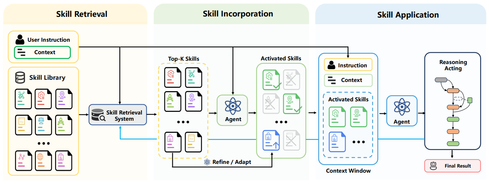

# Skill-RAG (SRA)

> **分类**: Skill 召回 | **成熟度**: 🟡 成长期 | **综合评分**: 0.60

---

## 一句话描述

**SRA（Skill Retrieval Augmentation）** 将技能使用管道拆解为三个独立可诊断的阶段：**检索（有没有找到）、融合（Agent 有没有加载）、应用（加载了有没有真的用上）**。并发布 **SRA-Bench**（5400 测试实例 + 636 手工黄金技能混入 2.6 万干扰技能）分别测量每个阶段的瓶颈位置。核心发现：**当前 Agent 的最大问题不在检索，而在融合 —— 它不知道自己什么时候该加载技能、该加载哪份。**

**来源**:
- 开发者：清华大学 & 字节跳动联合研究
- 发布年份：**2026 年 4 月**

**链接**:
- 论文：Skill Retrieval Augmentation for Agentic AI (2026)

---

## 核心实现

**1. SRA vs RAG：可执行能力检索 vs 陈述性知识检索**

RAG 检索的是陈述性知识（这段文字在说什么），评估标准是语义相似度。SRA 检索的是 **可执行能力**（这个技能能不能被 Agent 加载、理解和实际用于完成任务），评判标准是**下游效用——检索到的技能有没有真的帮 Agent 变强**。技能生态爆炸到百万级时，全量塞入上下文不可能也不该做——SRA 走的是按需检索路线，只在需要时加载相关技能。

**2. 三阶段管道拆解：检索 → 融合 → 应用**

SRA 将技能使用全链路拆为三段：**检索**，从海量外部技能库中找到相关候选技能，测的是 Top-K 里有没有黄金技能；**融合**，Agent 看到候选列表后能不能识别并正确加载真正有用的那几份，测的是 loaded ∩ gold / gold；**应用**，加载了的技能能不能实际在推理和执行中被使用从而提升任务表现，测的是端到端成功率提升）。三个阶段任何一个出问题，整个链路就断了。检索到了但 Agent 没加载 = 没用。加载了但 Agent 不知道怎么用 = 还是没用。

**3. 四个关键实验发现**

- **发现一**：**Agent 根本不知道什么时候该加载技能**，同一模型在"检索结果里有黄金技能"和"检索结果里全是噪音"两种情况下，加载技能的概率几乎完全一样。
- **发现二**：**Agent 加载技能的意愿跟任务是否真需要技能无关**，Agent 自己能做的任务和必须靠外部技能的任务，加载概率差不多，完全缺乏"需求感知"。
- **发现三**：**不同模型加载行为差异巨大但没有一致规律**，更大的模型并不比小模型更理性，"知道何时用技能"这一判断能力与模型规模无单调关系。
- **发现四**：**只要检索对了技能确实能帮到 Agent**，这验证了 SRA 路线正确，当前瓶颈在 Agent 的融合和应用能力跟不上检索的进步。

---

## 主要能力

- **三阶段独立诊断**：将"Agent 用不好技能"的模糊直觉拆解为检索、融合、应用三个可分别测量和定位的瓶颈
- **SRA-Bench 首个技能检索增强评测基准**：5400 测试实例 + 636 手工黄金技能 + 2.6 万网络干扰技能，模拟真实嘈杂技能库场景
- **按需技能检索范式**：替代全量上下文注入，RAG 处理知识检索 + SRA 处理能力检索形成双轮驱动

---

## 局限性

- Agent 缺乏"需求感知"能力，即使检索到正确 Skill 也无法判断是否需要，融合阶段是当前最大瓶颈
- 评测基准仅覆盖有限领域，更多 Agentic 任务类型的泛化性待验证
- 无开源代码仓库

---

## 成熟度评分

| 维度 | 评分 (0.0-1.0) | 说明 |
|------|---------------|------|
| 技术成熟度 | 0.65 | 有论文+SRA-Bench基准+开源代码+HuggingFace数据集 |
| 创新性 | 0.70 | 首次将RAG范式迁移到Skill检索，三阶段管道独立诊断，SRA-Bench首个基准 |
| 落地程度 | 0.50 | 有基准有代码，但学术研究阶段，缺工程化工具链 |
| 生态活跃度 | 0.50 | 清华+字节团队，GitHub+HuggingFace+CSDN解读 |

**综合评分**: 0.60

---

## 参考资料

- [论文](https://arxiv.org/pdf/2604.24594)
- [代码](https://github.com/oneal2000/SR-Agents)
- [官网](https://sr-agents.github.io/)
- [Hugging Face](https://huggingface.co/datasets/WeihangSu/SRA-Bench)
- [CSDN解读](https://blog.csdn.net/qq_73472828/article/details/160699171)
