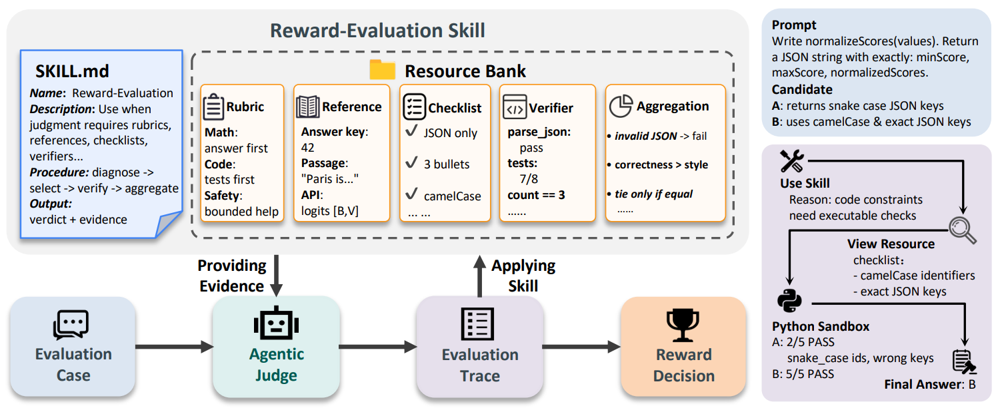

# Skill-RM

> **分类**: Agent 技能评测 | **成熟度**: 🟡 成长期 | **综合评分**: 0.52

---

## 一句话描述

Skill-RM 将奖励建模从**黑盒打分或 prompt 自由发挥**转变为**一套可复用、可审计的评估技能**：不是"给这个回答打几分"，而是"按这个流程、查这些标准、用这些工具、逐条收集证据、最后汇总成有据可查的判决"。每个维度的分数背后都有具体的被调用资源及其结构化证据记录。

**来源**:
- 阿里 Qwen 大模型应用团队、中山大学、港中文、北大、ETH 等，论文 arXiv: 2606.03980
- 发布年份：2026

**链接**:
- 论文：https://arxiv.org/abs/2606.03980
- 代码：https://github.com/Qwen-Applications/Skill-RM

---

## 核心实现

**1. Reward-Evaluation Skill：二元组架构**

核心形式为 **$(M_{RM}, U_{RM})$** 二元组。
- **$M_{RM}$**：技能说明书，显式规定评估涉及的维度、资源调用协议、证据收集格式规范、以及输出契约（最终结构化判决由证据记录集 E 和结论字段 d 组成）。
- **$U_{RM}$**：资源库，将评估所需外部材料组织为五类可加载资源：Rubric & Criterion（评估维度和优先级权重）、Reference（答案标准和官方解法）、Checklist & Constraint（指令遵循逐项检查条件）、Verifier & Tool（可执行确定性工具：Python 沙箱、代码检查器、精确匹配器）、Calibration & Aggregation Rule（证据冲突解决和分数映射规则）。

**2. 四步评估流程：诊断、选取、验证、汇总**

- 诊断阶段分析 (query, response) 对需要激活哪些评估维度：数学题激活参考答案和代码执行验证器，开放式写作只激活 rubric 和格式 checklist。
- 选取阶段从资源库按类型标签和适用范围抽取对应资源加载。
- 验证阶段逐条调用被激活的资源，每个验证步骤产出结构化证据记录 $e_m = (c_m, q_m, s_m)$。
- 汇总阶段将所有维度证据记录按预定义 Aggregation Rule 合成为结论字段 d，再映射为最终奖励分。

---

## 主要能力

- 结构化证据记录让奖励分**可追溯、可审计**：每分背后都可翻出对应的被调用资源和局部判定
- 五类可加载资源在技能控制下**按需调用**，不在当前评估范围的资源不进入上下文
- 评估流程四步标准化：诊断→选取→验证→汇总，执行顺序和冲突解决规则由技能规格显式控制
- 在 best-of-N 选择和 RFT 等下游应用中，Skill-RM 作为训练信号训练出的策略**优于传统 Judge 对照组**

---

## 局限性

- **技能本身需要构建和维护**：资源库包含人工设计的 rubric、checklist 和参考答案，全新评估领域需要对应专业知识
- 证据记录的可审计性**面向开发者**：观测结果的表达形式因资源类型而异，自动转为人类可读审计摘要需额外翻译层
- 多维合成中的**冲突解决规则完备性未穷举测试**：规则边界情况可能在特定实例中被触发但未覆盖

---

## 成熟度评分

| 维度 | 评分 (0.0-1.0) | 说明 |
|------|---------------|------|
| 技术成熟度 | 0.55 | 二元组架构+结构化证据记录的设计较完整 |
| 创新性 | 0.60 | 将奖励建模重新定义为可复用评估技能的思路独特 |
| 落地程度 | 0.40 | 阿里Qwen团队+多高校联合出品，有开源代码 |
| 生态活跃度 | 0.50 | 阿里Qwen团队背书，社区关注度较高 |

**综合评分**: **0.52**

---

## 参考资料

- [论文](https://arxiv.org/abs/2606.03980)
- [代码](https://github.com/Qwen-Applications/Skill-RM)
