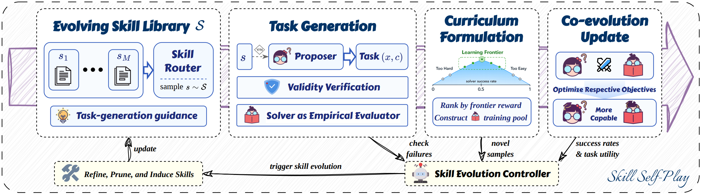

# Skill Self-Play (Skill-SP)

> **分类**: Skill优化 | **成熟度**: 🟡 成长期 | **综合评分**: 0.54

---

## 一句话描述

Skill-SP 是一个**共进化自博弈框架**，通过动态演进的**技能库作为训练时课程构建接口**，在 Proposer-Solver-Controller 三组件协作下解决了自博弈中**任务多样性与验证可靠性之间的矛盾**，让模型在 RL 训练循环中持续生成前沿难度的高质量训练数据。

**来源**:
- Skill Self-Play: Pushing the Frontier of LLM Capability with Co-Evolving Skills
- Qwen 应用团队 / 阿里
- 发布年份：2026

**链接**:
- https://github.com/Qwen-Applications/skill-self-play

---

## 核心实现

Skill-SP 的核心链路围绕 **Proposer 双流生成 → 门控验证 → 前沿课程排序 → 三组件共进化 → 技能库生命周期** 五个环节展开。

**1. 技能作为 Proactive 课程接口**

技能包包含六个要素：路由元数据、程序性规则、生成提示、示例、可执行验证器和历史使用统计。技能不是推理时上下文，而是**训练时驱动 proposer 生成课程的结构先验**。每次生成时从技能库动态采样技能，在技能约束下合成候选任务。

**2. 双流任务生成**

Proposer 同时运行两条流：
- **技能流**：在采样技能的结构约束下生成任务，注入强先验
- **探索流**：无技能约束的自由生成，持续发现新任务模式，防止课程坍缩

**3. 门控验证与前沿排序**

每个候选任务须通过三道检查：全局 schema 合规、技能包内验证器过滤、solver probe 一致性（当前 solver 采样 K 次，多数答案与 proposer 预设一致）。通过的任务按距 solver 能力边界的距离排序——成功率为 **50% 的题最优**，太简单或太难的被过滤。top-M 道题组成当轮训练课程。

**4. Controller 驱动的技能库进化**

Controller 分析每轮生成反馈：
- **精炼**：更新技能统计权重，从失败轨迹中修正技能内容
- **修剪**：移除期望前沿奖励低于阈值的"枯竭"技能
- **诱导**：从探索流中筛选高前沿奖励的新题目，抽象为**新技能包**

**5. 技能路由与共进化**

Proposer 和 Solver 均通过 GRPO 优化。Solver 在前沿课程上训练；Proposer 以门控奖励最大化前沿定向性。每轮进化后三组件同时提升，形成正反馈循环。**技能诱导和精炼仅占总运行时长的 6.5%。**

---

## 主要能力

- **双流课程生成**：技能引导流结构强、对齐前沿；探索流覆盖广、防止模式坍缩
- **门控验证**：三道检查将验证从"事后筛"变为 proposer reward 的前置条件，无效题目直接 -1
- **技能库共进化**：每轮约诱导 20 个新技能包，有效技能数持续增长，过时技能自动修剪
- **极限拉升能力**：Ministral-3-8B 从 20.7 → 63.6 工具调用分（+42.9），ZebraLogic 逻辑推理提升 20 点

---

## 局限性

- 底模需要一定能力基础才能启动有效的技能诱导循环，极弱模型在复杂领域起步困难
- 混合比例 α、能力边界等超参数目前凭经验设定，新任务家族需要重新调参
- 技能库跨模型架构迁移尚未验证，当前只在同模型的自博弈中验证了共进化效果
- 约一天的单轮训练时间（8×A800），大规模多任务联合训练的可扩展性未评估

---

## 成熟度评分

| 维度 | 评分 (0.0-1.0) | 说明 |
|------|---------------|------|
| 技术成熟度 | 0.55 | 双流生成+门控验证+Controller 进化闭环完整，极限拉升验证 |
| 创新性 | 0.75 | 技能库作为训练时课程接口+前沿排序门控，自博弈框架原创 |
| 落地程度 | 0.40 | Qwen 应用团队出品，工具调用 +42.9 分，仍在研究阶段 |
| 生态活跃度 | 0.45 | GitHub 开源仓库 Qwen-Applications/skill-self-play，阿里背书 |

**综合评分**: **0.54**

---

## 参考资料

- [Skill-SP论文](https://arxiv.org/abs/2607.22529)
- [Skill-SP代码](https://github.com/Qwen-Applications/skill-self-play)
