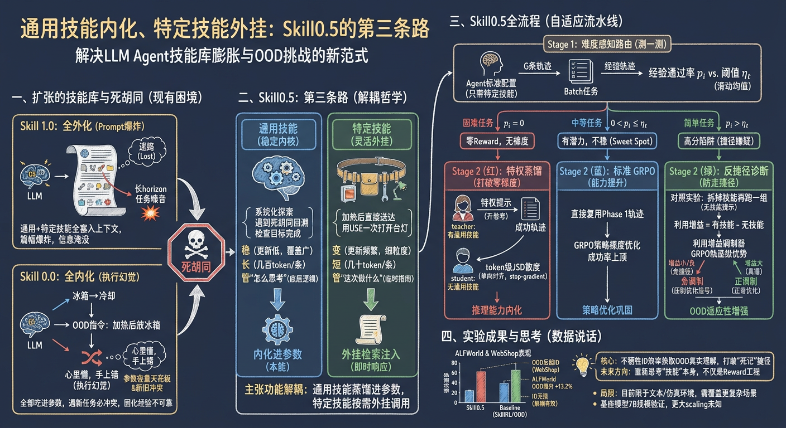
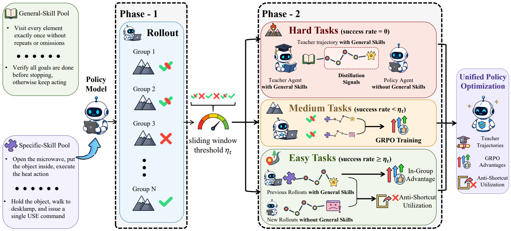

# Skill0.5

> **分类**: Skill 优化 | **成熟度**: 🟡 成长期 | **综合评分**: 0.54

---

## 一句话描述

**Skill0.5** 打破技能训练的"全外化 vs 全内化"两极化困局，提出 **第三条路：通用技能内化进参数打底、任务特定技能外挂灵活调用**。通过难度感知路由、特权蒸馏和反事实捷径诊断三层机制协同运作，在 ALFWorld OOD 任务上超出最强 skill-based 基线 **13.2 个百分点**，WebShop 上 **OOD 反超 ID**。

**来源**:
- 学术论文
- 发布年份：**2026**

**链接**:
- 论文：https://arxiv.org/abs/2605.28424
- 代码：https://github.com/JasonZhujp/Skill0_5

---

## 核心实现

**1. 难度感知路由：按任务困难度分桶，各自走不同优化路径**

每个训练 step，Agent 先用标准配置（仅带任务特定技能）对每个任务跑 G 条轨迹，算出通过率 $p_i$ 后分三桶：**困难任务**（$p_i=0$，全零 reward）、**中等任务**（$ 0 < p_i < \eta_t $）、**简单任务**（$ p_i > \eta_t $）。门槛 $\eta_t$ 是过去 W 个 step 的 batch 级通过率滑动均值，随 Agent 整体水平动态调整。三种损失互斥——一个任务只触发一条优化路径。

**2. 特权蒸馏：打破全零 reward 的梯度死锁**

困难任务全零 reward 导致 GRPO 组内归一化方差为零、优势信号消失、训练卡死。Skill0.5 换思路：给 Agent 额外加上通用技能（特权提示），在"开卷"条件下收集成功轨迹，然后用 **token 级 JSD 散度**让学生策略（无通用技能）模仿教师策略（有通用技能）的每一步推理。教师侧 stop-gradient 不动，学生单向对齐。通用技能被蒸馏进参数不是死记硬背，而是作为**推理能力内化**。

**3. 反事实捷径诊断：防止 Agent 背下 ID 映射、OOD 直接崩盘**

简单任务通过率高不一定是好事——Agent 可能完全没读技能，背下了"任务指令→动作"的直接映射。检测方法：对每个简单任务额外跑一组拆掉技能的轨迹，计算**利用增益 = 有技能通过率 − 无技能通过率**。增益小或为负说明 Agent 在走捷径。利用增益的滑动均值作为动态锚点，低于锚点的任务其 GRPO 优势被负调制分量拉低——在 batch 里被降权，不是因轨迹差，而是因没真正用技能。

---

## 主要能力

- **通用/特定技能解耦训练**：通用技能内化进模型参数（管"怎么思考"），任务特定技能外挂检索注入（管"这次做什么"），打破全外化 prompt 爆炸和全内化新旧技能冲突的死局
- **OOD 泛化突破**：ALFWorld OOD 超 SkillRL 13.2 个百分点，WebShop 上 OOD 反超 ID——这是在逼 Agent 走"读技能→理解→执行"这条更难但更可泛化的路
- **反捷径机制**：通过反事实对照实验检测技能利用增益，防止 Agent 背诵 ID 捷径而在 OOD 崩盘
- **零梯度冷启动解决**：特权蒸馏用教师成功轨迹打破全零 reward 梯度死锁，比靠随机探索硬扛冷启动快得多

---

## 局限性

- 仅在 ALFWorld 和 WebShop 两个文本交互仿真环境上验证，代码生成、多模态、开放网页导航等复杂场景未覆盖
- 技能库需要预先手工定义，自动化技能发现和演进是另一回事
- 基座模型为 7B 规模，更大模型上的扩展行为和双阶段训练在大规模下的稳定性未知

---

## 成熟度评分

| 维度 | 评分 (0.0-1.0) | 说明 |
|------|---------------|------|
| 技术成熟度 | 0.55 | 学术论文阶段，有开源代码，ALFWorld OOD超最强基线13.2个百分点，WebShop OOD反超ID |
| 创新性 | 0.80 | 打破全外化vs全内化困局提出第三条路，难度感知路由+特权蒸馏+反事实捷径诊断三层机制 |
| 落地程度 | 0.40 | 代码已开源，混合模型设计实用性强但需进一步工程化 |
| 生态活跃度 | 0.35 | 单团队研究，社区生态待构建 |

**综合评分**: 0.54

---

## 参考资料

- [Skill0.5 论文](https://arxiv.org/abs/2605.28424)
- [Skill0.5 代码仓库](https://github.com/JasonZhujp/Skill0_5)
