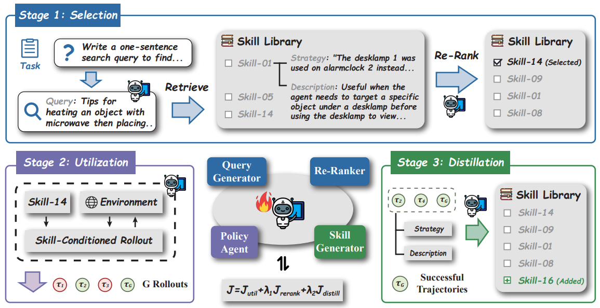

# Skill1

> **分类**: Skill 召回 | **成熟度**: 🟡 成长期 | **综合评分**: 0.51

---

## 一句话描述

**Skill1** 将 Agent 的 **技能选择、技能利用、技能蒸馏** 三个阶段全部并入同一个 RL 策略模型，仅用 **任务结果这一个信号** 驱动三者协同进化。通过将单一奖励按时间尺度拆分为低频趋势（选择信用）和高频变化（蒸馏信用），**不需要额外 reward model、auxiliary loss 或 teacher model**。

**来源**:
- 中科大 & 美团（石耀瑞、陈宇昕 等）
- 发布年份：**2026**

**链接**:
- 论文：https://arxiv.org/pdf/2605.06130
- 代码：https://github.com/AlphaLab-USTC/Skill1

---

## 核心实现

**1. 三阶段统一架构：选择→利用→蒸馏**

Skill1 将技能选择、技能利用、技能蒸馏全部塞入一个策略模型 $\pi_\theta$，按顺序跑三阶段：
1. 先由 $\pi_\theta$ 生成自然语言查询并重排序 Top-K 候选技能、选择工具最优；
2. 再条件化于所选技能与环境交互最多 T 步；
3. 最后从成功轨迹中蒸馏出新技能并写入库。选择过程的查询生成和重排序都可被梯度优化，而非冻结的检索器。

**2. 单信号分拆：低频趋势 vs 高频变化**

系统只有一个二元环境奖励 $r(\tau)$，但三项能力处于不同时间尺度：
- **利用信用**直接用任务结果；
- **选择信用**对每个候选技能维护 EMA 效用分（$\alpha=0.05$），用 NDCG 衡量重排序质量；
- **蒸馏信用**计算 $r(\tau)$ 与当前候选最佳效用 $\hat{U}_i$ 的差值——正差代表新技能有增量价值，负差代表冗余。

三项损失加权求和一次梯度更新。

**3. 技能库淘汰策略**

只有 $r(\tau)=1$ 时新技能才入库。库满时按 $U(s) \cdot \log n(s)$ 分数淘汰末尾——长期高效用且使用频繁的技能保留，低效用且无人问津的淘汰。库上限为 5000 条。

---

## 主要能力

- **统一信号驱动**：选择、利用、蒸馏全部使用同一个任务结果奖励，无需为不同阶段设计不同奖励函数
- **变化驱动蒸馏**：蒸馏奖励为任务结果减去库中最佳已有效用，迫使策略探索库未覆盖的更优策略，防止技能冗余
- **可优化选择**：查询生成和重排序由 $\pi_\theta$ 产生，选择过程本身可被梯度优化，而非依赖冻结检索器
- **多样性保持**：t-SNE 可视化验证高频技能覆盖更广的策略空间且分布均匀，变化驱动蒸馏主动填补未覆盖场景

---

## 局限性

- **环境覆盖窄**：仅在 ALFWorld 和 WebShop 两个纯文本环境上验证，视觉输入和深度搜索等更复杂场景的迁移性未测试
- **库容量瓶颈**：5000 条上限在当前任务上够用，任务种类大幅增加后淘汰策略和层级化组织需要进一步改进
- **计算开销**：比不带技能库的 GRPO 慢 1.3~1.7 倍，主要来自库上下文增长；蒸馏起压缩作用，不开蒸馏时库膨胀速度为 Skill1 的 2.4 倍

---

## 成熟度评分

| 维度 | 评分 (0.0-1.0) | 说明 |
|------|---------------|------|
| 技术成熟度 | 0.50 | 学术论文阶段，中科大+美团联合研究，有开源代码，单任务信号驱动创新性强但验证有限 |
| 创新性 | 0.75 | 首次将选择/利用/蒸馏三阶段并入同一RL策略，低频趋势+高频变化拆解单一奖励，范式创新 |
| 落地程度 | 0.35 | 代码已开源但仅在研究环境中验证，未在生产环境部署 |
| 生态活跃度 | 0.40 | 中科大+美团，单篇论文，社区生态待构建 |

**综合评分**: 0.51

## 参考资料

- [Skill1 论文](https://arxiv.org/pdf/2605.06130)
- [Skill1 代码](https://github.com/AlphaLab-USTC/Skill1)
