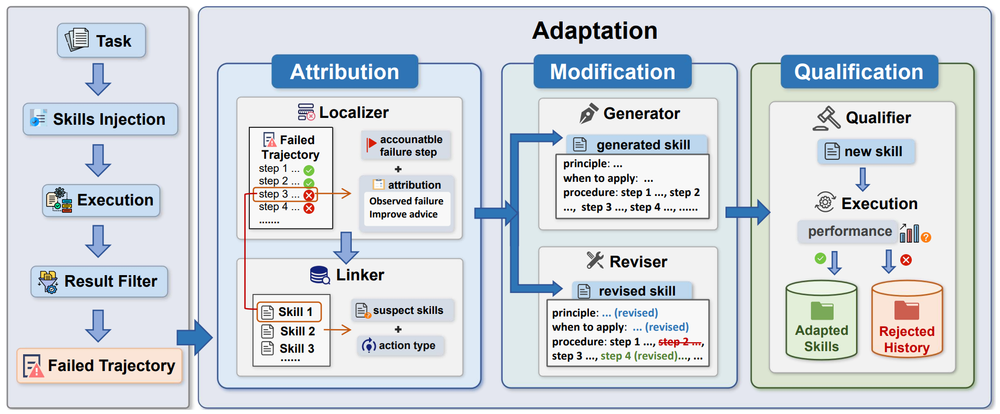

# SkillAdaptor

> **分类**: Agent 技能适应/自我改进 | **成熟度**: 🟡 实验阶段 | **综合评分**: 0.56

---

## 一句话描述

SkillAdaptor 将技能适应的反思单元从**整条轨迹压缩到具体步骤**：通过**归因-修改-审核三步闭环**，定位第一个可操作的故障步骤、将责任精确链接到具体技能、只改该改的那一点，其余全部保持不变。免训练、可插拔接入 Agent 框架，三个基准和三个底座模型上全面覆盖对比基线。

**来源**:
- 浙江大学 & 蚂蚁集团，论文 arXiv: 2606.01311
- 发布年份：2026

**链接**:
- 论文：https://arxiv.org/abs/2606.01311
- 代码：https://github.com/zjunlp/SkillAdaptor

---

## 核心实现

**1. 归因层：从轨迹到具体步骤的技能责任链接**

输入失败轨迹后：
1. **Localizer** 直接预测最早的可操作故障步骤 t*，同时输出故障行为描述和改进建议，不简单找"哪一步报了 error"而是推理最早到哪一步时事情开始偏离正确路径。
2. 随后，**Linker** 将责任分配给候选技能，输出加权嫌疑技能集 ${(s_j, w_j)}$，同时做二元决策 $â$：**REVISE** 表示故障归因于某个技能内容不当、走定向修订；**GENERATE** 表示能力盲区、走新技能合成。

**2. 修改层：只改目标技能，其余不动**

- 若 $â=REVISE$，Modifier 取权重最高的嫌疑技能做定向修改后替换回技能集 K。
- 若 $â=GENERATE$，Modifier 从故障步骤上下文中合成新技能追加到 K，配套**语义去重检测**控制膨胀。

整个过程只动一个技能或新增一个技能，其他技能保持原样。

**3. 审核层：改完必须验证才能入库**

候选更新在正式并入前，系统用旧集合 K 和新集合 K+ 分别重跑任务集比较执行反馈。**仅当 $∆≥0$（新集合不比旧集合差）时候选更新才被接受**，否则丢弃。消融实验中拿掉 Qualifier 后标准差从 ±5.2 跳涨到 ±8.1，审核是稳定性的核心机制。

---

## 主要能力

- **步骤级故障归因**：定位第一个可操作故障步骤，而非对整条轨迹做笼统反思
- 责任精确链接到具体技能，区分 **REVISE（内容不当）vs GENERATE（能力盲区）**
- 定向修改仅动目标技能，其余技能原样不变，改动小、稳定性高
- 资格审核门槛（∆≥0）压住有害更新，是稳定性的核心机制
- 免训练、**可插拔接入** OpenClaw 类 Agent 框架

---

## 局限性

- 效果分布不均：在**数据和代码类任务中收益最大**，研究/记忆/安全类任务中最弱
- 性能上限受限于底座模型内在能力：适应轮次后期瓶颈从技能覆盖转向模型能力天花板
- 归因和链接质量依赖 LLM 判断，长链推理场景下**早期错误可能导致级联归因偏差**
- 目前仅验证 Kimi-K2.5、GLM-5、GPT-5.2 三个底座，更多模型族覆盖待扩展

---

## 成熟度评分

---

## 参考资料

- [论文](https://arxiv.org/abs/2606.01311)
- [代码](https://github.com/zjunlp/SkillAdaptor)
