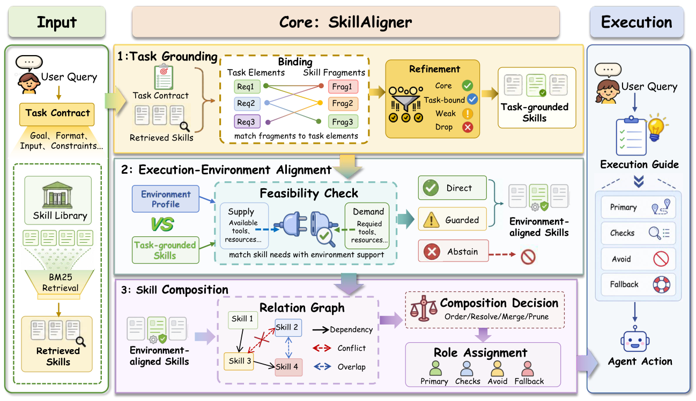

# SkillAligner

> **分类**: Skill执行 | **成熟度**: 🟡 成长期 | **综合评分**: 0.55

---

## 一句话描述

SkillAligner 是**执行时技能适配框架**，把检索到的技能当**可改编草稿**而非成品指令，执行前一次联合适配（任务接地、环境对齐、技能组合），产出含 Primary/Checks/Avoid/Fallback 的固定执行指南，解决技能与任务/环境/技能间三类错配。

**来源**:
- SkillAligner: Treating Retrieved Skills as Adaptable Drafts at Execution Time（Qinfeng Li 等，浙大 OmniAI Group of ZJU ACES Lab）
- 发布年份：2026

**链接**:
- https://arxiv.org/abs/2608.06880

---

## 核心实现

SkillAligner 在检索后、执行前插一步适配：输入查询 q、检索技能集 $S_q$、执行规范 E，一次调用产出执行指南 $H = \text{SkillAligner}(q, S_q, E)$，后续执行只用 H 不再用原始技能。三阶段在同一次调用内完成，不分开调模型、不物化中间结构。

**1. 任务接地：把技能切碎按任务挑保留**

- 把 q 解析成任务契约 $\tau$（目标/硬约束/软偏好/已知输入/期望输出/欠定条件），硬约束覆盖软偏好与技能指令，欠定条件保留为 check 不硬解。
- 每个检索技能分解成原子片段，按 $\tau$ 分类：**core**（通用任务一致）、**task-bound**（直接支撑目标约束）、**weak**（压缩）、**dropped**（无关或冲突硬要求，删）。
- 保留有用片段而不注入整份文档，generic 步骤只在查询支持时绑任务实体。

**2. 环境对齐：对照执行接口修或丢**

- 把接地技能的前置条件对照 E 的工具/动作格式/资源/权限。
- 错配若能做局部保语义修复，用功能等价受支持接口改写；否则不改。
- 每技能分使用模式：**Direct**（受支持或安全修复，直接指导）、**Guarded**（条件有用但运行时才验，留作 check/警告/fallback）、**Abstain**（核心假设与 E 冲突不可修复，丢弃）。

**3. 技能组合：解三类关系产四字段指南**

- 建模三关系：依赖定序、冲突按"硬任务约束 > 执行规范 > 技能指令"优先级解（被拒方案转 Avoid 规则）、冗余合并去重。
- 产出四字段指南：**Primary**（主路线）/ **Checks**（前置与中间需验条件）/ **Avoid**（不支持假设与无效动作）/ **Fallback**（主路被堵替代）。

整个过程破"技能在执行实例已知前定稿"的范式约束；三类错配（技能间/环境/任务）得一起解才顶；四字段显式带失败处理框架是防害根。

---

## 主要能力

- **全设置最优**：9 个 benchmark-骨干组合全第一，平均 58.17，超 SkillPyramid 3.92、超 top-5 原始技能 11.10 个点
- **regression 压到 2.24–3.57**：Qwen3-8B 对比原始技能，ALFWorld/WebShop/SearchQA regression 从 17.91/9.40/10.29 降到 2.24/2.80/3.57，transfer 同时升
- **强模型不消解错配**：Gemini 2.5 Pro regression 11.42% 不比 Qwen3-8B/32B 更抗造，指令跟随强反贴错配技能走
- **成本反降**：适配开销 8.33%，下游执行成本降 46.59%，净省 38.26%
- **三阶段互补**：单阶段彼此相当（52.30/51.56/51.71），完整版 58.17；不同 benchmark 偏不同模块对

---

## 局限性

- **仅一次性查询级对齐**：执行中不观察中间状态、不改指南，运行时才暴露的错配无法当场修
- **依赖执行规范 E 质量**：E 描述不全则环境对齐漏检，Guarded 技能的运行时验证仍靠骨干自行判
- **技能库规模非单调**：最优规模随 benchmark-骨干变（200–2000），需调参
- **未开源**：单篇论文，库构造基于社区仓库（ComposioHQ/awesome-claude-skills、anthropics/skills）但适配本身无代码

---

## 成熟度评分

| 维度 | 评分 (0.0-1.0) | 说明 |
|------|---------------|------|
| 技术成熟度 | 0.56 | 执行时一次联合适配三阶段 + 四字段指南，未开源 |
| 创新性 | 0.74 | 检索技能当可改编草稿 + 任务接地/环境对齐/技能组合 |
| 落地程度 | 0.48 | 9 组合全第一，regression 压到 2.24-3.57 净省 38.26% |
| 生态活跃度 | 0.40 | 单篇论文，未开源 |

**综合评分**: 0.55

---

## 参考资料

- [SkillAligner: Treating Retrieved Skills as Adaptable Drafts at Execution Time](https://arxiv.org/abs/2608.06880)
