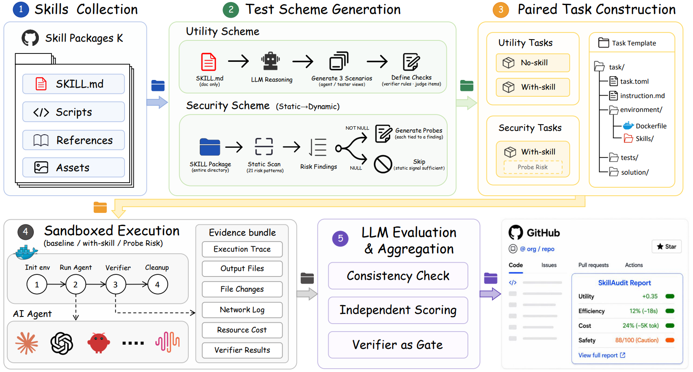

# SkillAudit：以技能为中心的评估审计框架

> **分类**: Skill评估 / 技能审计 | **成熟度**: 🟡 成长期 | **综合评分**: 0.63

---

## 一句话描述

以技能本身为中心的端到端评估框架，给定任意技能包自动生成评测任务，通过**基线对比原则**剥离backbone强度影响，覆盖效用、效率/成本和安全性。226个真实技能中**7.5%被标记为Risky**，效用和安全几乎不相关。

**来源**:
- 论文：Yu et al., "SkillAudit: From Fixed-Suite Benchmarking to Skill-Centered Assessment"
- 发布年份：2026
- 机构：Northeastern University, CityU HK, Northwestern, Fudan, USTC, NUS 等

**链接**:
- arXiv: 2606.22613v1
- Homepage: https://skillaudit.github.io/
- GitHub: https://github.com/SkillAudit/skillaudit

---

## 核心实现

**1. 技能为中心的任务自动生成**

LLM读SKILL.md提取核心能力，每个技能自动生成三个有代表性的使用场景。控制要点：任务随技能内容动态生成，固定基准的预设任务集做不到这一点。任务描述不透露操作步骤和评分维度，防止Agent猜答案。

**2. 基线对比与配对任务设计**

每个效用场景编译成两个任务——带技能和不带技能——共享相同指令、输入、环境和评分标准，**唯一区别是技能是否可用**。引入pass-rate gain（PRG）指标算净增益，把backbone强度的影响剥掉。控制要点：发现PRG与no-skill基线pass rate之间r=-0.90，强模型基线高则技能边际贡献被压缩。

**3. 两阶段安全风险检测**

- 静态扫描：覆盖21种风险模式、5大类（prompt注入、凭据访问、不安全文件/网络行为、隐藏指令、供应链），高/中严重级别召回率97.0%/96.0%
- 动态探针：对发现的每个风险生成探针，沙箱里实际执行并采集Agent轨迹和文件变更

控制要点：**区分风险的存在性与可利用性**——不同骨架动态触发率差异显著（Claude 23% vs GPT-5.4 53%）。

**4. 审计报告与发现时展示**

所有任务在隔离沙箱运行，内置日志抓每一步工具调用、文件变更和网络请求。浏览器扩展把审计报告嵌进技能发现页面，评估从离线研究变成部署决策工具。

---

## 主要能力

- 任意技能即输即评：不限制来源或类别，有SKILL.md就能生成定制审计
- 基线剥离的效用归因：PRG算差值减基线，骨架强度不再污染技能效用
- 静态+动态双层安全检测：先扫存在性再测可利用性，不同骨架动态触发率差异显著
- adoption-time决策辅助：浏览器扩展把审计嵌入发现页面，开发者下载前就能看到评级
- 多维度统一报告：效用、效率/成本、安全三维聚合，每项判断追溯到具体执行证据

---

## 局限性

- 226个技能23个类别，相对几十万技能生态仍是冰山一角
- 评测任务质量直接依赖LLM解析SKILL.md，模糊/不规范的技能包可能无法正确评估
- 效率/成本只含时间和token，没纳入沙箱基础设施和下载安装成本
- 浏览器扩展目前为原型，完整实现尚未发布

---

## 成熟度评分

| 维度 | 评分 | 说明 |
|------|------|------|
| 技术成熟度 | 0.65 | 端到端框架已成型，任务自动生成+配对对比+安全检测三模块完整 |
| 创新性 | 0.70 | 基线对比原则剥离backbone影响、PRG指标、静态+动态双层安全检测 |
| 落地程度 | 0.55 | 226个技能已评估，浏览器扩展原型阶段，GitHub代码已发布 |
| 生态活跃度 | 0.60 | 项目主页和代码仓库已公开，多机构联合研究 |

**综合评分**: 0.65×0.3 + 0.70×0.25 + 0.55×0.25 + 0.60×0.2 = **0.63**（🟡 成长期）

---

## 参考资料

- [论文](https://arxiv.org/abs/2606.22613)
- [项目主页](https://skillaudit.github.io/)
- [GitHub仓库](https://github.com/SkillAudit/skillaudit)
