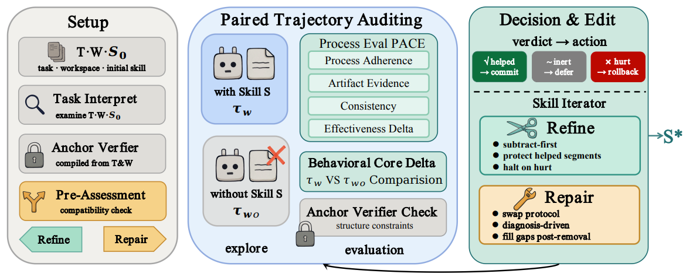

# SKILLAUDIT

> **分类**: Agent 技能优化 | **成熟度**: 🟡 成长期 | **综合评分**: 0.56

---

## 一句话描述

SKILLAUDIT 在**完全无 ground-truth 反馈**的条件下实现技能自进化：没有隐藏测试、没有参考答案、没有环境奖励。它通过**配对轨迹审计（PACE）**：同一任务带技能和不带技能各执行一次，从行为对比中提取编辑信号：配合**锚点验证器**锁定硬约束防漂移。SkillsBench 89 个容器化任务上平均奖励从 40.9% 提升至 **73.9%**（+33.0pp），**92% 的已正常工作技能保持或提升**。

**来源**:
- 中科院计算所 & 阿里通义实验室，论文 arXiv: 2606.14239v1
- 发布年份：2026

**链接**:
- 论文：https://arxiv.org/abs/2606.14239

---

## 核心实现

**1. PACE（过程对齐对比评估）：12 个评估器 × 4 个维度的行为对比**

配对轨迹审计的核心操作：同一任务分别在有技能和无技能条件下各执行一次。PACE 集群包含 12 个评估器，分布在四个维度上：
- **Process Adherence**：技能规定的步骤是否被遵循
- **Artifact Evidence**：产出的文件/数据是否达标
- **Consistency**：行为模式与技能意图是否一致
- **Effectiveness Delta**：带技能比不带技能好了还是差了）。

每个评估器输出锚定到具体技能段落的行动信号和受保护提示（protected hints），确保编辑有据可查。

**2. 锚点验证器 + 双策略路由**

锚点验证器从任务说明中编译一次后锁定（文件存在性、格式合规、可从工作区数据重新计算的值），提供硬结构约束。双策略路由根据技能问题类型分流：
- **Refine 管道**（减法优先）：处理大体有用但含噪声段落的技能，中位数 +19 行、均值 -260 行；
- **Repair 管道**（诊断驱动替换）：处理核心逻辑与任务冲突的技能，中位数 +16 行、均值 -165 行。

**3. 三态裁决：单评估器否决即阻止有害更新**

每条审计输出三种裁决之一：**技能有帮助（commit）、技能有害（rollback）、技能中性（defer）**。任何一个评估器输出"有害"报告即否决该次更新。在 89 个任务的进化中，92% 的已正常工作技能保持或提升，43% 的失败技能被拉回及格线，所有初始技能比无技能更差的 3 个任务全部恢复至奖励 1.0。

---

## 主要能力

- **零 ground-truth 自进化**：不需要隐藏测试、参考答案、oracle 信号或环境奖励
- PACE 配对轨迹审计从行为对比中提取编辑信号，锚定到具体技能段落
- **锚点验证器**提供不参与进化的硬结构约束，防止技能漂移
- 跨 8 个专业领域的 89 个容器化任务验证，整体奖励 +33.0pp

---

## 局限性

- **领域过程类技能（domain-procedure）是可观察性边界**：数学方法类技能达 80.7% 奖励而领域过程类仅 69.2%，77% 卡在奖励 0 的任务带有领域过程标签
- 进化发生在**隔离的 stub 容器**中，无法访问 pytest 验证器或测试内容，但这也意味着生产环境噪声未被模拟
- 锚点验证器的覆盖范围受限于**能从任务说明中确定性编译的约束**，隐式约束未被捕获
- 当前仅在 Claude Opus 4.8 单一底座上验证进化效果

---

## 成熟度评分

| 维度 | 评分 (0.0-1.0) | 说明 |
|------|---------------|------|
| 技术成熟度 | 0.60 | PACE 12评估器四维行为对比+锚点验证器架构完整 |
| 创新性 | 0.65 | 完全无ground-truth反馈条件下自进化，92%已有技能保持或提升 |
| 落地程度 | 0.45 | 中科院计算所+阿里通义出品，SkillsBench +33.0pp |
| 生态活跃度 | 0.50 | 论文新发，有开源代码，社区关注度待积累 |

**综合评分**: **0.56**

---

## 参考资料

- [论文](https://arxiv.org/abs/2606.14239)
