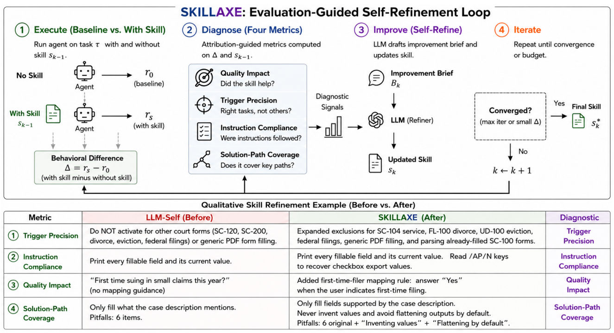

# SKILLAXE

> **分类**: Agent 技能优化 | **成熟度**: 🟡 成长期 | **综合评分**: 0.52

---

## 一句话描述

SKILLAXE 是一个**完全无监督的技能自改进框架**：不需要人工标注、测试套件或环境奖励，仅靠 Agent 带技能与不带技能的两次行为输出，从**质量影响、触发精度、指令合规度+故障归因、解法路径覆盖**四个维度自动诊断技能缺陷并生成改进方案。SkillsBench 上相对提升 **28%**，与人类技能的差距缩小 **47-67%**。

**来源**:
- 微软研究院，论文 arXiv: 2606.10546
- 发布年份：2026

**链接**:
- 论文：https://arxiv.org/abs/2606.10546

---

## 核心实现

**1. 质量影响维度：技能整体是否有正向贡献？**

LLM 裁判同时比对带技能和不带技能的两个输出（顺序随机化），先判断方向（更好/更差）再估计幅度。**轻微退化说明大方向对、局部需修；灾难性退化说明技能可能包含根本性错误的指导**。该维度是外环信号：告诉你"有没有问题"，后面三个维度告诉你"问题在哪"。

**2. 触发精度维度：技能是否在正确的时机激活？**

从技能描述中自动抽取正向触发短语和负向排除短语，通过依赖解析和否定追踪实现。关键在**语境化嵌入**：同一词在不同句式含义完全不同。从正负短语的嵌入分布计算三个几何指标：**覆盖广度**（正向触发是否太窄）、**负向特异性**（排除区域是否与正向清晰分离）、**边界锐度**（最差情况下的正负混淆程度）。

**3. 指令合规度与故障归因维度：是技能写得烂还是 Agent 没照做？**

先从技能文档自动提取可评估规则集，每条带严重程度权重。然后对每条规则同时评四个信号：是否适用当前任务、Agent 遵循得如何、规则本身是否精确可操作、故障该归到技能还是 Agent。**故障归因是核心分叉**：规则为"使用黄色背景（#FFFF00）"而 Agent 用了 #FFF2CC，是 Agent 没照做；规则仅为"使用黄色背景"而 Agent 用了合法黄色，是技能不够精确。同一种行为，归因不同，改进动作完全相反。

**4. 解法路径覆盖维度：技能是否支持多种合法解法？**

LLM 先枚举所有合法解法路径，再计算技能内容与每条路径的嵌入对齐程度。分数低说明技能只支持很窄的行为空间：Agent 若选了一条技能完全未覆盖的合法路径，技能等于不存在。

---

## 主要能力

- 四维度无监督诊断：质量影响（有没有用）、触发精度（时机对不对）、指令合规+故障归因（写得烂还是没照做）、解法覆盖（路径窄不窄）
- **故障归因区分技能缺陷与 Agent 执行偏差**，避免误修正确规则
- 技能库自动积累：SpreadsheetBench 上仅用 **22 个技能**达到 LLM 自写 69 个技能的同等效果，技能数量减少 **68%**
- 无需人工标注、测试套件或环境奖励，仅需任务描述和两次 Agent 输出

---

## 局限性

- 技能内部自洽但策略根本错误的情况**无法检测**，四个维度均假设技能方向基本合理
- 多技能同时激活时的**交互冲突未建模**，当前仅处理单技能场景
- **单轮迭代**设计，多轮迭代的收敛性和退化风险尚未验证
- 诊断质量依赖 LLM 裁判的可靠性，裁判系统性偏差可能传播到改进过程

---

## 成熟度评分

| 维度 | 评分 (0.0-1.0) | 说明 |
|------|---------------|------|
| 技术成熟度 | 0.55 | 四维度自动诊断框架设计完整 |
| 创新性 | 0.60 | 完全无监督的自改进思路绕开了数据标注瓶颈 |
| 落地程度 | 0.40 | 微软研究院出品，SkillsBench相对提升28% |
| 生态活跃度 | 0.50 | 微软研究院背书，社区关注度较高 |

**综合评分**: **0.52**

---

## 参考资料

- [论文](https://arxiv.org/abs/2606.10546)
