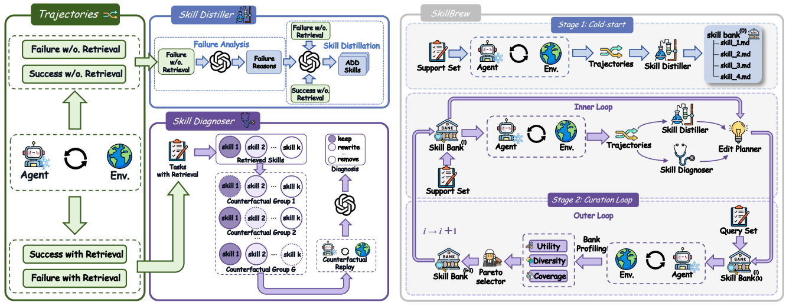

# SkillBrew

> **分类**: Skill 管理 | **成熟度**: 🟡 成长期 | **综合评分**: 0.50

---

## 一句话描述

**SkillBrew** 将技能库管理从"逐份技能的局部决策"升级为 **全库级的全局多目标优化**——在效用（硬约束）、多样性、覆盖率三个互相制约的维度上求帕累托前沿，用 **leave-one-out 反事实评测 + 双层 propose-then-verify** 找出哪些该删、哪些该改、哪些该留。

**来源**:
- 城大、Squirrel AI、中科大、UCSD、Griffith、华师大、上海交大联合研究
- 发布年份：**2026**

**链接**:
- 论文：https://arxiv.org/pdf/2605.29440

---

## 核心实现

**1. 全库级多目标优化形式化**

技能库质量有三个互相制约的维度：
- **效用**：技能有没有帮 Agent 提升表现；
- **多样性**：库里有多少冗余和重复；
- **覆盖率**：技能能不能覆盖各种不同任务）。

三者互相拉扯——加技能扩覆盖通常引入冗余降低多样性；删技能保多样性通常牺牲覆盖。无法糅成一个标量而不引入偏差。SkillBrew 形式化为带约束的多目标优化：最大化三者同时效用不跌破门槛 $\eta$，目标是求帕累托前沿。

**2. Leave-One-Out 反事实信用分配**

要评估单份技能的边际贡献，不靠"检索次数"这种表面指标，而是**把这份技能从库里临时移除，在同一批任务上跑 Agent，看表现变了多少**。变差说明有用、没变说明可有可无、变好说明在帮倒忙。这种反事实评测比检索统计准确得多——被检索不等于被用到，被用到不等于起了正面作用。

**3. 双层 Propose-then-Verify 循环**

- **Propose层**：在 Support Set 上利用轨迹证据提出候选编辑（新增、改写、删除）。
- **Verify 层**：在 Query Set 上跑多目标评估，仅非支配配置进入下一轮。

两层数据分离防止过拟合。采用帕累托感知选择——保留所有互不支配的候选配置，让优化器在"有用 vs 多样 vs 覆盖"的三角张力中自寻平衡，而非人工预设权重强行糅成单标量。

---

## 主要能力

- **全库级多目标优化**：从"单份技能好不好"升级为"库作为一个整体的效用、多样性、覆盖率是否健康"
- **Leave-One-Out 反事实评测**：精确量化每份技能的边际贡献，区分"检索到"和"真正起了作用"
- **帕累托感知技能库管理**：不预设各维度权重，让优化器在三角张力中自动找到平衡点
- **与 SKILLPYRAMID/SkillDAG 互补**：它们解决"技能是什么结构"，SkillBrew 解决"结构里的内容怎么管理"

---

## 局限性

- **反事实评测计算成本高**：Leave-one-out 需要为每份技能跑多次 rollout，大规模技能库下成本随库大小线性增长
- **双层优化的 Support/Query 划分对结果敏感**：数据划分不合适可能导致验证偏差
- **评测环境有限**：论文未详细给出多领域实验数据

---

## 成熟度评分

| 维度 | 评分 (0.0-1.0) | 说明 |
|------|---------------|------|
| 技术成熟度 | 0.45 | 学术论文阶段，多机构联合研究，无开源代码 |
| 创新性 | 0.75 | 首次将技能库管理升级为全局多目标优化，帕累托前沿+leave-one-out反事实评测 |
| 落地程度 | 0.30 | 纯学术研究，无代码/工具发布 |
| 生态活跃度 | 0.45 | 城大+Squirrel AI+中科大+UCSD等七机构联合 |

**综合评分**: 0.50

---

## 参考资料

- [SkillBrew 论文](https://arxiv.org/pdf/2605.29440)
