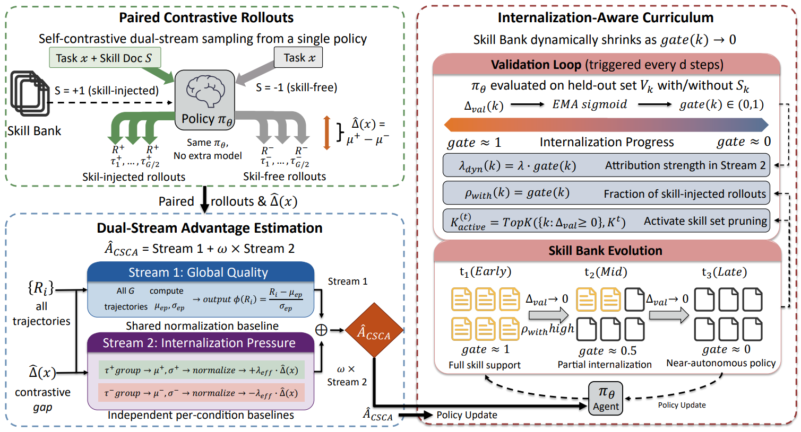

# SKILLC

> **分类**: Skill 优化 | **成熟度**: 🟡 成长期 | **综合评分**: 0.50

---

## 一句话描述

**SKILLC** 将技能内化从"课程控制问题"升级为"**信用分配问题**"——不是简单地决定什么时候撤技能，而是在每次优化中通过**对比技能信用分配（CSCA）**让 Agent 知道"不带技能也能成功"比"靠技能成功"更值得学。在 ALFWorld 上超 SKILL0 5.5 个百分点，推理时 **完全不带技能**。

**来源**:
- 美团
- 发布年份：**2026**

**链接**:
- 论文：https://arxiv.org/pdf/2605.27899

---

## 核心实现

**1. 对比技能信用分配（CSCA）：双流优势估计**

对每个活跃任务类型，同一策略参数同时采样两组 rollout——一组带技能注入、一组不带。标准 GRPO 将所有 rollout 混在一起归一化，导致不带技能但靠自己成功的 rollout 被人为压低优势。CSCA 将优势分解为两个互补流：**全局质量流**保持标准归一化维持稳定性，**对比修正流**基于任务级对比信号 $\hat{\Delta}(x)$ 对不带技能的 rollout 施加**单向向上修正**——独立成功比靠技能成功更值得优化器关注。

**2. 验证驱动的自适应课程**

每隔 d 步在验证集上用"有技能"和"无技能"两种条件各跑一次，测量成功率差异，经 EMA 平滑和 Sigmoid 激活后联合控制三个课程参数：**归属强度**（内化差距越小修正力度越大）、**技能注入比例**（从早期大部分带技能渐进到晚期仅保留少量探针预算）、**活跃技能集**（对比信号持续为零则从活跃集中移除，单调收缩不恢复）。三个参数全由同一验证对比信号驱动，无需人工调参。

**3. 与 RESKILL 和 SKILL0 的定位差异**

SKILL0 用课程门控决定何时撤技能但优化时混在一起归一化——好的课程控制但不是好的优化。RESKILL 在同组内对比新旧技能版本，SKILLC 对比的是有技能 vs 没技能——更进一步：技能不只要一起进化，进化到最后应被策略吸收、内化、可以被扔掉。

---

## 主要能力

- **内化盲区的系统性解决**：通过双流优势估计让梯度"看到"独立成功的价值，填补 SKILL0 的优化盲区
- **无技能推理下超越技能增强方法**：WebShop 上 SKILLC 无技能分数超过 SkillRL 带技能分数
- **自适应课程**：三个课程参数全由验证对比信号自动驱动，无需人工干预
- **信号质量感知**：对比信号弱的简单任务（如 Pick）CSCA 增益不大，信号强的任务（Heat/Cool/Pick2）提升达 +10% 到 +33%

---

## 局限性

- **对比信号质量关键**：在 Pick 子任务上 CSCA 反而退步 11.5%，因为任务本身太简单、对比信号太弱、修正流引入噪声
- **单一环境验证**：评测仅在 ALFWorld 和 WebShop 两个文本环境上，多任务类型场景更适合 CSCA 发挥
- **小模型上的技能理解天花板未深入分析**：4B 模型是否能充分理解"独立成功"这一概念值得进一步验证

---

## 成熟度评分

| 维度 | 评分 (0.0-1.0) | 说明 |
|------|---------------|------|
| 技术成熟度 | 0.50 | 学术论文阶段，美团研究，ALFWorld超SKILL0 5.5个百分点，推理时完全不带技能 |
| 创新性 | 0.75 | 首次将技能内化升级为信用分配问题，CSCA让Agent学到不带技能也能成功的元能力 |
| 落地程度 | 0.35 | 工业研究但无开源代码，仅在ALFWorld上验证 |
| 生态活跃度 | 0.35 | 美团单篇论文，社区生态待构建 |

**综合评分**: 0.50

---

## 参考资料

- [SKILLC 论文](https://arxiv.org/pdf/2605.27899)
