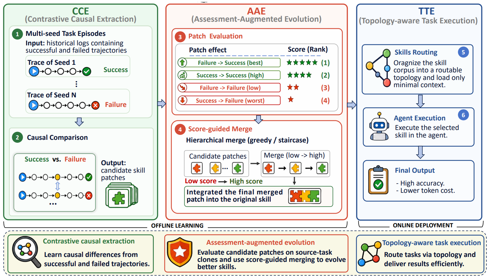

# SkillCAT

> **分类**: Agent 技能优化 | **成熟度**: 🟡 成长期 | **综合评分**: 0.54

---

## 一句话描述

SkillCAT 通过**对比因果提取（CCE）**从多轨迹的分叉点提取技能证据，而非简单摘要全轨迹；通过**评估增强进化（AAE）**将每个候选 patch 作为假设进行回放验证，用校准分数做阈值合并；通过**拓扑感知执行（TTE）**将进化后技能编译为可路由图，**减少 41.6% 上下文**同时保持性能。SpreadsheetBench 上 **55.50% Vrf**（+25.83pp over Trace2Skill），跨模态 DocVQA 上 ANLS **0.9159**（+0.2316）。

**来源**:
- 武汉大学 & 南洋理工大学，论文 arXiv: 2606.13317v1
- 发布年份：2026

**链接**:
- 论文：https://arxiv.org/abs/2606.13317

---

## 核心实现

**1. CCE（对比因果提取）：在成功/失败分叉点提取技能证据**

现有方法从单条轨迹中提取技能容易引入偶然噪声。CCE 对同一任务通过多种子执行采样多条轨迹（最优 5 种子），构建同一任务的成功/失败对比对，提取点在**因果分叉水线（causal watershed）**：即两条轨迹开始出现结果分化的位置。从该点附近的决策差异中提取技能证据，而非概括整条轨迹。消融中去掉 CCE 后性能从 55.50 跌至 32.50。

**2. AAE（评估增强进化）：将 patch 作为可验证假设**

每个候选技能 patch 被视为一个假设，需在源任务克隆上回放验证。校准评分赋予差异化权重：**失败 → 成功=3.0（最佳），成功 → 失败=0.0（最差）**。仅评分 ≥2.0 的 patch 通过阈值进入分层合并。消融中去掉 AAE 后性能跌至 26.00：低于无技能基线，说明未经验证的 patch 合并可能有害。Trace2Skill+Error 变体在 DocVQA 上 ANLS 跌至 0.6223（低于 No-Skill 基线），直接印证了这一风险。

**3. TTE（拓扑感知执行）：编译技能为可路由图以控制上下文膨胀**

进化后的技能库可能比原始技能更庞大。TTE 将技能编译为一个有向拓扑图，用 LLM 图路由器在 top_k=7 的候选节点中选择，达到 **41.6% 上下文缩减**同时性能几乎不降。消融中去掉 TTE 后性能降至 46.50。跨模型验证中，gemma-4-31B-it 使用 SkillCAT 技能达到 61.00% Vrf（+22.00），gpt-5.4-mini 达到 37.00%（+6.00）。

---

## 主要能力

- **CCE 对比因果提取**：在多轨迹分叉点提取技能证据，比单轨迹摘要更干净
- **AAE 回放验证合并**：每个 patch 作为假设在源任务克隆上回放，校准评分做阈值过滤
- **TTE 拓扑感知执行**：技能编译为可路由图，41.6% 上下文缩减，性能保持
- 跨任务（电子表格→WikiTableQuestions OOD +72.53pp）、跨模态（DocVQA ANLS +0.2316）、跨模型全部正向

---

## 局限性

- **多种子执行的采样成本**是 CCE 的固有开销，最优种子数可能随任务复杂度变化
- 当前仅在结构化较强的任务上验证，**开放式对话和创意类任务的效果未知**
- AAE 回放验证依赖 LLM 作为 Judge，**Judge 的标定偏差**可能影响 patch 评分准确性
- TTE 的图路由 top_k=7 是固定参数，**不同技能库规模下的最优 k 值未探索**

---

## 成熟度评分

| 维度 | 评分 (0.0-1.0) | 说明 |
|------|---------------|------|
| 技术成熟度 | 0.60 | CCE+AAE+TTE三组件链式架构设计完整，消融验证三组件均有效 |
| 创新性 | 0.60 | 因果分叉提取+假说回放验证的视角独特，41.6%上下文节省 |
| 落地程度 | 0.45 | 武大+NTU出品，SpreadsheetBench +25.83pp |
| 生态活跃度 | 0.50 | 论文新发，有开源代码，社区关注度待积累 |

**综合评分**: **0.54**

---

## 参考资料

- [论文](https://arxiv.org/abs/2606.13317)
