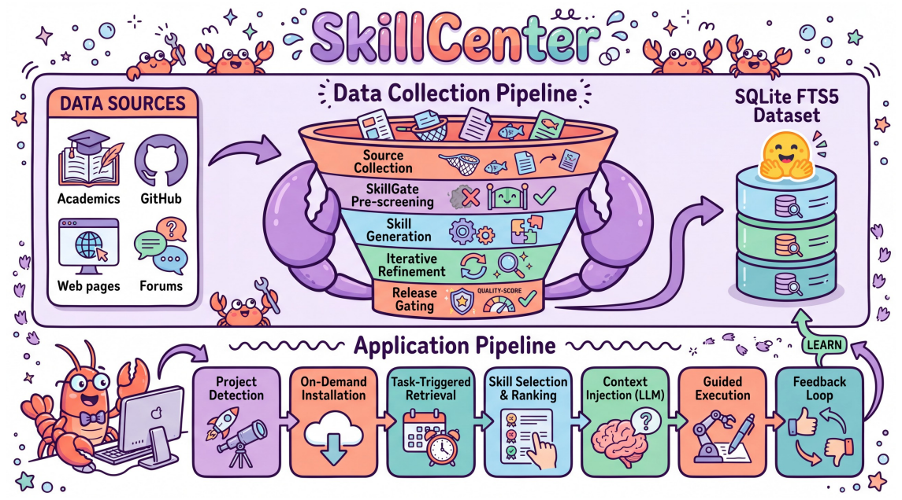

# SkillCenter：大规模技能知识库

> **分类**: Skill 管理 | **成熟度**: 🟢 可用阶段 | **综合评分**: 0.68

---

## 一句话描述

**SkillCenter** 是一个包含 **216,938 条结构化技能、覆盖 24 个领域**的大规模 Agent 技能知识库。由 **SkillGate 流水线**从学术论文、GitHub 仓库、技术网站、Stack Overflow 等来源自动化提取，每条技能可追溯到源文档精确引文位置，通过 **LLM 质量门打分**（平均 **3.91/5**）和**迭代来源校准**确保质量。已开源 SQLite FTS5 格式分发，支持离线关键词搜索。

**来源**:
- SkillCenter: A Large-Scale Source-Grounded Skill Library for Autonomous AI Agents
- 发布年份：2026 年 7 月

**链接**:
- https://arxiv.org/abs/2607.07676v1
- https://github.com/LabRAI/SkillCenter
- https://huggingface.co/datasets/Tommysha/skillcenter-bundles

---

## 核心实现

**1. 技能库规模与领域覆盖**
216,938 条技能分 24 个领域包。其中 **114,565 条由 SkillGate 自动化流水线生产**（学术 90,084 + 技术 24,481），**102,373 条来自社区集成**（GitHub SkillMD 90,984 + ClawHub 市场 11,389）。每条技能包含标题、描述、适用条件、证据引用和质量分数（1-5 分）。所有技能以 **SQLite FTS5** 格式发布，支持离线关键词搜索，`bundle-install --auto` 自动检测项目类型并加载对应领域包。

**2. SkillGate 提取流水线**

1. **多源采集**：PLOS 全部开放获取、XML 格式规范，可自动化解析全文；Nature 系列通过 DOI 拆为 30+ 子刊；GitHub 按领域搜索（最低 star 数 + 最近更新时间），只取 README 和关键代码文件；网页按域名 allowlist 爬；Stack Overflow 按标签和评分过滤。跨域归属不确定时 LLM 分类器决定路由。
2. **SkillGate 质量把关**：每条候选技能进入生成前，GPT-5.2 从**清晰度、准确性、可操作性**三维度打分（1-5），低于阈值的丢弃。DevTools 来源质量分最高（**4.23**），因企业仓库 README 最规范；ArXiv 预印本最低（**3.73**），未经同行评议的内容噪声更大。
3. **模板驱动生成 + 迭代来源校准**：学术论文按四种技能种类拆解（idea_intro、experiment、method、picture），技术源用对应模板。最关键的设计是**迭代来源校准（source-grounding）**，LLM 必须把每条主张映射到源文档的精确引文位置，如果一条主张找不到对应原文则被修改或删除。这个约束大幅压缩了 LLM 编造内容的倾向。
4. **去重**：Jaccard 相似度 0.8 阈值下，仅 **3%** 近似重复跨域出现。同一篇论文的 4 种技能种类之间 Jaccard 远低于 0.8，覆盖不同维度。技能库的大是拆出来的，不是堆出来的。

---

## 主要能力

- **21.7 万条结构化技能**：覆盖 24 个领域，114,565 条自动化生产 + 102,373 条社区集成，规模远超此前最大的公开技能库
- **源头可追溯**：每项技能可追踪至源文档精确引文位置，与无来源标注的 RAG 文档片段有本质区别
- **质量门控 + 迭代校准**：三维度 LLM 质量打分（流水线平均 3.91），source-grounding 约束防止 LLM 编造内容
- **SQLite FTS5 + 按需加载**：24 领域包按需加载，`bundle-install --auto` 自动检测项目类型并加载对应包，无需全量塞入上下文

---

## 局限性

- **质量分是 LLM 自评**：GPT-5.2 给 4 分不代表在真实 Agent 执行中确实有用——质量分是内部 QA 信号，不是外部效果验证
- **仅英文技能**：非英语文献未纳入，多语言操作知识的覆盖缺失
- **社区集成部分跳过了 SkillGate**：GitHub SkillMD 和 ClawHub 的 102,373 条技能跳过了质量把关和来源校准，与流水线技能不在同一质量体系下
- 学术论文拆成多条技能后，跨章节的逻辑关系可能断裂

---

## 成熟度评分

| 维度 | 评分 (0.0-1.0) | 说明 |
|------|---------------|------|
| 技术成熟度 | 0.70 | 21.7万条技能24领域，SQLite FTS5离线分发+bundle-install自动加载，工程成熟 |
| 创新性 | 0.55 | 大规模技能知识库构建方法论，source-grounding迭代校准防LLM编造有价值但非范式突破 |
| 落地程度 | 0.60 | GitHub开源+HuggingFace数据集，114,565条自动化生产，社区集成102,373条 |
| 生态活跃度 | 0.60 | GitHub+HuggingFace双平台分发，24领域按需加载，社区可贡献领域包 |

**综合评分**: 0.62

---

## 参考资料

- [论文](https://arxiv.org/abs/2607.07676v1)
- [代码](https://github.com/LabRAI/SkillCenter)
- [Hugging Face数据集](https://huggingface.co/datasets/Tommysha/skillcenter-bundles)
