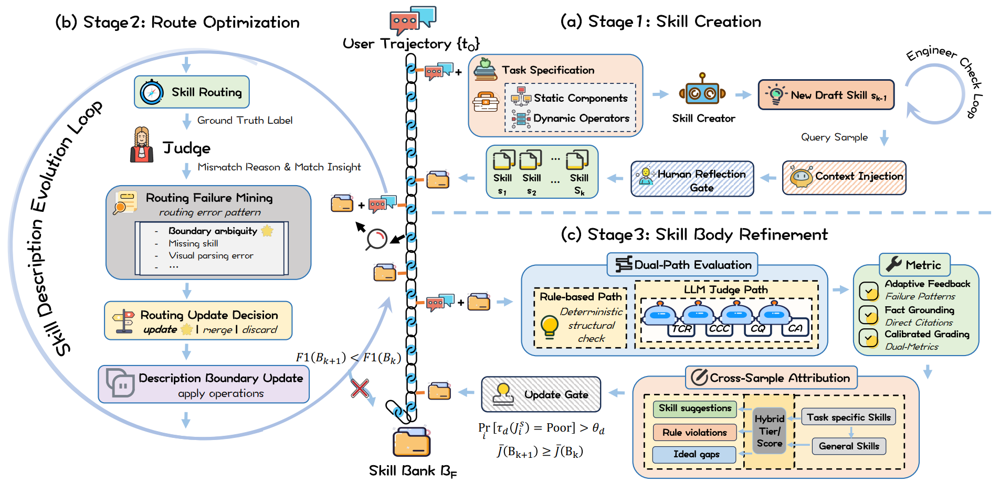

# SkillChain

> **分类**: Agent 技能生成 | **成熟度**: 🟢 成熟期 | **综合评分**: 0.69

---

## 一句话描述

SkillChain 是首个**生产部署的图像电商 AI 助手技能自进化框架**，通过三阶段闭环（Skill Creator→Route Optimizer→Body Refiner）自动化技能生命周期，每个阶段修改技能的解耦组件并提供**单调质量保证**。线上 A/B 实验验证了交互 UV **+1.92pp**、全文阅读率 **+4.98pp**、七日回访率 **+1.15pp** 的显著增益。

**来源**:
- 阿里巴巴集团，论文 arXiv: 2606.12984v1
- 发布年份：2026

**链接**:
- 论文：https://arxiv.org/abs/2606.12984

---

## 核心实现

**1. Stage 1 — Skill Creator：从任务规范和生产轨迹中引导技能**

从任务规范和用户交互轨迹中提取初始技能，每个技能是一个 (Description, Body) 元组：**Description 管路由匹配，Body 管响应质量**。技能创建后经人工反思门控（human reflection gating）过滤低质量产物，确保初始技能库达到生产基线。Description 和 Body 的架构解耦是整个链式设计的基石，后续两个阶段各自修改一个组件，互不干扰。

**2. Stage 2 — Route Optimizer：挖掘路由失败并修复 Description**

线上流量持续变化导致意图到技能的映射退化（C2 路由漂移）。Stage 2 挖掘路由失败案例，对技能 Description 执行三种操作：**Update**（修正单个技能的 Description）、**Merge**（合并路由混淆的技能对）、**Discard**（移除不再匹配流量分布的技能）。路由修复是下游质量优化的前提：如果技能没被正确触发，Body 质量再高也用不上。

**3. Stage 3 — Body Refiner：双路径评估 + 跨样本归因修复 Body**

单条轨迹的 LLM Judge 评分方差太高，直接按单样本修改有过拟合风险。Stage 3 改用**跨样本归因**：先对每个技能的所有生产响应跑双路径评估（规则路径检测结构性违规 + LLM Judge 在 TCR/CCC/CQ/CA 四维度打分），将分数离散化为 Good/Average/Poor 三档，按技能聚合计算各维度的 Poor 比例，仅当超过阈值 θ 时才触发定向修复。更新接受条件为 **$J̄(B_{k+1}) ≥ J̄(B_k)$**，构成单调质量保证。

---

## 主要能力

- **三阶段解耦闭环**：Skill Creator（引导）、Route Optimizer（路由修复）、Body Refiner（质量迭代），各自修改技能的不同组件
- **单调质量保证**：每个阶段仅在接受改进时才更新，确保技能质量不回退
- 跨五个视觉意图类别的**严格递增加成**：S1 62.5→S1+S2 67.2→Full 72.2（NoSkill 基线 59.1）
- 线上 A/B 验证**用户行为指标全面正向**：交互 UV +1.92pp，全文阅读率 +4.98pp，七日回访率 +1.15pp

---

## 局限性

- **基座 MLLM 固定为 Qwen3-VL-235B**，跨模型泛化性未验证，Judge 为 Gemini-3.1-Pro-Preview
- Body Refiner 的收敛需要**足够的生产流量暴露**，内容质量维度的长尾问题收敛慢于结构性维度
- 当前仅在图像电商领域验证，**框架在其他垂直领域的可迁移性待确认**
- 人工反思门控是 **Stage 1 的质量保障但也是吞吐瓶颈**，完全自动化可能引入级联错误

---

## 成熟度评分

| 维度 | 评分 (0.0-1.0) | 说明 |
|------|---------------|------|
| 技术成熟度 | 0.75 | 三阶段闭环+单调质量保证，已在生产环境部署验证 |
| 创新性 | 0.65 | 首个电商AI助手技能自进化框架，线上A/B实验证明效果 |
| 落地程度 | 0.70 | 阿里巴巴集团出品，真实电商场景落地，UV+1.92pp |
| 生态活跃度 | 0.65 | 阿里巴巴背书，业界首个生产级技能自进化案例 |

**综合评分**: **0.69**

---

## 参考资料

- [论文](https://arxiv.org/abs/2606.12984)
