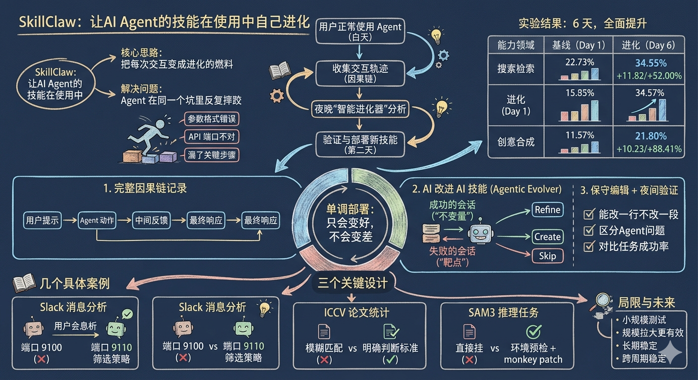
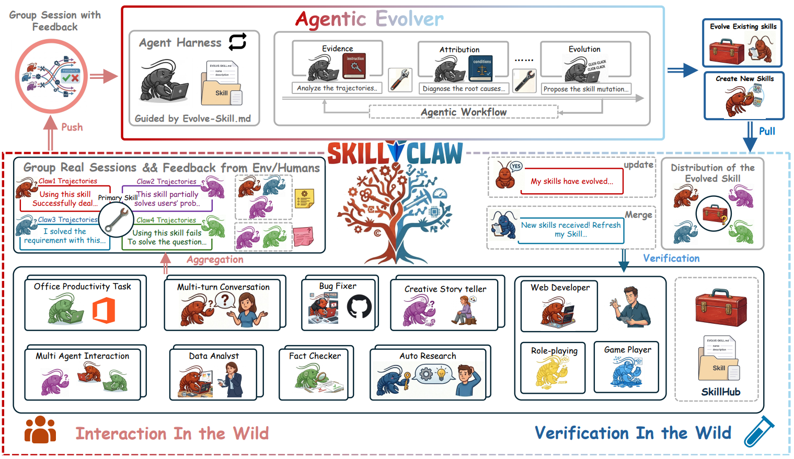

# SkillClaw：让 AI Agent 的技能在使用中自己进化

**一句话描述**：SkillClaw 在多个用户独立部署的 Agent 之间搭了一个**集中的技能进化闭环**——白天自动收集交互轨迹，夜晚用 LLM 驱动的"进化器"分析失败模式并修正技能，验证通过后自动同步给所有用户，在 WildClawBench 上 6 天内实现 Search **+52%**、Creative **+88.41%**、Social **+11.72%**、Safety **+33.33%** 的全面提升。

---

## 核心实现

整个流程分白天和夜晚两个阶段。白天用户正常使用，系统在后台记录完整交互因果链；夜晚进化器分析轨迹、修正技能、跑验证，通过后部署给所有人。技能池只在验证通过的方向移动，不会退化。

**因果链追踪**：不只是记对话内容，而是记录完整的"用户提示 → Agent 动作（含工具调用）→ 中间反馈（工具结果、错误、用户回复）→ Agent 最终响应"链路。大部分技能层面的失败是过程性的——参数格式错了、少了一步校验、调用顺序反了——这些问题不会出现在最终响应里，只有顺着动作-反馈链往回追溯才能定位到具体哪一步出错。

**按技能分组 + G(∅) 挖掘**：每条轨迹按引用了哪些技能分组，没引用任何技能的进 G(∅)。同一个技能被不同用户在不同环境下调用，有的成功有的失败，技能本身就成了可控变量——不需要刻意设计对照实验，跨用户数据自然暴露了技能在什么条件下好使、什么条件下会崩。G(∅) 用于识别反复出现但没被任何技能覆盖的操作模式。

**进化器——AI 进化 AI**：进化器是 LLM Agent，不是手写规则。同时看成功和失败记录——成功定义"不变量"（绝对不能动的已验证有效部分），失败定义"靶点"（需要修正的行为）。三种动作：Refine（根据失败模式修正现有技能）、Create（从 G(∅) 中创建新技能）、Skip（证据不够不动）。保守编辑原则：能改一行不改一段，不动 API 端口/输出路径/payload 格式除非多条会话明确证明信息已变，区分"技能有问题"和"Agent 没好好用技能"。

**夜间验证 + 单调部署**：所有候选更新在真实环境里用同样工具链跑新旧对比，验证成功率。只有确实更好的才部署，第二天所有人自动拿到升级。技能池不会退化。

---

## 主要能力

跨用户技能进化：每个人的踩坑经验自动贡献给整个生态，你踩过的坑后面的人不用再踩。

因果链追踪让过程性失败可定位——不是只知道"任务失败了"，而是知道在哪个具体步骤、因为什么原因失败。

保守编辑 + 单调部署确保技能池只会变好不会变差——验证通过的才合并，被拒的不部署。

进化器同时看成功和失败，实现累积式进化——每次只修正识别出的缺陷，保留已验证有效的不动，避免修一个 bug 搞坏另一个流程。

---

## 局限性

目前只是小规模测试（8 个并发用户、6 天周期），更大规模下的进化稳定性未验证。

多个技能同时进化时的互相冲突问题（技能 A 改了会影响技能 B 的使用场景）没有处理。

技能池越来越大后如何高效组织和检索未涉及。

进化器本身的开销（LLM 推理成本）在论文中未量化分析。

---

## 参考资料

1. [论文](https://arxiv.org/pdf/2604.08377)
2. [代码](https://github.com/AMAP-ML/SkillClaw)
3. [详解](https://zhuanlan.zhihu.com/p/2015436383439847936)
