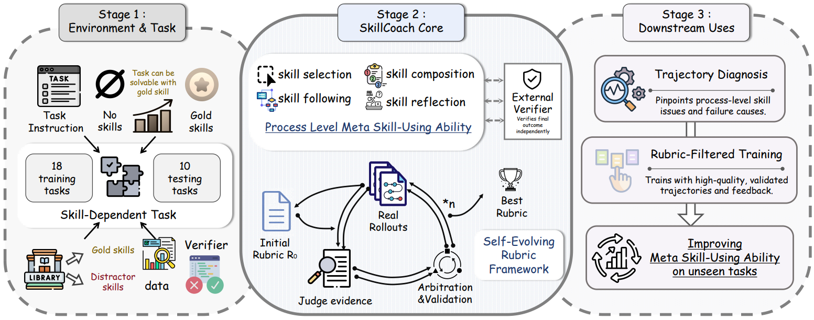

# SkillCoach：自演化技能使用评分表

> **分类**: Skill评测 | **成熟度**: 🟡 研究验证阶段 | **综合评分**: 0.58

---

## 一句话描述

**SkillCoach** 提出了一套**自演化的评分表（rubric）**体系，从过程维度评估 Agent 的技能使用质量，将**"任务做对了"和"技能用对了"**两个概念分离开。评分表从 gold 技能文档**自动生成**，通过真实 rollout 暴露的缺陷驱动**迭代补丁**，经验证集质检把关，最终将轨迹筛选一致性从 **82.00** 提升到 **96.00**、幻觉率降至 **0.00**。用评分表筛选 SFT 数据，模型最终准确率从结果筛选的 **18.0%** 提升到 **32.0%**。

**来源**:
- SkillCoach: Self-Evolving Rubrics for Evaluating and Enhancing Agentic Skill-Use
- 发布年份：2026 年 7 月

**链接**:
- https://arxiv.org/abs/2607.01874v1

---

## 核心实现

SkillCoach 由两个核心机制组成：**四维过程评分体系**和**评分表自演化循环**。

**1. 四维过程评分体系**

评分表将技能使用拆为四个独立于最终验证结果的维度：
- **技能选择**：用集合级 F1 衡量——漏选 gold 技能和选中干扰技能均扣分；无适用技能时 Agent 应主动选择不用
- **技能遵循**：按技能文档规定的关键步骤逐项检查，每步评分 0/0.5/1，必须有轨迹中可观测证据支撑
- **技能组合**：多技能任务时检查执行顺序和中间产物传递；单技能任务不适用
- **技能反思**：提交前 Agent 是否主动做显式检查（验证输出文件、格式、schema 等），与外部验证器独立

外部验证器被刻意独立在外——验证器回答"结果对不对"，四个维度回答"过程对不对"，两者分开才能区分可靠技能使用和偶然成功。

**2. 评分表自演化循环**

评分表从 gold 技能文档自动生成初始版本 R₀，然后在迭代中演化：

- **初始构建**：从 gold 技能文档、任务描述、验证器信息中提取关键步骤，映射到可观测事件，定义各维度评分规则、证据要求和负面案例
- **轨迹评估**：Agent 在带干扰的技能库上跑 rollout，LLM judge 从轨迹中提取可观测证据并按当前评分表逐维度打分，正面评判必须引用证据
- **仲裁补丁**：仲裁模型分析评分表在校准集上的表现，提出局部补丁（加证据要求、补充负面案例、收紧评分条件、增加顺序依赖），但禁止删除关键步骤、绕过验证器或访问验证集
- **验证把关**：补丁候选在验证集上通过硬门禁（如不能把选干扰技能标为正确）和软指标（证据覆盖度、证据质量、与验证器一致性、紧凑度）双重检验，通过才被接受

演化效果显著：gold 关键点覆盖率从 **71.56** 提升到 **83.70**，可用性从 **81.53** 分提升到 **94.33**，幻觉率从 **2.00** 降到 **0.00**。

---

## 主要能力

- **过程-结果分离评估**：将技能使用拆为选择、遵循、组合、反思四个过程维度，独立于最终验证器，暴露"碰巧做对"的伪成功轨迹
- **自演化评分表生成**：无需人工标注，从 gold 技能文档自动生成初始评分表，通过 rollout 驱动迭代优化，幻觉率降至零
- **高质量训练数据筛选**：用 R_best 评分表筛选 SFT 数据优于结果筛选（32.0% vs 18.0%），四个维度中关键步骤遵循的筛选价值最大
- **技能库规模压力测试**：定义了退化边界和崩溃边界，揭示高语义相似度干扰对技能选择的致命影响远大于随机无关干扰

---

## 局限性

- **依赖 gold 技能标注**：初始评分表构建需要 gold 技能文档，在技能元数据缺失或质量差的场景下起点受限
- **评分表演化需要多次 rollout**：每轮演化消耗真实环境交互预算，在大规模技能库上扩展成本较高
- **多技能组合维度的自动化程度有限**：技能组合的中间产物传递检查依赖显式定义的接口，隐式数据依赖难以自动识别
- 实验仅在 SkillsBench 的软件工程任务上验证，在更多样化的 Agent 任务域中的泛化性待检验

---

## 成熟度评分

| 维度 | 评分 (0.0-1.0) | 说明 |
|------|---------------|------|
| 技术成熟度 | 0.55 | 四维评分体系+自演化循环完整，但依赖 gold 技能标注作为起点 |
| 创新性 | 0.75 | 首次将过程评估与结果验证系统性分离，自演化评分表替代人工标注的范式创新 |
| 落地程度 | 0.50 | 学术验证阶段，仅在 SkillsBench 软件工程任务上验证 |
| 生态活跃度 | 0.50 | arXiv 论文，评分表自演化方法具有通用性，但尚未形成独立社区 |

**综合评分**: 0.58

---

## 参考资料

- [论文](https://arxiv.org/abs/2607.01874v1)
