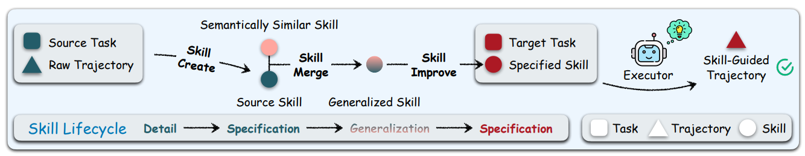

# SkillComposer

> **分类**: Agent 技能生成 | **成熟度**: 🟢 成熟期 | **综合评分**: 0.63

---

## 一句话描述

SkillComposer 将 Agent 技能构建从一个**一次性提取动作**重新定义为由三个可学习操作驱动的**持续进化过程**：**Create** 从轨迹中提取初始技能，**Merge** 通过多视图语义相似度合并重复技能驱动泛化，**Improve** 从新轨迹中注入缺失的边界条件和模式驱动专化：整套流程通过 **Delta Pass Rate 拒绝采样**自动化质控，无需人工标注。

**来源**:
- 浙大 & 通义实验室，论文 arXiv: 2606.06079
- 发布年份：2026

**链接**:
- 论文：https://arxiv.org/abs/2606.06079

---

## 核心实现

**1. Create 操作：从原始轨迹到可复用技能的初次提取**

Agent 在无技能指导下纯靠自身能力跑完任务轨迹作为输入。LLM 审视轨迹，从中抽取**可复用的过程性知识**：先做什么、再做什么、遇到什么情况如何处理。关键约束是区分"这条轨迹特有的偶然操作"和"这类任务通用的有效策略"，只抽出后者。每个技能包含三个不可变组件：**名称（一经确定不可修改）、描述（触发条件和功能概要）、正文（markdown 格式的操作指令）**。

**2. Merge 操作：通过多视图语义识别驱动泛化**

技能库膨胀后，Merge 在名称、描述、正文三个维度上分别计算语义相似度并取均值，超过阈值 δ 的配对触发合并。合并后的技能需覆盖原有技能的全部有效指导，同时去除冗余和矛盾。这是框架中**驱动泛化**的核心机制。

**3. Improve 操作：从新轨迹注入缺失模式驱动专化**

Agent 拿着已有技能执行新任务时，新轨迹会暴露原技能未覆盖的边界条件和错误模式。Improve 审视新轨迹与原技能的差异，找出"轨迹里做到了但技能没写"和"轨迹里犯了错但技能没预警"的部分，精准注入。内置**防退化机制**：若新轨迹没有提供有用改进信号，直接返回原技能。

**4. Delta Pass Rate 拒绝采样：无需标注的自动化质量门**

三种操作的基线各不相同：Create 以"不用技能"为基线，Merge 以"各自原技能"为基线，Improve 以"改进前原技能"为基线。候选技能需在对应任务上的 **pass@1 提升超过阈值**才被保留。约 7000 条高质量样本 SFT 训练 **Qwen3.5-4B** 模型，让技能编排成为一种可跨任务类型迁移的元能力。

---

## 主要能力

- 从原始执行轨迹中**自动提取可复用技能**，区分偶然操作与通用策略
- 通过多视图语义相似度**合并重复技能驱动泛化**，压缩技能库规模
- 从新任务轨迹中**增量注入缺失模式**，驱动专化落地，内置防退化保护
- **三种部署模式**覆盖不同场景：Offline（批量泛化）、Online（零先验迭代）、Hybrid（冷启动+专化）
- 技能编排能力**跨领域、跨任务类型、跨模型规模**可迁移

---

## 局限性

- **拒绝采样训练成本高**：每个候选技能需多次推理计算 delta pass@1，数据收集计算开销大
- 实验仅覆盖 **Qwen 系列模型**，其他模型族的泛化性尚未验证
- Pass@1 作为唯一质量信号可能忽略部分难以在单次执行中暴露的深层问题

---

## 成熟度评分

| 维度 | 评分 (0.0-1.0) | 说明 |
|------|---------------|------|
| 技术成熟度 | 0.65 | 三操作驱动+拒绝采样的架构设计较成熟 |
| 创新性 | 0.65 | Create/Merge/Improve三操作组合创新度高 |
| 落地程度 | 0.55 | 浙大+通义实验室联合出品，代码未开源 |
| 生态活跃度 | 0.65 | 论文新发，社区关注度待观察 |

**综合评分**: **0.63**

---

## 参考资料

- [论文](https://arxiv.org/abs/2606.06079)
