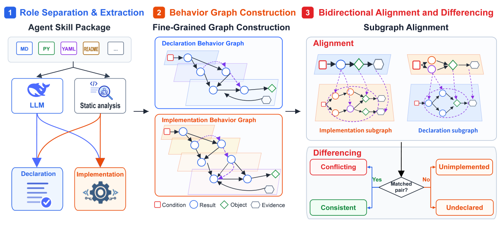

# SkillConsist

> **分类**: Skill评测 | **成熟度**: 🟡 成长期 | **综合评分**: 0.54

---

## 一句话描述

SkillConsist 是**技能声明-实现不一致检测框架**，把不一致形式化成**双向行为图对齐**：声明侧/实现侧各建四节点六边图，双向 Anchor-Expand 子图对齐+四值证明+覆盖证书，检出 Conflict/Unimplemented/Undeclared 三类不一致。

**来源**:
- SkillConsist: Detecting Inconsistencies in Agent Skills via Bidirectional Graph Alignment（Chaofan Meng 等，南开大学 密码学与网络安全学院）
- 发布年份：2026

**链接**:
- https://arxiv.org/abs/2608.07639

---

## 核心实现

不一致三类：**Conflict**（声明要求实现矛盾）、**Unimplemented**（声明要求实现无）、**Undeclared**（实现有声明无）。难点在声明实现粒度天然不同（一句声明对应多步实现）且混在文本/代码里。

**1. 角色分离与记录抽取：按语义判角色不按文本/代码判**

- 按内容边界切文件段保行范围，LLM 把声明/实现事实转四元组记录 $\langle C,O,R,E\rangle$（条件/对象/效果/源位置），双角色段进两组。
- 程序分析（静态前端+受控执行）补实现记录，静态前端提公共入口/调用/输入输出/配置绑定/路径，受控执行补观察输出和副作用。

**2. 行为图构建：每侧四节点六边的有向图**

- 每侧建类型有向图 $G_X=(V_X,A_X)$，四节点（记录/对象/公共入口/证据）六边（入口-记录可达、记录-对象操作、证据-记录支撑、结果-输入、结果-条件、条件-条件约束）。
- 对象名规范化、别名仅同 owner 认，边仅包证据确立时加。
- 沿六关系走兼容 owner/入口/范围成行为组 $\mathcal{B}_X(S)$，对齐前固定。

**3. 双向对齐+四检+四值证明：两方向 Anchor-Expand 子图匹配**

- 两方向对齐（D→M、M→D）。Anchor 取锚点，Expand 沿关系引导扩展候选子图。
- 候选过绑定分数排序剪枝→硬检查（兼容入口/owner/范围）→子图四检（Cond/Input/Result/Path 完备）。
- 四值证明评每绑定字段对：**Supported/Contradicted/Not-Applicable/Unknown**，冲突优先于支持。

**4. 覆盖证书防误报：缺失侧须穷尽证据才闭合**

- 缺失侧须完整覆盖证书 $\Gamma$（查询清单穷尽+证据完整+无部分对应未解）才闭合，否则 Unknown。
- 冲突靠对齐+证明发，缺失靠覆盖证书。去覆盖证书 recall 涨但 precision 崩（预测 858→5792、假阳 278→5039）。

控制要点：粒度差是根双向对齐是解；检索更多证据不建对应（86.5% 假阴已含证据）；覆盖证书是防缺失误报的闸。

---

## 主要能力

- **检测超 baseline 20.43 点**：633 人工审技能，检测 F1 87.93%（P 86.85/R 89.03），两数据集均第一
- **源码级定位**：定位 F1 62.52%，每发现带双侧或缺失侧源位置
- **三组件互补**：角色分离+子图扩展恢复对应，覆盖证书控假阳（去覆盖 precision 崩到 14.90%）
- **恶意技能筛查助力**：风险门控加 MASB，+High recall +11.90% 零冗余，+Med/high +26.19% 仅 3.51% 冗余
- **跨源稳定**：Skill-Inject F1 92.91、ClawHub 86.71，无源特定调参

---

## 局限性

- **定位比检测难**：858 预测仅 580 有效覆盖 257/442，跨工件对应是瓶颈
- **未实现须完整覆盖**：依赖覆盖证书完整性，分析边界不全则 Unknown
- **强 LLM 依赖**：Flash vs Pro 检测 recall 降 15–30 点，记录完整性靠强模型
- **未开源**：单篇论文，633 标注基准与流水线无公开代码

---

## 成熟度评分

| 维度 | 评分 (0.0-1.0) | 说明 |
|------|---------------|------|
| 技术成熟度 | 0.54 | 双向行为图对齐 + 四值证明 + 覆盖证书，未开源 |
| 创新性 | 0.76 | 声明-实现不一致形式化成双向图对齐 + 三类不一致检测 |
| 落地程度 | 0.44 | 633 技能 F1 87.93% 两数据集第一，定位 F1 62.52% |
| 生态活跃度 | 0.38 | 单篇论文，未开源 |

**综合评分**: 0.54

---

## 参考资料

- [SkillConsist: Detecting Inconsistencies in Agent Skills via Bidirectional Graph Alignment](https://arxiv.org/abs/2608.07639)
