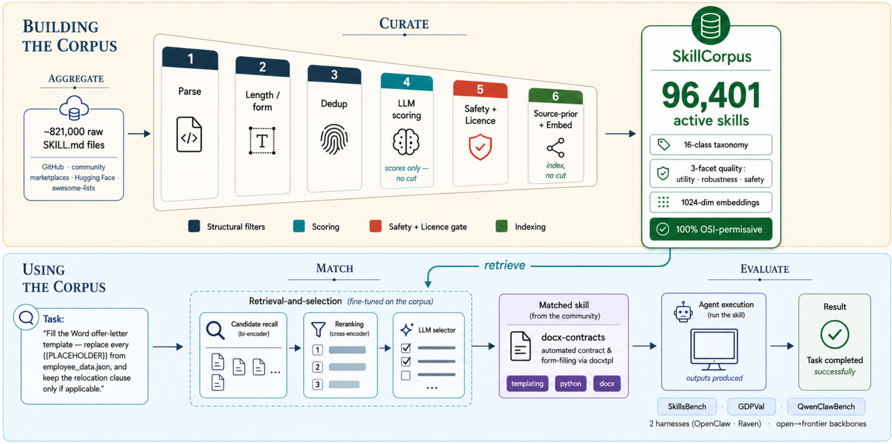

# SkillCorpus

> **分类**: Skill管理 | **成熟度**: 🟡 成长期 | **综合评分**: 0.57

---

## 一句话描述

**SkillCorpus** 将开放的 SKILL.md 生态从 **~82.1 万个原始文件** 经六阶段管道（聚合→去重→三维质量评分→安全闸门→许可过滤→分类）精炼为 **96,401 个商用可分发技能**，配精调检索-选择栈，**首次在三个 Benchmark、两种 Harness、多骨架模型上证明经系统治理的社区技能库能稳定提升 Agent 任务表现**。

**来源**:
- SkillCorpus: Consolidating and Evaluating the Open Skill Ecosystem for Real-World LLM Agents
- 发布年份：2025

**链接**:
- https://arxiv.org/abs/2607.15557

---

## 核心实现

**1. 六阶段管道**

- **聚合**：62 个源头、五种抓取机制覆盖 GitHub 仓库、Awesome 清单、市场 API、站点爬虫和 JSON 目录
- **去重**：精确去重（内容+名称指纹）砍掉 59.7% 副本；语义去重（嵌入相似度 >0.90 标记、>0.995 自动合并、中间区间 LLM 裁定），最终从 28.3 万砍到 10.1 万，净减 64%
- **三维质量评分**：**实用性**（描述的任务范围与触发条件是否清晰）、**鲁棒性**（正文与描述的承诺是否一致）、**安全性**（11 类风险 Flag）。实用与鲁棒性相关（$r=0.59$），安全与两者独立（$r=0.15$ 和 $0.30$）
- **硬闸门**：五类安全 Flag 直接归零排除 + OSI 许可过滤器，最终 96,401 个商用可分发的活跃技能

**2. 检索-选择栈**

召回用 Qwen3-Emb-0.6B 微调嵌入模型，重排用 Qwen3-Rank-0.6B 微调重排序模型，均在严格去重后的活跃集上做对比微调。低重叠的数据分布给对比学习更干净的信号。**LLM 精读层**读取候选技能完整正文，返回 0-2 个精确匹配工具以满足严格 Token 预算。

---

## 主要能力

- 首份覆盖全开放 SKILL.md 生态的聚合、去重、质量把关和许可审计管道
- 96,401 个 OSI 许可技能，任何项目商用可分发
- 三个 Benchmark 上全部正向增益，SkillsBench 平均 +7.5pp
- 开源社区技能中六成是重复的——去重是最关键的治理步骤
- 覆盖度边界和 Harness 边界决定增益天花板

---

## 局限性

- 语料库为 2026 Q2 快照，社区持续演变，需周期性重跑管道
- 质量评分和分类依赖单一 LLM 裁判，未经人工金标验证
- 技能以英文为主，非英文技能覆盖有限
- 三维评分框架的内部一致性已验证，但构造效度需要独立的人类标注研究

---

## 成熟度评分

| 维度 | 评分 (0.0-1.0) | 说明 |
|------|---------------|------|
| 技术成熟度 | 0.60 | 六阶段管道+精调检索选择栈完整，从82.1万精炼为9.6万商用技能，已成型可用 |
| 创新性 | 0.80 | 首份覆盖全开放 SKILL.md 生态的聚合治理管道，三Benchmark证明社区技能可稳定增益 |
| 落地程度 | 0.40 | 语料可分发，三Benchmark全部正向，但无生产部署，质量评分依赖单一LLM裁判 |
| 生态活跃度 | 0.45 | 论文发布，9.6万OSI许可技能可商用分发，社区关注度有限 |

**综合评分**: **0.57**（0.60×0.30 + 0.80×0.25 + 0.40×0.25 + 0.45×0.20）

---

## 参考资料

- [论文](https://arxiv.org/abs/2607.15557)
