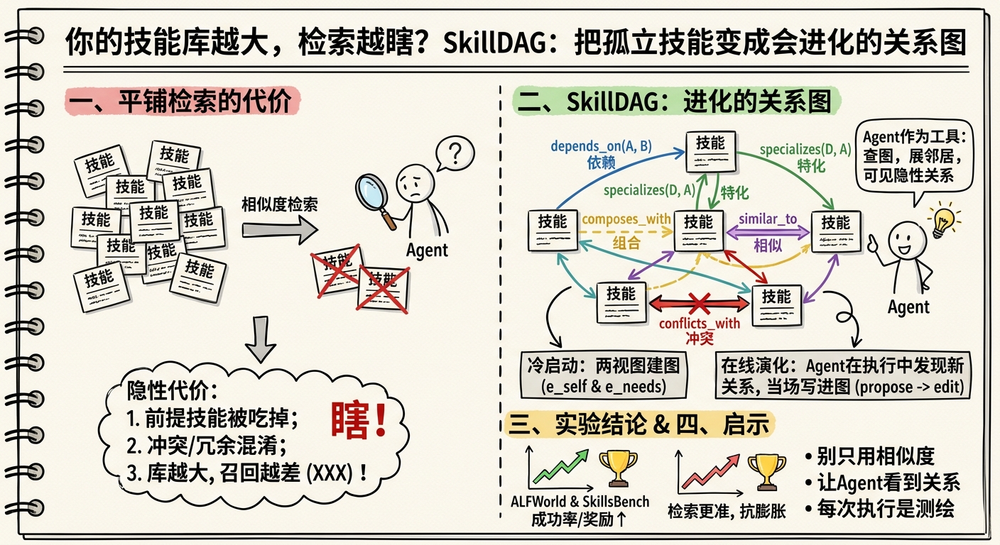
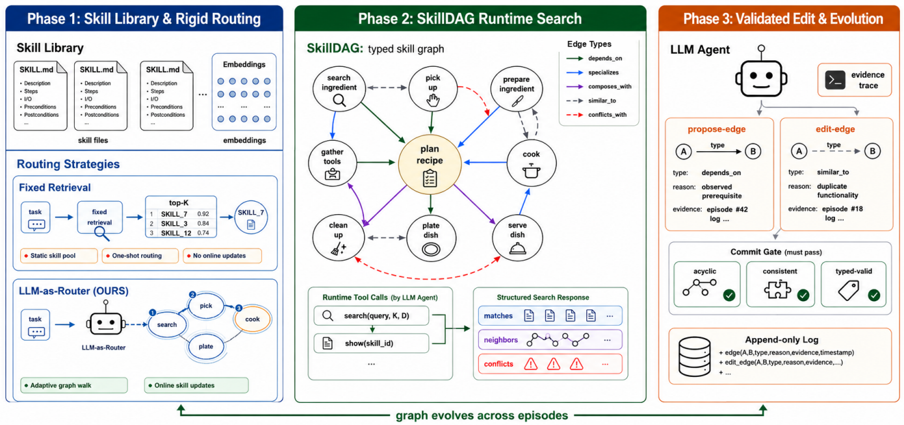

# SkillDAG

> **分类**: Skill 召回 | **成熟度**: 🟡 成长期 | **综合评分**: 0.43

---

## 一句话描述

**SkillDAG** 把技能之间的依赖、特化、组合、相似、冲突五类关系建模为 **有向图**，并将图结构作为 **Agent 可直接查询的工具**，而非离线排序算法的内部数据。Agent 在执行中随时查图、展开邻居、发现新关系并写回图里，让技能检索从"语义相似度匹配"升级为 **结构感知的图推理**。

**来源**:
- 复旦大学、新加坡国立大学（NUS）、A*STAR 联合研究
- 发布年份：**2026**

**链接**:
- 论文：https://arxiv.org/pdf/2606.03056
- 代码：https://github.com/Ericbai06/SkillDAG

---

## 核心实现

**1. 五类型有向边：建模相似度看不见的关系**

SkillDAG 用五类有向边替代模糊的"相关"概念：**depends_on**（A 需要 B 作前提）、**specializes**（D 是 A 的特化版本）、**composes_with**（组合使用效果更优）、**similar_to**（功能重复可互换）、**conflicts_with**（同时使用会失败）。同一对技能可有多条边。有向性让 Agent 能区分"我需要你"和"你跟我很像"——这两者在 Embedding 空间里几乎不可区分。

**2. 冷启动建图：双视图 + LLM 分类器**

冷启动采用 **两视图策略**补全互补技能的盲区。**e_self** 视图对技能自我描述做 Embedding，捕获话题相近的技能；**e_needs** 视图让 LLM 想象调用场景并总结共享前置条件（如"需要物品在手中"），捕获功能互补的技能——一份技能需要的东西恰好是另一份的产出。两张视图各自拉候选、过自适应阈值，再由 LLM 分类器分配边类型。**conflicts_with 被有意留空**，冲突只有执行后才能发现，留给在线演化阶段处理。

**3. Agent 可调用的图检索接口：三分路信号**

Agent 调用 `search(query, K, D)` 一次获得三个独立字段，不融合排序：**matches**（Top-K 余弦相似技能）、**neighbors**（沿正向边 BFS 深度 D 遍历的邻居技能，带边类型标注）、**conflicts**（一跳冲突边）。Agent 自行决定取舍——上下文紧张时可丢弃 neighbors，需要全局视野时展开，并在推理 Trace 中记录选择理由。另有 `show(skill)` 按需加载技能完整内容，不提前占满上下文。

**4. 在线演化：Agent 执行中写回图**

Agent 发现新关系后通过两步动作写回图：**propose-edge** 预览提交后果，展示同对技能的历史边和编辑记录；**edit-edge** 正式提交，附带自然语言理由和执行 Trace 证据。提交时强制执行 **无环性**（depends_on/specializes 不能成环）、**非矛盾性**（正向边和 conflicts_with 互斥）、**可回滚性**（追加日志可按时间或任务 ID 回滚）。一次 Agent 判决即提交，不需要投票或人工 curator。

---

## 主要能力

- **结构化技能检索**：将技能间关系从隐式语义相似度提升为显式的五类有向边，Agent 依结构而非分数做技能选择决策
- **双视图冷启动建图**：e_self 捕获话题相近、e_needs 捕获功能互补，补全单一 Embedding 视角的盲区
- **Agent-in-the-loop 图推理**：图不是离线预处理步骤，而是 Agent 执行中随时可查、可展开、可编辑的活工具
- **抗规模衰减**：技能池从 200 扩至 2000（10×），Ret@5 仅降 3.5 个点（78.2→74.7），typed-graph embedding 排序天然比 PageRank 扩散更抗膨胀
- **在线自演化**：Agent 发现新关系当场写回图，图随使用次数增长而持续完善

---

## 局限性

- **单次观察驱动演化**：propose-then-commit 允许基于一次执行证据就提交边编辑，长期积累下的质量退化、噪声边累积效应仍是开放问题
- **跨模型迁移未验证**：图结构在不同主干模型间迁移后的行为变化未被研究，一条边在模型 A 下有效不代表在模型 B 下同样成立
- **冷启动分类依赖特定模型**：配对边分类使用 gpt-5-nano，弱模型下分类稳定性和准确率未测试
- **评测范围局限于文本交互任务**：主要在 ALFWorld 和 SkillsBench 上验证，五类边对更复杂语义关系的覆盖能力有限

---

## 成熟度评分

| 维度 | 评分 (0.0-1.0) | 说明 |
|------|---------------|------|
| 技术成熟度 | 0.40 | 学术论文阶段，验证环境限于ALFWorld和SkillsBench，五类边对复杂语义关系覆盖有限 |
| 创新性 | 0.65 | 五类有向边+双视图冷启动+Agent-in-the-loop图推理，技能检索范式创新 |
| 落地程度 | 0.35 | 代码已开源，但主要面向研究场景，未见生产部署案例 |
| 生态活跃度 | 0.30 | 复旦+NUS+A*STAR联合研究，单篇论文 |

**综合评分**: 0.43

## 参考资料

- [SkillDAG 论文](https://arxiv.org/pdf/2606.03056)
- [SkillDAG 代码仓库](https://github.com/Ericbai06/SkillDAG)
- [详细解析](https://zhuanlan.zhihu.com/p/2045562414347949707)