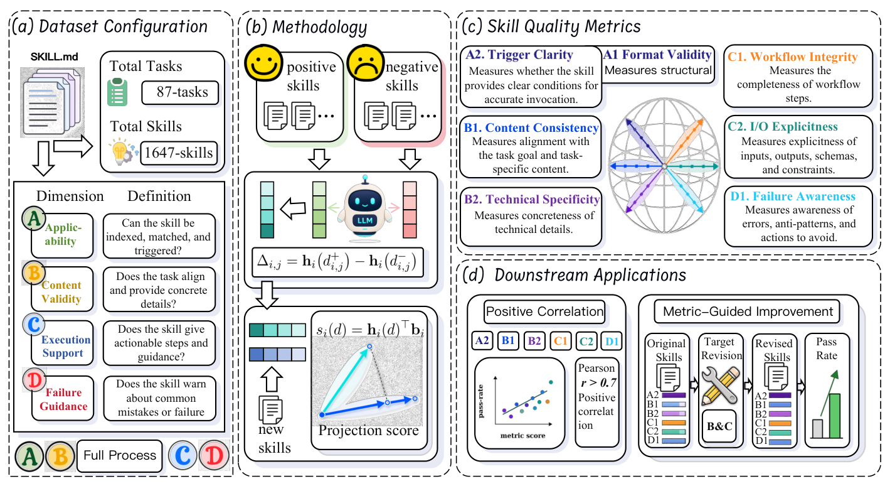

# SkillEval

> **分类**: Skill评测 | **成熟度**: 🟡 成长期 | **综合评分**: 0.54

---

## 一句话描述

SkillEval 是**文档级技能质量评估框架**，把技能质量拆成四维七指标，从受控正负技能对在冻结 LLM hidden space 学**固定可查证方向**评分，不靠执行不靠生成式 judge，定位技能薄弱点并指导定向修订。

**来源**:
- SkillEval: Decomposing Agent Skill Quality into Interpretable Signals（Jiahui Han 等，西安交通大学 / 上海 AI Laboratory / 香港理工大学 等）
- 发布年份：2026

**链接**:
- https://arxiv.org/abs/2608.06891

---

## 核心实现

SkillEval 把技能质量拆四维七指标：适用性（A1 格式有效性 / A2 触发清晰度）、内容质量（B1 一致性 / B2 技术具体性）、执行引导（C1 工作流完整性 / C2 I/O 显式性）、鲁棒性（D1 失败感知）。

**1. A1 规则判，六语义指标从正负对学方向**

- A1 用确定性规则验 Markdown+YAML frontmatter。
- 其余六指标各从受控正负技能对学一个 hidden space 方向：正例 $d^+$ 满足指标，负例 $d^-=T(d^+)$ 只削弱目标属性、保任务/主题/工具不变以压无关差异。

**2. 方向提取：冻结骨干按指标特定 pooling 聚合**

- 冻结 Qwen3.5-9B 抽 hidden-state index 16，按指标特定 pooling（A2 取 description、B1 取 description+body 均值、B2/C1/C2 取 body 均值、D1 取末 token）聚成 $h_i(d)$。
- 算每对差 $\Delta=h(d^+)-h(d^-)$，归一化均值得固定方向 $b_i$。

**3. 混杂正交化与评分：减掉长度等无关分量再投影**

- 把文档长度等无关特征表示成方向 $u_{conf}$，从训练差减其分量 $\Delta^\perp=\Delta-(\Delta^\top u_{conf})u_{conf}$，让分数专一抓目标语义。
- 新技能评分 $s=h(d)^\top b$，转 z-score。方向固定、可查证可复现，不靠生成式 judge。

控制要点：下游跑分是技能与任务兼容性的局部投影非质量本身（同技能跨任务 uplift 差 66.7 个点）；质量分两互补面——任务兼容性与跨场景复用通用属性；无单一最优层/pooling，按指标语义选。

---

## 主要能力

- **正负分离**：518 held-out 文档六指标正例>0、负例<0，A2 gap 1.94、B1/B2 1.36/1.28
- **下游强相关**：B1/B2/C1/C2/D1 五指标与 pass-rate uplift Pearson $r$ 0.779–0.787，all-metric 0.716，当早期指示
- **驱动定向修订**：指标引导改 pass rate 从 18.6%→48.1%（+29.5），比 LLM 盲改高 9.8 个点
- **跨骨干一致**：四骨干两两 Pearson 0.811–0.948，换评分器信号保留
- **偏置可诊断去除**：六指标与长度 Pearson 多数弱（A2 0.017、B1 −0.056），正交化减长度影响

---

## 局限性

- **语义指标需受控对**：正负对构造质量决定方向纯度，B2 仍有中度长度相关（$r=-0.355$）
- **无单一最优设置**：最优 hidden-state 层与 pooling 随指标变，需逐指标调
- **固定骨干与层**：主实验锁 Qwen3.5-9B index 16，D1 在该层 0.889 非峰值（0.992）
- **未开源**：单篇论文，1647 技能数据集与方向未公开

---

## 成熟度评分

| 维度 | 评分 (0.0-1.0) | 说明 |
|------|---------------|------|
| 技术成熟度 | 0.56 | 四维七指标文档级评估 + 正负对学方向，未开源 |
| 创新性 | 0.72 | 从受控正负对学固定可查证方向，不靠执行不靠生成式 judge |
| 落地程度 | 0.44 | 518 held-out 验证下游 r 0.779，驱动修订 18.6%→48.1% |
| 生态活跃度 | 0.40 | 单篇论文，1647 技能数据集未公开 |

**综合评分**: 0.54

---

## 参考资料

- [SkillEval: Decomposing Agent Skill Quality into Interpretable Signals](https://arxiv.org/abs/2608.06891)
