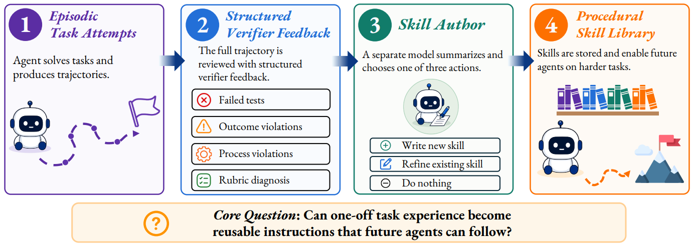

# SkillEvolBench

> **分类**: Skill 评测 | **成熟度**: 🟡 成长期 | **综合评分**: 0.57

---

## 一句话描述

**SkillEvolBench** 用 **180 个任务、六个真实 Agent 环境、十个模型配置、三个 Agent 平台**系统化回答一个核心问题：**Agent 能不能把一次性的执行经验变成可复用的程序知识？** 答案很扎心——大多数情况下不能，而且直接复用原始轨迹经常比蒸馏出来的技能更管用。

**来源**:
- OSU、芝加哥大学、UCL、密歇根大学、港中文、Amazon 联合研究
- 发布年份：**2026**

**链接**:
- 论文：https://arxiv.org/pdf/2605.24117

---

## 核心实现

**1. 完整的技能进化弧线评测设计**

六个环境（代码修改、API 编排、数据处理、文档转换、研究合成、沟通操作），每个五个任务家族，每个家族六个角色任务。
- **三个学习任务**：标准任务采集经验 → 升级版暴露缺失的子能力 → 变体版改变形式保持底层逻辑，每步 Agent 可选写/改/不改技能。
- **三个冻结评估任务**：上下文漂移（技能需正确识别但描述变了）、对抗性捷径（存在绕开正确流程的浅层方案）、组合（需与其他技能协同），评估时技能库冻结——测的是"学到的能不能迁移"而非"现场再学"。

**2. 四组控制条件 + 原始轨迹复用对标**

裸跑（无技能）、零样本技能（任务前生成不更新）、自主生成（从空库自我归纳）、精炼种子（从有盲区的人工技能出发修补）。更重要的是把 raw-trajectory reuse（直接注入之前任务的经验轨迹作为上下文）跟 skill-based 条件做对比，暴露蒸馏的有损程度。

**3. 多平台 × 多模型矩阵**

评估覆盖 Claude Code、Codex CLI、Gemini CLI 三个 Agent 框架和十个模型配置，测量技能形成能力在不同 Agent 平台和模型间的差异。

---

## 主要能力

- **技能进化标准化测试协议**：首次将"从经验到可复用技能"的整条链条做成可量化评估的标准协议
- **迁移 vs 记忆的系统化区分**：冻结评估任务（上下文漂移、对抗、组合）区分 Agent 是"记住了"还是"学懂了"
- **蒸馏有损性的量化证据**：原始轨迹复用经常超过蒸馏技能，揭示当前技能生成本质上是一次有损压缩
- **跨平台能力差异暴露**：不同 Agent 框架在"从经验中提炼技能"上表现差异显著，框架本身是变量

---

## 局限性

- **环境覆盖仍有限**：六个环境虽多但皆为文本交互任务，多模态和具身环境尚未覆盖
- **进化机制未深入对比**：未分解不同技能提取/蒸馏策略的因果贡献
- **180 任务规模在基准中属中等**：覆盖广度足够用于方法对比但不够用于统计显著性推断

---

## 成熟度评分

| 维度 | 评分 (0.0-1.0) | 说明 |
|------|---------------|------|
| 技术成熟度 | 0.55 | 学术论文阶段，OSU+UChicago+UCL+Michigan+港中文+Amazon联合，有开源代码+官网 |
| 创新性 | 0.70 | 首个系统化评测Agent经验→技能转化能力的基准，揭示Agent通常不能有效复用经验的关键发现 |
| 落地程度 | 0.45 | 180任务6环境10模型3平台，评测体系完整，标准化程度高 |
| 生态活跃度 | 0.55 | 六机构(含Amazon)跨国联合，GitHub+官网，工业学术双重背书 |

**综合评分**: 0.57

---

## 参考资料

- [SkillEvolBench 论文](https://arxiv.org/pdf/2605.24117)
- [代码](https://github.com/AIoT-MLSys-Lab/SkillEvolBench)
- [官网](https://skillevolbench.github.io/)