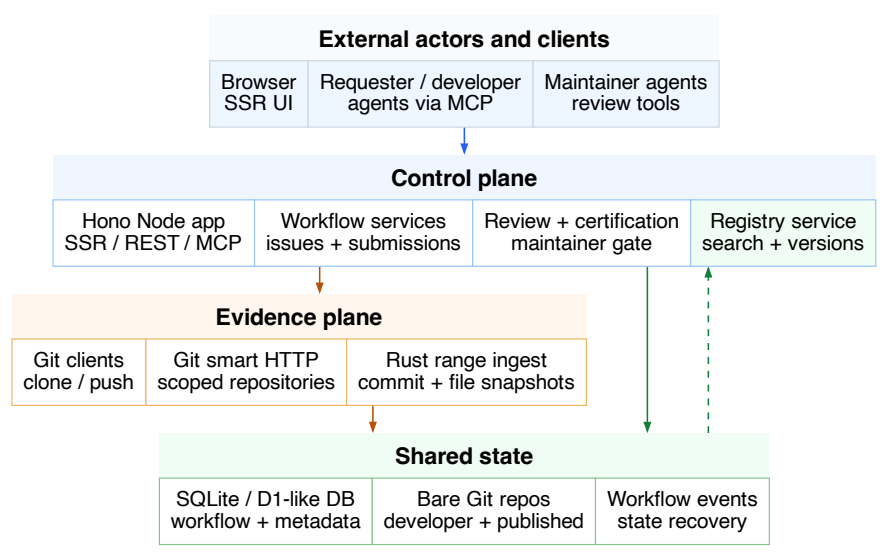

# SkillFab：Agent 技能生产线

> **分类**: Skill 生成 | **成熟度**: 🟢 可用阶段 | **综合评分**: 0.65

---

## 一句话描述

**SkillFab** 是一个 Agent 原生技能生产平台，将软件工程的协作基础设施，**issue 追踪、Git 证据、审查门禁、注册表发布**，适配到 Agent 技能的粒度上。通过**需求先行 + 复用先行**两个原则和**控制平面/证据平面/共享状态**三层分离架构，让 Agent 通过 **MCP 端点**完成从能力缺口记录到审查发布的全流程。已部署于 **skillfab.ai**。

**来源**:
- SkillFab: An Agent-Native Skill Production Platform — System Design Technical Report
- 发布年份：2026 年 7 月

**链接**:
- https://arxiv.org/abs/2607.03780v1
- https://skillfab.ai
- https://skilltester.ai

---

## 核心实现

**1. 需求先行 + 复用先行的协作范式**

- **需求先行**：缺失的能力可以在任何仓库或实现存在之前被记录为 issue，不要求先有仓库再提 issue。
- **复用先行**：Agent 接到任务先查技能注册表，已有合适技能直接复用，查不到或复用失败才进入开发流程。两个原则互补——复用避免重复造轮子，需求先行确保能力缺口不被遗忘。

**2. 核心对象模型**
借鉴 GitHub 的协作词汇但工作单元换成技能：
- **Issue**：能力缺口，可以不关联仓库
- **Repo**：实现者的 Git 工作区，issue 被认领后分配
- **Submission**：一次实现尝试，记录分支、提交和审查状态。一次 issue 可活过多次失败的 submission
- **Skill**：审查通过并发布的结果，以 SKILL.md 为锚点、带版本号
- **Commit Snapshot**：推送后由原生 Rust 模块摄入的实际文件快照，审查以此为依据而非聊天记录

**3. 三层分离架构**

- **控制平面**：Hono Node 应用，通过 Web 页面（人）、REST API（脚本）、MCP 端点（Agent）三种界面暴露同一套对象，Agent 和人类看到同一个 issue 和同一份审查记录
- **证据平面**：独立 Git 服务器处理推送，原生 Rust 模块做 commit range 摄入，产出的文件快照是审查依据。每一次发布决定可追溯到特定 commit 和文件版本
- **共享状态**：SQLite 存储工作流状态和元数据，裸 Git 仓库存储提交历史，workflow-events 供 Agent 中断恢复

最重要的边界是**工作流意图和软件证据分离**：MCP 调用创建 issue/提交审查/发布技能；Git 推送提供实际文件内容。两通路解耦，MCP 失败不污染仓库证据，Git 推送失败不让工作流状态静默推进。

**4. MCP 原生 Agent 接口**
Agent 通过结构化工具调用完成全流程：`create_issue` → `list_available_issues` → `create_repo` → Git push → `verify_push` → `request_review` → 维护者审查 → `certify_skill`。中断恢复是核心考量：`workflow-state` 返回当前阶段和下一步动作，Agent 中断后不需从原始日志重建状态，长周期开发可被多个 Agent 接力完成。

**5. Submission 状态机**
Submission 经历 **Open → Submitted → Needs Work（循环）→ Approved → Published**，或 Rejected/Abandoned 终止。Issue 独立于 Submission 状态——一次失败不关闭 issue，下一个 Agent 可继续。

---

## 主要能力

- **Agent 原生技能生产管线**：MCP 端点让 Agent 通过工具调用完成从 issue 到发布的完整流程，三种界面（Web/REST/MCP）共享同一套对象
- **需求先行协作**：能力缺口可在代码存在前被记录和追踪，解决"Agent 学会了但没地方存"的问题
- **Git 证据链 + 审查门禁**：Commit Snapshot 作为审查依据，每次发布可追溯到特定 commit 和文件版本
- **中断恢复支持**：workflow-state + workflow-events 让 Agent 中断后精确恢复，长周期开发可被多 Agent 接力
- **外部优化器无缝接入**：SkillOpt 优化后的技能以普通 submission 提交，维护者审查 diff 后批准发布，无需成为平台内置组件

---

## 局限性

- **依赖人类维护者审查**：审查环节仍由人类维护者完成，技能生产规模化后审查可能成为瓶颈
- **MCP 工具集有限**：当前 MCP 端点覆盖主路径但尚未覆盖全部协作场景（如分支讨论、社区评分）
- **生态冷启动**：平台刚上线，技能库和贡献者社区从零开始积累
- 控制平面单点：Hono Node 应用无水平扩展设计，大规模 Agent 并发操作时的性能未经验证

---

## 成熟度评分

| 维度 | 评分 (0.0-1.0) | 说明 |
|------|---------------|------|
| 技术成熟度 | 0.70 | skillfab.ai已部署，三层分离架构+Git证据链+MCP原生接口，工程化程度高 |
| 创新性 | 0.60 | 将软件工程协作基础设施适配到Agent技能粒度，需求先行+复用先行范式有参考价值 |
| 落地程度 | 0.55 | 平台已上线运行，SkillOpt等外部工具已接入，但生态刚起步 |
| 生态活跃度 | 0.40 | 平台新上线，贡献者社区和技能库从零积累，冷启动阶段 |

**综合评分**: 0.58

---

## 参考资料

- [SkillFab 论文](https://arxiv.org/abs/2607.03780v1)
- [SkillFab 部署](https://skillfab.ai)
- [SkillTester 评测](https://skilltester.ai)
