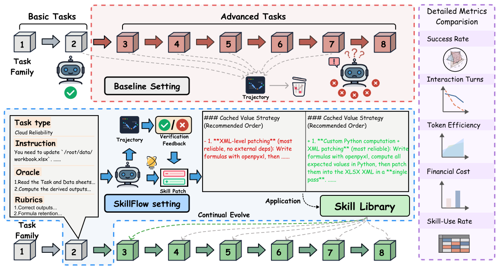

# SKILLFLOW

> **分类**: Skill 评测 | **成熟度**: 🟡 成长期 | **综合评分**: 0.54

---

## 一句话描述

SKILLFLOW 提出了首个 Agent 技能的**终身学习评测基准**，覆盖 11 个主流模型，系统评估了技能持续更新过程中的退化与回归——结论是：**大部分模型在连续技能更新后确实会越学越差**，且退化幅度和模型基座能力并非线性相关，强模型不一定更稳。

---

## 核心实现

SKILLFLOW 将技能终身演化评估拆为一条三阶段流水线，核心抽象是 DAEF（Domain Agnostic Execution Flow）和技能补丁（skill patch）机制。

**DAEF 执行流抽象**：将每个技能定义为一组有序的执行步骤和对应的验证检查点，使不同领域、不同格式的技能可以在统一框架下被评估和比较。

**技能补丁机制**：每次技能更新被视为对原始技能的一个补丁，系统追踪补丁链上的性能变化，量化每次修改带来的净收益——修了几个 bug、引入几个回归。

**三阶段演化协议**：初始训练建立基线 → 技能更新注入变更 → 持续适应观察长期漂移，模拟真实部署中技能库不断被修改的场景。

**跨模型退化分析**：在 ALFWorld、WebShop、ScienceWorld 三个环境上，对 GPT、Claude、Gemini、Qwen、DeepSeek 等 11 个模型做退化曲线追踪，区分"技能本身退化"和"模型在执行中忽略技能"两类根本原因。

---

## 主要能力

- 为 Agent 技能演化提供标准化的评测框架，把"技能越改越差"这个之前只能定性描述的问题变成可定量追踪的指标
- 用技能补丁链追踪每次技能更新的净效果——修了多少个 case、搞砸了多少个原本能对的 case
- 跨 11 个模型的退化曲线对比，揭示了一个反直觉发现：基座能力更强的模型，在技能持续更新中并不一定更稳定
- 区分两类退化根因——技能内容真的写坏了，还是模型在执行时没有正确遵循技能指令——直接指向不同的修复策略

---

## 局限性

- 评估环境限于文本模拟器（ALFWorld、WebShop、ScienceWorld），真实生产环境的技能退化模式可能更复杂
- 技能补丁的来源依赖人工标注，大规模自动化评测还需要额外工程
- 目前只关注了单一技能的纵向退化，多个技能同时演化时的交叉影响未覆盖

---

## 成熟度评分

| 维度 | 评分 (0.0-1.0) | 说明 |
|------|---------------|------|
| 技术成熟度 | 0.55 | 有完整论文和实验验证 |
| 创新性 | 0.65 | 首个技能终身学习评测基准 |
| 落地程度 | 0.45 | 学术研究阶段 |
| 生态活跃度 | 0.50 | 有项目页面和代码 |

**综合评分**: 0.54

---

## 参考资料

- [项目](https://zhangzi-a.github.io/SkillFlow-project-page/)
- [论文](https://arxiv.org/pdf/2604.17308)
- [代码](https://github.com/ZhangZi-a/SkillFlow)
- [详解](https://zhuanlan.zhihu.com/p/2030587991689785774)