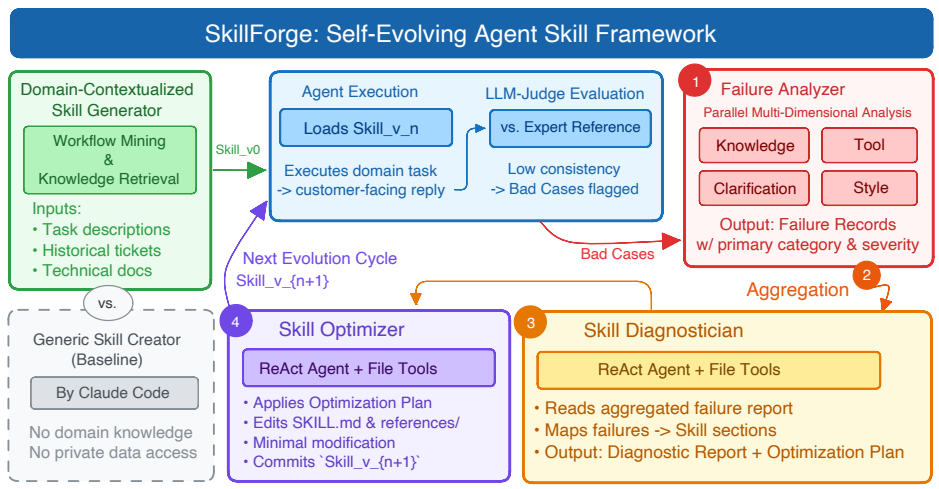

# SkillForge

> **分类**: Skill 优化 | **成熟度**: 🔴 探索期 | **综合评分**: 0.55

---

## 一句话描述

SkillForge 是**业界首个端到端垂直领域 Agent Skills 自进化框架**，扎根企业真实业务数据，打通从 Skills 生成、部署运行、多维故障分析到自动优化的**完整闭环**，**全程无需人工介入**。

**来源**:
- 学术论文：阿里云团队
- 发布年份：2026年
- 会议：ACM SIGIR

**链接**:
- 论文链接：https://arxiv.org/pdf/2604.08618

---

## 核心实现

SkillForge 采用五阶段流水线，围绕"完全扎根业务"和"全程无需人工介入"两个核心原则：

**1. 初始化**：从历史工单中挖掘专家工作流、高频内部工具和领域专属知识，填充到预定义模板生成初始 Skills，全程使用内部大模型处理私有数据。

**2. 执行与监控**：Agent 加载 Skills 处理业务请求，LLM 评判器对比输出与专家参考回复，低于阈值则标记为不良案例。

**3. 故障分析**：从知识、工具、澄清、风格四个维度并行诊断不良案例，生成结构化故障记录。

**4. 聚合**：按类别聚合故障，识别系统性问题并选取典型案例。

**5. 诊断与优化**：基于 ReAct 的诊断器将故障映射到 Skills 具体缺陷位置，优化器通过虚拟文件系统执行最小化修改，生成新版本 Skills。

为适配企业安全，SkillForge 采用约束型 Skills 结构：剔除可执行脚本，所有操作通过预定义系统工具完成，Agent 通过虚拟文件系统（VFS）与 Skills 资源交互。

---

## 主要能力

- 领域情境化 Skills 生成：从历史工单中挖掘工作流、工具和领域知识，冷启动质量显著优于通用生成器
- 多维度故障分析：从知识、工具、澄清、风格四维度并行诊断，自动聚合识别系统性问题
- 端到端自进化闭环：从故障诊断到 Skills 自动优化全程无需人工介入

---

## 局限性

- 依赖企业真实业务数据，缺乏历史数据的场景冷启动效果受限
- 知识类问题受底层知识库覆盖范围限制，迭代后期提升趋于平缓

---

## 成熟度评分

| 维度 | 评分 (0.0-1.0) | 说明 |
|------|---------------|------|
| 技术成熟度 | 0.55 | 有完整论文和工业验证 |
| 创新性 | 0.80 | 端到端自进化框架的创新 |
| 落地程度 | 0.40 | 阿里云实际场景验证 |
| 生态活跃度 | 0.35 | 学术研究阶段 |

**综合评分**: 0.55

---

## 参考资料

- [论文](https://arxiv.org/pdf/2604.08618)
- [详解](https://zhuanlan.zhihu.com/p/2027332205161006631)
