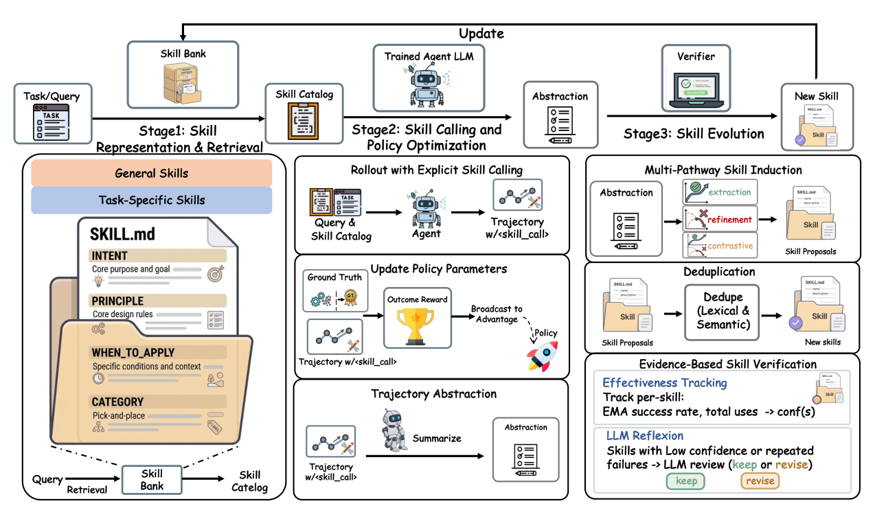

# SkillForge

> **分类**: Skill优化 | **成熟度**: 🟡 成长期 | **综合评分**: 0.56

---

## 一句话描述

SkillForge 是阿里高德提出的**持续技能演化框架**，让 RL agent 用**显式 `<skill_call>` 标签**按需调用技能、用**证据性验证**修订低效技能，使技能库随训练连续演进而非只增不改，三基准均超 SKILLRL。

**来源**:
- SkillForge: Evolving Verifiable Skills for Reinforcement Learning Agents（Shidong Yang 等，AMAP, Alibaba Group）
- 发布年份：2026

**链接**:
- https://arxiv.org/abs/2608.24747

---

## 核心实现

SkillForge 把**技能从 prompt 注入物改造成可调用可验证可修订的演进单元**，核心沿三阶段闭环。

**1. 技能表示与检索：紧凑目录 + 渐进披露**

- 每技能是结构化元组 `(title, intent, principle, applicability, category, status)`，title 是 `<skill_call>` 标签里发出的调用名，principle 是调用后返回的核心决策策略。
- 每 episode 开头按任务描述做 embedding 检索取 top-6 通用加 top-6 任务型技能，拼成**只放调用名和一行触发条件**的紧凑目录注入 prompt；全文仅在调用后返回，保持 prompt 紧凑。

**2. 显式调用与策略优化：调用事件可观测可归因**

- agent 每步输出环境动作加可选 `<skill_call>NAME</skill_call>`，框架解析调用名从目录取全文拼进下一观测，调用事件记入轨迹使技能使用可观测可归因。
- 因调用标签是生成 token 序列一部分，**同一 GRPO 目标联合优化环境动作和技能调用决策**，组相对优势 $\hat{A}_i=(R_i-\bar{R})/\sigma_R$ 驱动策略更新。

**3. 多路径技能归纳：成功/失败/对比三模式**

- 每 5 步触发，轨迹先经 LLM 抽象成结构化摘要再按奖励分成成功/失败集。
- 三模式依缓冲状态切换：**extraction** 从成功抽策略、**refinement** 从失败找纠正、**contrastive** 配对成功失败找决定性差异；新技能经词法和语义去重入库，控制要点是已有库作为上下文防重复生成。

**4. 证据性技能验证：欠绩效分驱动修订**

- 每技能维护 EMA 成功率 $\hat{p}_s$（更新式 $\hat{p}_s\leftarrow\alpha\cdot r+(1-\alpha)\cdot\hat{p}_s$）和使用次数 $n_s$，合成欠绩效分 $\mathrm{conf}(s)=(1-\hat{p}_s)(1-0.5n_s/h)$，$h$ 为半衰期。
- 高分技能（低成功率高使用）送 LLM 反思审查，返回 keep 或 revise（重写 principle 和 applicability），低效技能被及时修订防止知识退化——这是技能库"不再只增"的核心机制。

---

## 主要能力

- **显式技能调用**：用 `<skill_call>` 标签把技能使用变成轨迹里的离散可观测事件，使 RL 能强化好技能抑制差技能。
- **证据性验证**：按 per-skill EMA 成功率加使用次数算欠绩效分，驱动 LLM 反思修订，低效技能被淘汰，库不再只增。
- **多路径归纳**：从成功、失败、对比三路径合成新技能，覆盖单一成功蒸馏抓不到的失败模式和决定性差异。
- **跨模型迁移**：4B 演化的技能库搬到 30B 不再训练反超自演化，技能存的是可迁移知识而非模型特化物。
- **低开销高增益**：技能相关总开销低于 10%，墙钟时间在多数基准上比 GRPO 基线还短。

---

## 局限性

- 技能归纳和修订依赖外部教师 LLM，技能库质量受教师能力约束，自教师能涨但弱于强教师。
- 技能库随训练持续增长，长训练周期下检索开销会累积，虽去重和修订能部分控制。
- 显式 `<skill_call>` 标签增加生成 token 量，大规模部署时推高 prompt 长度和推理成本。
- 验证依赖 episode 级二元奖励做归因，对奖励稀疏或延迟的环境，per-skill 成功率信号可能噪声大。

---

## 成熟度评分

| 维度 | 评分 (0.0-1.0) | 说明 |
|------|---------------|------|
| 技术成熟度 | 0.60 | 显式 skill_call 标签 + 多路径归纳 + 证据性验证，阿里高德 |
| 创新性 | 0.68 | 技能从 prompt 注入改造为可调用可验证可修订演进单元 |
| 落地程度 | 0.48 | 三基准均超 SKILLRL，跨模型迁移，但依赖教师 LLM |
| 生态活跃度 | 0.45 | 单篇论文，未开源 |

**综合评分**: 0.56

---

## 参考资料

- [SkillForge: Evolving Verifiable Skills for Reinforcement Learning Agents](https://arxiv.org/abs/2608.24747)
