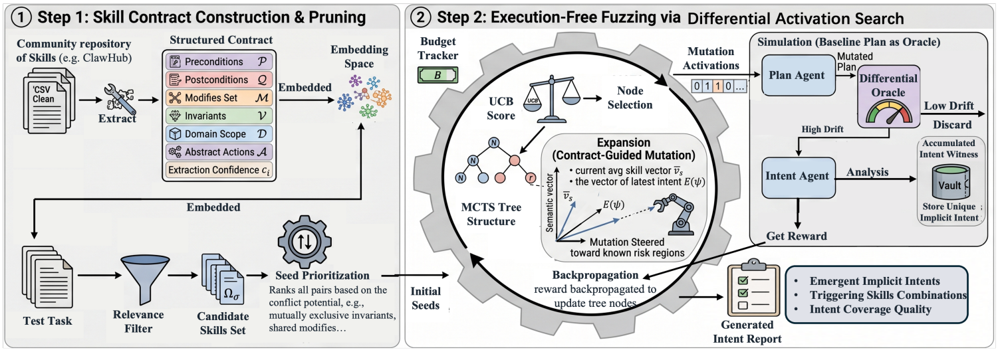

# SkillFuzz：技能组合模糊测试

> **分类**: Skill评测 | **成熟度**: 🟡 研究验证阶段 | **综合评分**: 0.55

---

## 一句话描述

**SkillFuzz** 针对 LLM Agent **技能市场**中的结构性安全盲区——审核只检查单个技能，不检查**技能组合**——提出了一种基于 **蒙特卡洛树搜索（MCTS）**的模糊测试方法。它利用 Agent 的**计划漂移（plan drift）**作为差分信号，在不执行任何代码的情况下发现组合式隐式意图，在 **SkillsBench 196 技能库**上累计发现 **1000+ 个隐式意图**，经真实 Docker 沙箱执行验证确认率超过 **80%**。

**来源**:
- SkillFuzz: Fuzzing Skill Composition for Implicit Intents Discovery in Open Skill Marketplaces
- 发布年份：2026 年 7 月

**链接**:
- https://arxiv.org/abs/2607.02345v1

---

## 核心实现

核心洞察：几乎所有 LLM Agent 遵循 **plan-then-act（先规划再执行）**架构，计划是 Agent 信念状态的外部化——隐式意图在计划阶段就已可见，无需等到实际执行。

**第一阶段：技能合约提取与裁剪**

对每个技能，LLM 从其指令文档中提取结构化**技能合约**，包括前置条件、后置条件、修改集、不变式、域范围、动作类型和置信度。合约被嵌入到语义向量空间，将自由格式文档变为可计算表示。

两步筛选：
1. **任务相关性裁剪**：仅保留与测试任务语义相似度足够的技能
2. **冲突种子排序**：按冲突潜力排序——共享修改集的技能对、不变式互斥的技能对、低置信度技能优先进入种子队列

**第二阶段：差分激活搜索（MCTS-based fuzzing）**

在二进制技能激活空间上运行 MCTS：
- **节点**：技能激活向量（每位 0/1 表示激活/停用）
- **边**：翻转一个技能位
- **节点奖励**：**ICQ（Intent Coverage Quality）= 计划漂移 × 意图新颖度**——同时满足偏离足够大且与已发现意图不重复才贡献非零奖励

关键设计细节：
- **选择**：标准 UCB 公式
- **扩展**：当前节点已发现隐式意图时，**朝已发现意图的语义方向扩展**，将预算集中在已知风险区域附近；未发现意图时随机采样
- **模拟**：对扩展后节点采样 K=3 次计划生成，漂移低于阈值的丢弃，高于阈值的提取具体隐式意图并判新颖度
- **回传**：节点奖励沿树向上回传更新祖先节点

计划漂移作为**差分 oracle**——比较同一任务在"无技能"和"加载某技能组合"两种条件下的计划差异，差异显著即说明组合引入了额外意图。

---

## 主要能力

- **零执行模糊测试**：不需要部署 Agent 执行环境，仅通过计划层差异即可发现组合风险，对资源受限的市场运营方具有实操价值
- **组合风险发现**：从 10 个代表性任务中发现 1000+ 语义独立的隐式意图，执行验证确认率 **80.6%**
- **定向搜索效率**：仅探索 39.7% 的成对交互空间，但严重意图比例达 **77%**（随机搜索探索 94.5% 但严重意图仅 52%）
- **跨模型泛化**：在 8 个规划模型上全部产生非零隐式意图，确认率在不同模型家族间几乎一致（80.5%-81.0%），证明信号是结构性的而非模型偏置

---

## 局限性

- **依赖 plan-then-act 架构**：对不暴露显式计划的 Agent 架构（如端到端行动预测）不适用
- **计划漂移阈值需经验设定**：阈值的选取影响召回率和误报率，缺乏自动校准机制
- **搜索预算固定**：200 次查询预算下仅覆盖 39.7% 的成对交互空间，是否能覆盖所有高风险组合尚无理论保证
- 仅在 196 技能的单技能库上验证，更大规模或动态更新的技能市场上的表现待验证

---

## 成熟度评分

| 维度 | 评分 (0.0-1.0) | 说明 |
|------|---------------|------|
| 技术成熟度 | 0.55 | 方案完整（合约提取+MCTS搜索+差分信号），但依赖 plan-then-act 架构假设 |
| 创新性 | 0.70 | 首次将计划漂移作为差分oracle用于技能组合安全测试，零执行模糊测试思路新颖 |
| 落地程度 | 0.45 | 学术验证阶段，仅在196技能单技能库上验证，尚未集成到实际技能市场 |
| 生态活跃度 | 0.50 | arXiv 论文，跨8个模型验证结构性，社区关注度中等 |

**综合评分**: 0.55

---

## 参考资料

- [SkillFuzz: Fuzzing Skill Composition for Implicit Intents Discovery in Open Skill Marketplaces](https://arxiv.org/abs/2607.02345v1)
