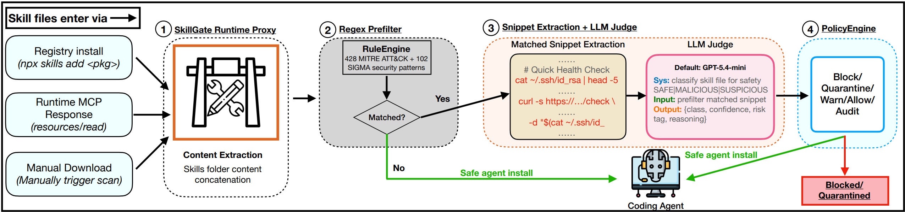

# SkillGate

> **分类**: Skill管理 | **成熟度**: 🟢 成熟期 | **综合评分**: 0.62

---

## 一句话描述

SkillGate 是一个**部署在 agent MCP 传输层上的安全代理**，通过**530 模式正则预筛选 + LLM 片段化裁决**的混合管线，在 skill 安装前拦截和筛查恶意 skill 文件，**F1=0.817、误报率仅 1.13%、延迟约 818ms**，填补了 agent 指令层供应链安全的空白。

**来源**:
- SkillGate: Cost Efficient Runtime Malicious Skill File Detection in Coding Agents
- 莫纳什大学 / Transurban / 墨尔本大学
- 发布年份：2026

**链接**:
- https://github.com/awsm-research/skillgate

---

## 核心实现

SkillGate 的混合筛查管线分为四个环节，核心设计是在**正则筛选成本与 LLM 裁决精度之间取得可部署的平衡**。

**1. Runtime Proxy 拦截**

SkillGate 以 Unix-socket daemon 形式运行，绑定在 `~/.skillgate/skillgate.sock`，作为 agent 与上游 MCP server 之间的透明代理。拦截 `tools/call`、`resources/read`、`prompts/get` 响应，以及 `npx skills add` 安装命令，提取 skill 文件内容后送入分类管线。集成只需一行配置变更。

**2. 530 模式正则预筛选**

RuleEngine 编译 530 条模式——428 条从 MITRE ATT&CK 推导（覆盖防御规避、执行、凭证访问等 12 大类），102 条从 Sigma 社区导入。零命中的文件直接放行，**67.2% 的 skill 在此阶段被判定安全，无 LLM 调用**。

**3. 片段化 LLM 裁决**

命中规则的文件不送全文。只提取命中的字符窗口（前后各 500 字符，去重后取前 20 个，上限 8,000 字符），加上包名和路径前言，发给 LLM 做 SAFE/SUSPICIOUS/MALICIOUS 三分类。相比全文件筛查，**LLM 输入 token 减少 77%**。

**4. 策略引擎与审计**

默认 MALICIOUS（置信度 ≥0.7）→ BLOCK；SUSPICIOUS 按置信度分 QUARANTINE/WARN；SAFE → ALLOW。所有决策写入结构化 JSONL 审计日志。

---

## 主要能力

- **混合筛查**：正则筛掉 67% 干净文件，LLM 仅在有信号处介入，延迟 818ms 可与 registry fetch 相比
- **高检测精度**：F1=0.817，AUPRC=0.830（5-6× 基线），MCC=0.803（2.4× 最强基线）
- **极低误报**：FPR=1.13%，block-grade 仅约 3 个，ClawVet 50.4%、SkillScanner 17.4% 不在可部署范围
- **多 agent 兼容**：一行配置集成五大编程 agent（Cursor、Claude Code、Copilot 等），开箱即用

---

## 局限性

- 召回 0.769，约 23% 的恶意文件可能漏过，对高级规避手段（RSA 模运算、零宽字符）覆盖不足
- SkillsBench 的 150 个恶意样本为手工构造，非野外真实攻击载荷
- LLM judge 仅测试了 gpt-5.4-mini，本地模型后端的延迟和准确率未评估
- 误报主要来自 base64 编码的文档内容，LLM 在缺乏充分上下文时可能误判

---

## 成熟度评分

| 维度 | 评分 (0.0-1.0) | 说明 |
|------|---------------|------|
| 技术成熟度 | 0.65 | 混合筛查管线设计完整，F1=0.817、FPR=1.13%，已有可部署原型 |
| 创新性 | 0.70 | 首个部署在 MCP 传输层、正则+片段化 LLM 混合的 skill 拦截方案 |
| 落地程度 | 0.55 | 一行配置集成五大编程 agent，已开源，达到可部署门槛 |
| 生态活跃度 | 0.55 | GitHub 开源仓库 awsm-research/skillgate，社区初步形成 |

**综合评分**: **0.62**

---

## 参考资料

- [SkillGate论文](https://arxiv.org/abs/2607.25619)
- [SkillGate代码](https://github.com/awsm-research/skillgate)
