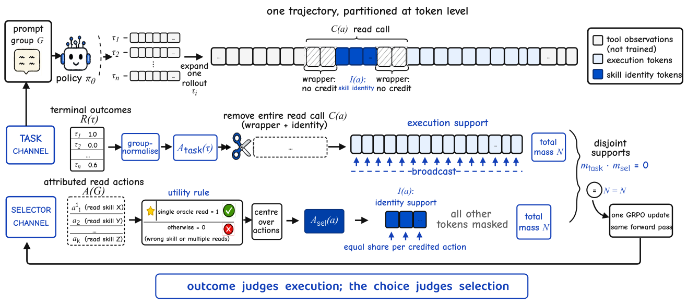

# SkillGate

> **分类**: Skill召回 | **成熟度**: 🟡 成长期 | **综合评分**: 0.58

---

## 一句话描述

SkillGate 是针对长程 agent **选技能决策**的训练方法，先诊断出 outcome-only RL 下选择 token 被**信号饿死**（份额随长度稀释 7×、近 40% 信用反符号），再用双不相交信用通道把选技能做成独立可训练决策，9B 策略从 **40.8% 提到 53.2%** 超同预算 outcome-only 和 397B 参考。

**来源**:
- SkillGate: Training In-Policy Skill Selection in Long-Horizon Agents（Qingyao Li、Wenxiang Jiao、Shuai Shao 等，上海交通大学 / 小红书公司）
- 发布年份：2026

**链接**:
- https://arxiv.org/abs/2608.18852

---

## 核心实现

立论：outcome-rewarded RL 把一个序列级优势广播到所有 token，选技能的几个 token 在数千执行 token 里是噪声——**信号被饿死**。审计 12,800 条同策略训练轨迹量化三个性质，都随 horizon 单调恶化。

**1. 诊断层：量化 selector credit starvation**

- 离线审计 SkillRL (outcome only) 的 12,800 条训练轨迹，按轨迹长度分层，量化三性质。
- **Share**：技能命名 token 占轨迹损失权重中位仅 **0.14%**，从最短到最长 bin 稀释 **7×**。
- **Sign**：近 **40%** 正确读 oracle 的轨迹拿到负优势（执行失败连累选择），最长 bin 越过抛硬币线。
- **Value**：同 prompt 组内读 oracle 仍值 **+11.2 pp** 成功率；三量随长度变差、值不变。

**2. 归属层：把选技能的 token 和执行的 token 分开**

- 每个 read 动作 $a$ 有调用 span $C(a)$（整个工具调用）和嵌套的身份 span $I(a)\subseteq C(a)$（路径里的技能名）。
- **选择 = 身份 span**（其正确性可从候选集单独判定），**执行 = 其他 assistant token**（其质量只能从结果判定）。
- 归属性只从 assistant 文本出发，对齐失败 **fail closed**，不让观察回声的路径冒领信用。

**3. 双通道层：两条不相交信用通道**

- **task channel**：删整个 read call（包装器+函数名+路径）从 assistant mask，把组归一化 GRPO 优势广播到执行 token——结果不碰选择。
- **selector channel**：对组 $G$ 全部 read 动作用 clean single-oracle utility，其优势组中心化：

$$u(a)=\begin{cases}1, & |A(\tau_a)|=1 \text{ 且 } a \text{ 读 oracle}\\ 0, & \text{否则}\end{cases},\quad A^{sel}(a)=u(a)-\frac{1}{|A(G)|}\sum u(a')$$

- 单读且读 oracle 才得正分（阻止靠多读买信用），动作加权和**精确为零**（无驻压读不读），组全同则静默。两支撑不相交，实现三处 assert。

**4. 再缩层：N=N 长度不变**

- task 权重再缩到 $\sum w^{task}=N$，selector 权重再缩到 $\sum w^{sel}=N$——删 read call 不降 task 有效学习率、少数 selector token 不复现饿死。
- 每 credited 动作同权重 $N/M$，独立于轨迹长度；目标总损失中 selector 系数 $\lambda=0.20$，两和同 forward pass、on-policy。

控制要点：选择该单独优化不该埋噪声；信用分区非奖励调参；single-read 阻止靠多读买信用。

---

## 主要能力

- **诊断量化饿死**：12,800 轨迹测三性质随长度恶化，**0.14%** 份额、7× 稀释、近 40% 反符号
- **9B 超 397B**：overall **53.2%** vs SFT 40.8% / outcome-only 47.0% / Qwen3.5-397B-A17B 51.7%
- **误导暴露降三分之二**：oracle 83.9% / 误导 **21.8%**（outcome-only 69.6%），reads/trial 1.11（outcome-only 1.88）
- **推理更便宜**：distinct reads −41.2%、turns −5.2%，只 output token 涨（单读前推理）
- **消融逐层归因**：粗落点逐层失败，只到身份 token + 单读约束才转成成功

---

## 局限性

- **单次运行无 seed 复现**：每配置 100 步单 run，task bootstrap 排零但 pass@4 区间 [−1.4, +15.7] 不排零
- **需已知正确技能训练任务**：action-local utility 依赖 oracle 标注，无正确技能标注的场景不适用
- **不能信用 abstention**：partition 支撑方案覆盖交错决策的信用分区，但该走该停不读无法归因
- **短轨迹增益有限**：selector credit starvation 随 horizon 恶化，≤3k token 任务饿死不严重

---

## 成熟度评分

| 维度 | 评分 (0.0-1.0) | 说明 |
|------|---------------|------|
| 技术成熟度 | 0.58 | 双不相交信用通道 + 单读约束，代码模型开源 |
| 创新性 | 0.76 | selector credit starvation 量化诊断 + 信用分区非奖励调参 |
| 落地程度 | 0.50 | 9B 超 397B 与 outcome-only，但单 run 无 seed 复现 |
| 生态活跃度 | 0.46 | 单篇论文，GitHub + HuggingFace 开源 |

**综合评分**: 0.58

---

## 参考资料

- [SkillGate: Training In-Policy Skill Selection in Long-Horizon Agents](https://arxiv.org/abs/2608.18852)
- [SkillGate 代码](https://github.com/DeepExperience/SkillGate)
- [SkillGate 模型](https://huggingface.co/simonlqy/SkillGate-9B)
