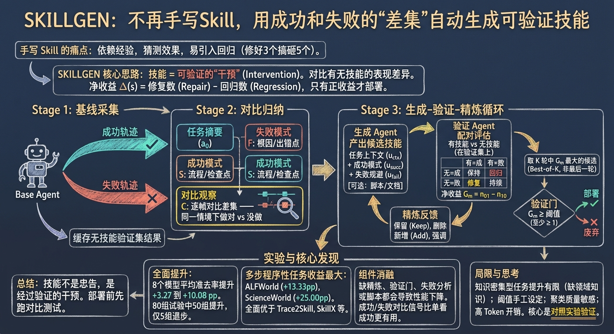
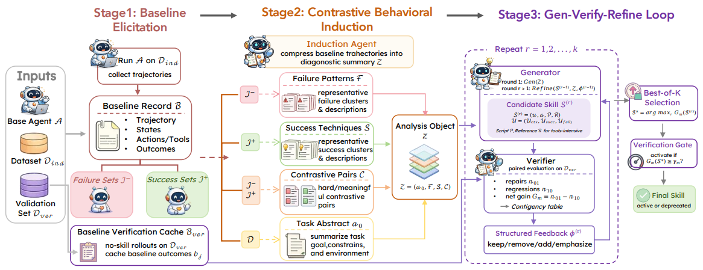

# SKILLGEN

> **分类**: Skill 生成 | **成熟度**: 🟡 成长期 | **综合评分**: 0.48

---

## 一句话描述

SKILLGEN 不靠人工写技能，而是从 Agent 已有执行轨迹中**对比成功和失败的差异**，自动生成候选技能，然后跑**配对对照实验**来验证净收益——只有修复数大于回归数的技能才部署，8 个模型平均准确率提升 **+3.27 到 +10.08 个百分点**。

---

## 核心实现

把技能定义为一种"干预"——加载技能等于对 Agent 做了一次处理，效果用配对实验衡量。三阶段流水线：采集基线 → 对比归纳 → 生成-验证-精炼循环。

**Stage 1：基线采集**

让基础 Agent 在训练集上裸跑一轮，成功和失败的轨迹都保留。只看成功不知道缺口在哪，只看失败拿不到可复用的正确做法。

**Stage 2：对比归纳**

归纳 Agent 生成结构化诊断报告，分四块——任务摘要（这类任务在干什么）、失败模式聚类（根因 + 典型出错点 + 正确做法）、成功模式聚类（可复用操作流程 + 检查点）、逐案例对比（对每个失败实例找到嵌入空间最近的同类成功实例，逐帧对比"成功那次做了什么、失败那次没做"）。第四块是 SKILLGEN 最特别的地方——它锚定的是 Agent 自己已经展示过但某些场景下遗漏了的能力。

**Stage 3：生成-验证-精炼循环**：

1. 生成 Agent 写出候选技能（任务上下文 + 成功模式 + 失败规避）；
2. 验证 Agent 在验证集上跑配对评估——同一个输入分别用有技能和无技能的 Agent 执行，拉列联表算净收益 Gm = 修复数 − 回归数；
3. 精炼 Agent 据此提四类反馈（keep/remove/add/emphasize），生成 Agent 修改后进下一轮。最终不取最后一轮而是取 K 轮候选中 Gm 最大的——论文数据显示最新候选期望 Δ 是 -3.1pp，最佳候选是 +8.1pp，差了约 11 个百分点。

**验证门**

哪怕最佳候选，Gm 低于阈值就标记 deprecated，不部署。宁可什么都不做，也不装未经验证的技能。

---

## 主要能力

- 对比归纳不只从成功中提取经验，更从失败和成功的"差集"中定位能力缺口的精确位置
- 配对评估用列联表量化每个候选技能的真实净收益——不是修好几个 case 就认为有用，而是同时看它搞砸了几个原本能做对的 case
- best-of-K 选择把精炼当搜索而非收敛，不假设最后一轮一定最好，效果更诚实
- 验证门是硬约束——τ-Bench 上多个模型生成的候选技能直接被挡掉，避免了对基线的负向干预

---

## 局限性

- 知识密集型任务（如 PubMedQA）提升有限——技能能教模型怎么做事，补不了它不知道的事实
- 验证门的阈值手工设的（g_abs、g_rel），不同任务可能需要不同阈值
- 归纳阶段依赖嵌入聚类发现行为模式，行为差异很细微时可能漏掉对比信号
- 多轮 rollout 做验证的 token 开销不小，论文未做成本横向对比

---

## 成熟度评分

| 维度 | 评分 (0.0-1.0) | 说明 |
|------|---------------|------|
| 技术成熟度 | 0.45 | 有论文和代码开源 |
| 创新性 | 0.70 | 对比归纳+配对验证的创新设计 |
| 落地程度 | 0.35 | 学术验证阶段 |
| 生态活跃度 | 0.40 | 有开源代码 |

**综合评分**: 0.48

---

## 参考资料

- [论文](https://arxiv.org/pdf/2605.10999)
- [代码](https://github.com/yccm/SkillGen)
- [详解](https://zhuanlan.zhihu.com/p/2040842733053539665)