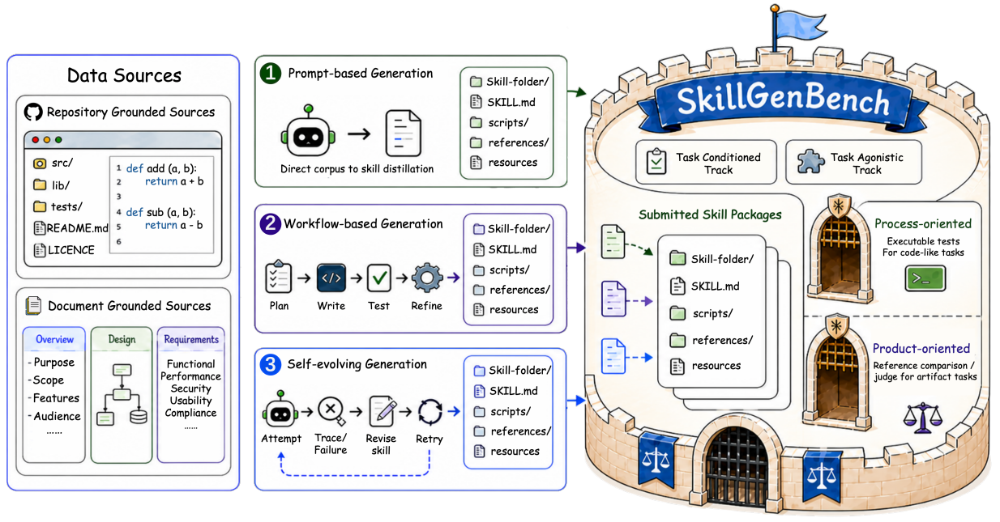

# SkillGenBench

> **分类**: Skill 评测 | **成熟度**: 🟡 成长期 | **综合评分**: 0.56

---

## 一句话描述

**SkillGenBench** 是 **首个将技能生成从端到端评测中单独剥离出来的标准化基准**：187 个任务、两种生成模式（任务已知/任务未知）、两类知识来源（代码仓库/长文档）、五种方法、六种 Backbone，统一执行环境和评测协议，只测一件事——**从原始材料到技能这一步的质量**。

**来源**:
- SJTU、NUS、THU、PKU 等多机构联合推出
- 发布年份：**2026**

**链接**:
- 论文：https://arxiv.org/pdf/2605.18693

---

## 核心实现

**1. 生成与执行解耦的评估架构**

SkillGenBench 的核心设计是将**生成器和执行器拆开**。生成器负责从原始材料产出标准化技能包，执行器固定不变不参与比较，评测统一协议且以确定性执行验证为主。这消除了已有基准中"方法 Backbone vs 执行 Backbone vs 检索策略"的变量混淆，确保评测差异完全来自生成能力。

**2. 两种生成模式 + 两类知识来源**

**任务已知模式**：生成器拿到原始材料 + 任务描述，测的是"知道要干什么后能不能精准提炼"。**任务未知模式**：生成器只拿到原始材料，不知道下游任务，测的是"不看考题能不能写成好教材"——目前这一模式几乎是空白，且实验显示该模式下生成技能在部分情况不如无技能。**代码仓库类**：程序知识隐藏在目录结构、调用关系和配置中，最佳 Backbone pass@3 仅 14.4%。**长文档类**：知识显式写出但散落各处，最佳 pass@3 为 25.0%。

**3. 五阶段质量保证流水线**

任务不是手写的——经过知识图谱构建、场景生成、任务和测试生成、无技能验证（太简单或材料直抄都能搞定的打回）、参考技能验证（连参考技能都跑不通的打回），反复循环直到落入目标难度"甜点"，最后加人工审核。

---

## 主要能力

- **技能生成能力的独立标准化评估**：首次将"从材料到技能"这一步从端到端评测中解耦，纯测生成质量
- **任务未知模式首次成体系评估**：揭示不看考题写教材在代码仓库类几乎做不到的残酷现状
- **跨方法 × 跨 Backbone 矩阵对比**：五种方法 × 六种 Backbone，目前最好方法 + 最强 Backbone 在代码仓库类仅 17.1%
- **静态技能质量六维分析**：接口合约完整性、环境依赖覆盖等六维，揭示不同方法各有优缺、全优者为零

---

## 局限性

- **187 个任务覆盖面仍有限**：基准仍在扩展中，覆盖的领域和任务类型数量有限
- **统一执行器的代表性问题**：评测使用固定执行器，其性能特征可能影响不同生成方法的相对排名
- **任务未知模式评估粒度较粗**：未区分"技能原子性""技能组合方式"等细粒度维度的差异

---

## 成熟度评分

| 维度 | 评分 (0.0-1.0) | 说明 |
|------|---------------|------|
| 技术成熟度 | 0.55 | 学术论文阶段，SJTU+NUS+THU+PKU等多机构联合，有开源代码，187任务5方法6Backbone |
| 创新性 | 0.70 | 首个将技能生成从端到端评测中剥离的标准化基准，统一执行环境和评测协议 |
| 落地程度 | 0.45 | 标准化基准已发布，多方法多Backbone对比，评测工具链完整 |
| 生态活跃度 | 0.50 | 多机构联合推出，GitHub开源，有望成为技能生成领域标准评测 |

**综合评分**: 0.56

---

## 参考资料

- [SkillGenBench 论文](https://arxiv.org/pdf/2605.18693)
- [代码](https://github.com/QuantaAlpha/SkillGenBench)
