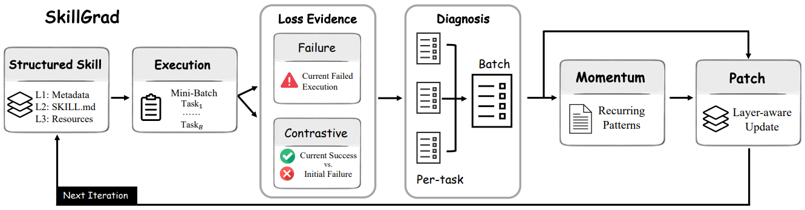

# SkillGrad

> **分类**: Skill 优化 | **成熟度**: 🟡 成长期 | **综合评分**: 0.52

---

## 一句话描述

**SkillGrad** 将梯度下降的四个核心概念用文本机制逐一模拟——**参数 = 结构化技能包、损失证据 = 任务执行结果、梯度信号 = 自动诊断、动量 = 跨轮累积修正模式**——让技能优化不再是"试一次改一次"，而是像神经网络训练一样有方向、有记忆、有信号分解。平均超过最强训练基线 **6.7 个百分点**。

**来源**:
- Penn State University
- 发布年份：**2026**

**链接**:
- 论文：https://arxiv.org/pdf/2605.27760

---

## 核心实现

**1. 三层结构化技能包作为可优化"参数"**

技能不再是平文本，而是三层结构：L1 元数据头（触发条件、技能名）、L2 SKILL.md 正文（始终加载的核心指引）、L3 资源文件（条件加载的详细过程和边缘案例）。优化时的关键子决策是"新增内容放哪一层"：放 L2 始终占上下文但保证被读到，放 L3 只在需要时加载但可能被遗漏。

**2. 损失证据：对比成功轨迹 + 失败轨迹**

每轮收集的不仅是通过/失败结果，还有完整轨迹。关键创新是识别"本轮成功但上轮失败"的对比成功轨迹——这类轨迹揭示了当前技能到底学会了什么、哪些修改应该保留。纯失败驱动优化里这部分信息被完全丢弃。

**3. 动量代理：模式记忆 + 覆盖层**

动量 Agent 维护两份状态：**持久模式记忆**累积跨轮反复出现的诊断模式（如"分页处理三次出错"，从模糊逐步精确化），**当前覆盖层**只反映本轮新出现的模式。两者共同输入给更新器，使优化不会每轮从零开始，而是带着"什么根问题最应该改"的累积证据。

**4. 分层补丁手术**

更新器不重写技能，而是按分层逻辑做手术级修改——核心流程改 L2，长过程和边缘案例改 L3，触发条件改 L1。这个分层的价值在于不让一次性的任务细节污染核心指引，也不让核心工作流被放错位置导致找不到。

---

## 主要能力

- **梯度下降式技能优化**：将优化分解为参数、损失、梯度、动量四个组件，每轮迭代系统性地朝更好方向更新
- **对比诊断**：同时利用失败轨迹（缺什么）和跨轮对比成功轨迹（什么要保留），比纯失败驱动多一个正面的信号维度
- **跨轮记忆累积**：动量机制让反复出现的修正模式从模糊变得越来越精确，优化器不做"每轮从零开始"的短视决策
- **自适应层级路由**：新增内容根据性质自动落入 L1/L2/L3 三层，防止上下文被无关内容撑爆

---

## 局限性

- **优化范围依赖训练任务**：梯度信号的质量取决于训练任务覆盖度，任务集不够全面时技能优化可能不完整
- **动量质量依赖累积轮次**：初始轮次的模式记忆比较模糊，早期优化的效率受限
- **仅两个基准上验证**：SpreadsheetBench 和 WikiTableQuestions，更多领域通用性未证

---

## 成熟度评分

| 维度 | 评分 (0.0-1.0) | 说明 |
|------|---------------|------|
| 技术成熟度 | 0.50 | 学术论文阶段，Penn State，有开源代码，平均超最强训练基线6.7个百分点 |
| 创新性 | 0.80 | 首次将梯度下降四核心概念用文本机制逐一模拟，技能优化从试错升级为有方向有记忆的优化 |
| 落地程度 | 0.35 | 代码已开源但研究阶段，需与具体Agent系统集成 |
| 生态活跃度 | 0.35 | 单一机构研究，社区生态待构建 |

**综合评分**: 0.52

---

## 参考资料

- [SkillGrad 论文](https://arxiv.org/pdf/2605.27760)
- [代码](https://github.com/wwwhy725/SkillGrad)
