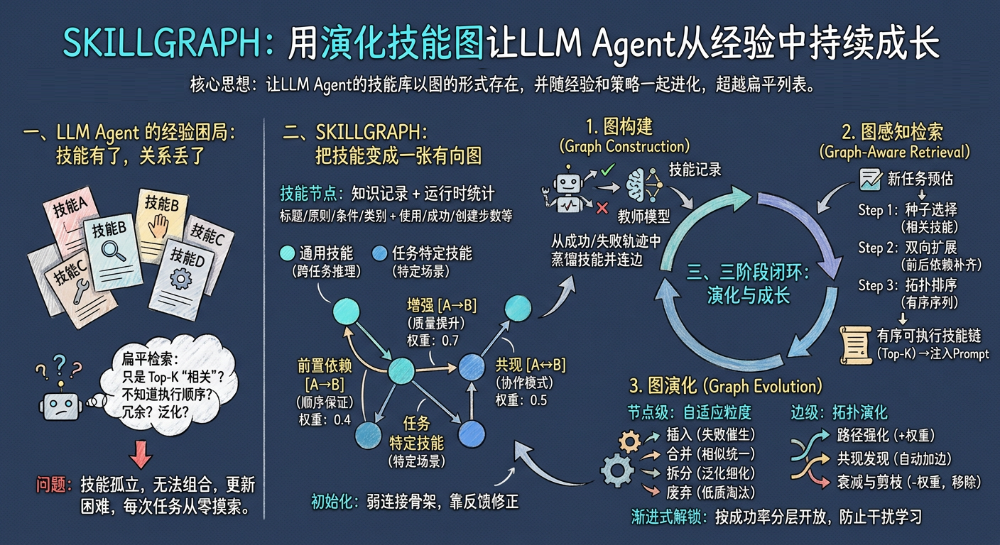
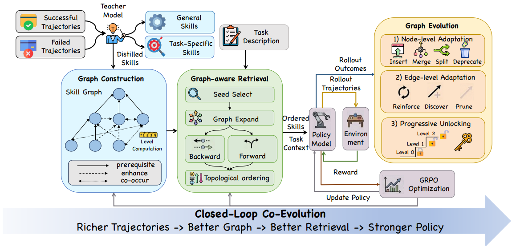

# SKILLGRAPH：用演化技能图让 7B 模型反超 GPT-4o

**一句话描述**：SKILLGRAPH 把技能库从"扁平列表"升级为**带类型边（前置/增强/共现）的有向图**，然后用强化学习让图和策略一起进化——**一个 Qwen2.5-7B 在 ALFWorld 上以 90.6% 的成功率碾压 GPT-4o（48.0%）和 Gemini-2.5-Pro（60.3%）**。

---

## 核心实现

三阶段闭环：从轨迹中蒸馏技能建图 → 图感知检索输出有序技能序列 → 每轮验证后图自行演化（节点+边调整）。图和策略互相推动——策略变强产生更丰富轨迹，轨迹精炼图，更好的图提供更精准的检索，加速策略学习。

**技能图骨架**：节点是技能（标题 + 核心原则 + 适用条件 + 运行时统计），边分三种——Prerequisite（A 必须在 B 前，有向）、Enhancement（通用技能增强特定技能效果，有向）、Co-occurrence（成功轨迹里反复共现，对称）。每个节点有拓扑层级，0 级是地基技能，高层级站在低层级肩膀上。

**图感知检索**：种子选择（匹配当前任务的通用 + 特定技能）→ 后向 BFS（找回种子依赖的前置技能，最大深度 2）→ 前向 Beam Search（发现后续技能，束宽 3，扩展分数 = 前驱分数 × 边权重乘积）→ 拓扑排序输出有序序列（上限 8 个）。Agent 拿到的不是一堆技能名，而是从基础到高级、尊重前置条件的执行参考。

**图演化——节点级**：四种操作——插入（新失败模式催生新技能，最多 3 个）、合并（邻居 Jaccard ≥ 0.85 合并为一个）、拆分（使用 ≥ 10 次但成功率 15-40% 的拆成 2-3 个子技能）、废弃（使用 ≥ 20 次且成功率 < 15% 移除）。

**图演化——边级**：路径强化（成功轨迹走过的边权重 +0.05）、共现发现（≥ 2 次自动加边）、衰减剪枝（每 checkpoint 乘以 0.99，低于 0.05 移除）。每次边更新后重算节点层级。

**渐进式解锁**：初始只开放 0 级技能，前 5 步热身期不解锁。之后每个 checkpoint 检查当前最高活跃层级平均成功率，超过 0.6 就解锁下一层，可跨级连续解锁。

---

## 主要能力

图感知检索用拓扑排序输出有序技能序列，直接解决扁平检索"给你四个技能但不说先执行谁"的组合性规划问题——Clean、Heat 类严格顺序任务吃到最大收益。

节点四种操作 + 边三种操作构成技能质量自循环：差的淘汰、泛的细分、重复的压缩、新的失败催生新技能。

边权重沉淀了跨轨迹的集体经验——被反复验证的路径权重高，长期不用的自动衰减，比静态规则或单次启发式推断更健壮。

7B 模型靠图结构组织反超大规模闭源模型，知识组织方式的差距可以部分弥补参数量的差距。

---

## 局限性

强依赖教师模型（o3）做技能蒸馏和图演化，推理开销不低。

技能图在单一环境内闭环——ALFWorld 训出来的图能不能给 WebShop 用，没有实验验证。

只验证了 7B 规模（Qwen2.5-7B-Instruct），更大基座模型（70B+）上的表现未知。

---

## 参考资料

1. [论文](https://arxiv.org/pdf/2605.12039)
2. [详解](https://zhuanlan.zhihu.com/p/2041200150153000299)
