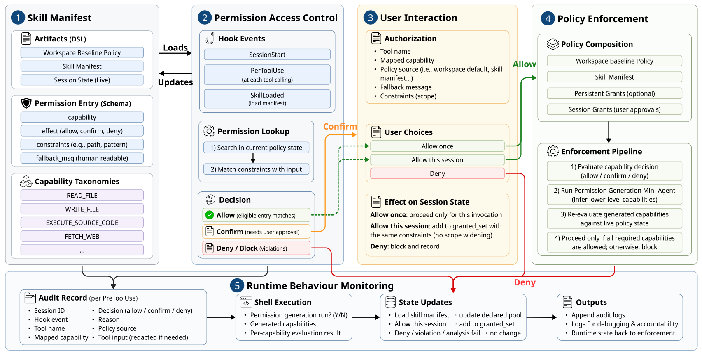

# SkillGuard

> **分类**: Agent 技能安全 | **成熟度**: 🟡 实验阶段 | **综合评分**: 0.54

---

## 一句话描述

SkillGuard 将 **Android 权限模型**搬到 Agent 技能生态上：每条技能必须通过 **JSON DSL** 声明所需能力，运行时每次敏感操作都经策略引擎检查，**默认拒绝、按需授权**，并引入用户交互式授权机制。对 315 个真实技能实现 **99.76% 权限覆盖率**，上下文注入攻击成功率从 32.37% 降至 23.02%，正常任务完成率无显著下降。

**来源**:
- CSIRO、澳大利亚国立大学、新南威尔士大学（UNSW），论文 arXiv: 2606.03024
- 发布年份：2026

**链接**:
- 论文：https://arxiv.org/abs/2606.03024
- 代码：https://github.com/Dianshu-Liao/SkilLGuard

---

## 核心实现

**1. Skill Manifest DSL：三层权限声明体系**

核心概念是 **capability**：将每类被保护行为抽象为独立于工具名称的能力标签（文件读/写、网络外发、凭证访问、进程生成、技能间委托）。DSL 分三个层级：
- 底层 **workspace baseline policy** 为新会话设定默认权限种子；
- 中间层每个技能的 **manifest** 列出所需能力、执行效果（允许/拒绝/询问用户）和约束条件；
- 顶层 **session-state document** 记录当前活跃的运行时策略状态。

**2. Permission Access Control：每次操作独立授权**

Agent 执行过程中每次尝试访问受保护资源，访问控制模块做一次完整检查：当前技能是否拥有该操作的权限？是否在允许的上下文范围内？若操作标记为敏感，是否已通过用户授权？对应 Android 的"完整中介"原则：权限不是加载时验一次就永远有效，每次实际调用都是独立授权点。

**3. User Consent + Policy Enforcement：用户在场 + 默认拒绝**

对高敏感权限（网络外发、文件写入、进程生成），用户可给一次授权、会话级授权或拒绝。运行时策略引擎将 workspace 默认、skill manifest、持久授权和会话审批合并为统一策略管线。**默认行为是拒绝**：只有当四层中至少有一层提供正面授权时才放行。对 shell 类执行，额外启动一个权限生成 mini-agent 在命令执行前分析文本和脚本，推断所需底层能力。

**4. 自动 Manifest 生成 + Runtime Monitoring**

自动生成器在 SkillInject 基准达到 **91.0% F1**，召回率尤其高。同时维护完整审计日志，记录每次被中介操作的关键字段，支持事后追溯和归因。

---

## 主要能力

- **五层权限架构**：Skill Manifest → Access Control → User Consent → Policy Enforcement → Runtime Monitoring
- 能力标签 DSL 对 315 个真实技能实现 **99.76% 对象覆盖率和 100% 组级覆盖率**
- 自动 Manifest 生成达到 **91.0% F1**，降低技能作者权限声明的人为成本
- 默认拒绝 + 会话级动态策略，兼顾安全与可用性，正常任务完成率无显著下降
- 全量审计日志确保每次被中介操作可追溯、可归因

---

## 局限性

- **Shell 命令的权限推断是精度瓶颈**：mini-agent 静态分析复杂管道、动态变量替换和脚本间依赖时可能出错，漏报或误报均有代价
- **技能间委托链未完全覆盖**：多级委托的权限传递和衰减规则尚未完整形式化
- 自动 Manifest 生成剩余的 **9% 漏报**在实际部署中是最危险的盲区：安全攻击倾向于选择边缘情况入手

---

## 成熟度评分

---

## 参考资料

- [论文](https://arxiv.org/abs/2606.03024)
- [代码](https://github.com/Dianshu-Liao/SkilLGuard)
