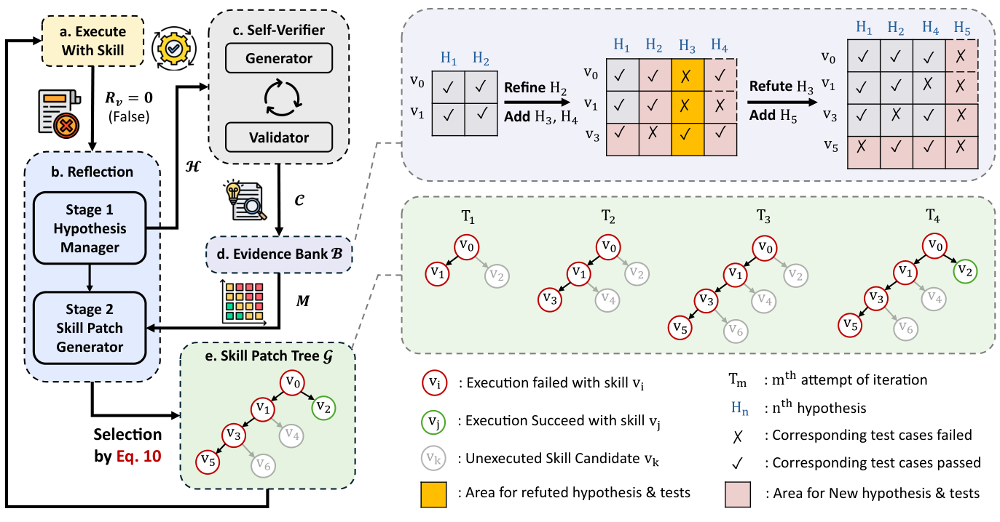

# SkillHEX

> **分类**: Skill优化 | **成熟度**: 🟡 成长期 | **综合评分**: 0.57

---

## 一句话描述

SkillHEX 是**测试时技能自进化框架**，把贪心原地精炼改成"假设驱动自验证产稠密证据 + 证据引导树搜索保替代路径"，逃稀疏奖励下的利用陷阱，有限交互预算内持续提升技能质量。

**来源**:
- SkillHEX: Improving Agent Skills via Hypothesis-Driven Autonomous Exploration and Exploitation（Yuru Feng 等，微软/UCSD/USTC/UBC）
- 发布年份：2026

**链接**:
- https://arxiv.org/abs/2608.05628

---

## 核心实现

SkillHEX 闭环两组件，平衡利用与探索：

**1. 假设驱动自验证：把失败原因表成可证伪假设再测**

- **假设管理**：候选失败原因表成可证伪假设元组 $h_i=(d_i,q_i,\sigma_i,C_i)$（描述/可观测行为/状态/关联测试），反思 agent 执行 Add/Refine/Refute。
- **测试生成验证**：对 active 假设合成可执行测试，过规则验证器，**在缓存输出上重跑不额外耗环境尝试**。
- **动态证据银行**：证据矩阵 $M[v,j]$（节点×测试二元），对称扩展——新补丁加行、新测试加列回顾重跑，refuted 假设剪列。

**2. 证据引导树搜索：持久补丁树保替代路径**

- **语义扩展**：反思 agent 提 K 候选补丁，序数排名 $\rho$ 映射策略先验 $P$，**所有有效子节点保留不剪**。
- **层级评估+max-backup**：硬约束门控语义指标，$Q(v)=\max(s(v),\text{子树最强 } Q)$，失败分支不罚强父。
- **证据驱动选择**：PUCT 变体选 child，新证据削弱当前轨迹估值时转向替代路径。

控制要点：exploitation trap 是根（贪心原地精炼每次绑死单轨迹，早期误诊断耗尽预算）；自验证产稠密证据不耗额外环境尝试；树搜索保替代路径防过早承诺；两件互补（自验证保利用，树搜索保探索）。

---

## 主要能力

- **逃利用陷阱**：假设转可执行测试在缓存输出挤出稠密诊断（语义梯度），不额外耗有限交互预算
- **保替代修订路径**：持久补丁树所有有效子节点保留，PUCT 平衡利用探索，不绑死单轨迹
- **超人类策划 skill**：5迭代预算 GPT 55.9%/Claude 57.9%，超人类 52.9%/54.4%，比最强基线 +9.5/8.5pp
- **token 效率**：比 CoEvoSkills 省 18.0% token 还更高 pass rate，树搜索比原地精炼省 6.2% 还涨 6.8pp
- **跨域一致**：8 域全超基线，过程编排密集域（软工/网安/数学）尤强，数学 +54.1pp

---

## 局限性

- **知识获取瓶颈**：自然科学/金融域靠领域先验，从失败执行推不出，仍不及人类策划
- **依赖反思 agent 质量**：假设提/测试生成靠 LLM，LLM 推理偏置可能产错假设和测试（靠 refuted 机制剪但非完全）
- **有限迭代预算**：5 迭代内需平衡，更复杂任务可能需更多迭代但预算受限
- **PUCT 超参**：c_puct 和 β 温度需调，跨任务最优性未验

---

## 成熟度评分

| 维度 | 评分 (0.0-1.0) | 说明 |
|------|---------------|------|
| 技术成熟度 | 0.58 | 假设驱动自验证 + 证据引导树搜索，未开源 |
| 创新性 | 0.76 | 可证伪假设 + 动态证据银行 + PUCT 保替代路径 |
| 落地程度 | 0.48 | 超人类策划 skill，8 域全超基线 token 省 18% |
| 生态活跃度 | 0.45 | 单篇论文，未开源 |

**综合评分**: 0.57

---

## 参考资料

- [SkillHEX: Improving Agent Skills via Hypothesis-Driven Autonomous Exploration and Exploitation](https://arxiv.org/abs/2608.05628)
