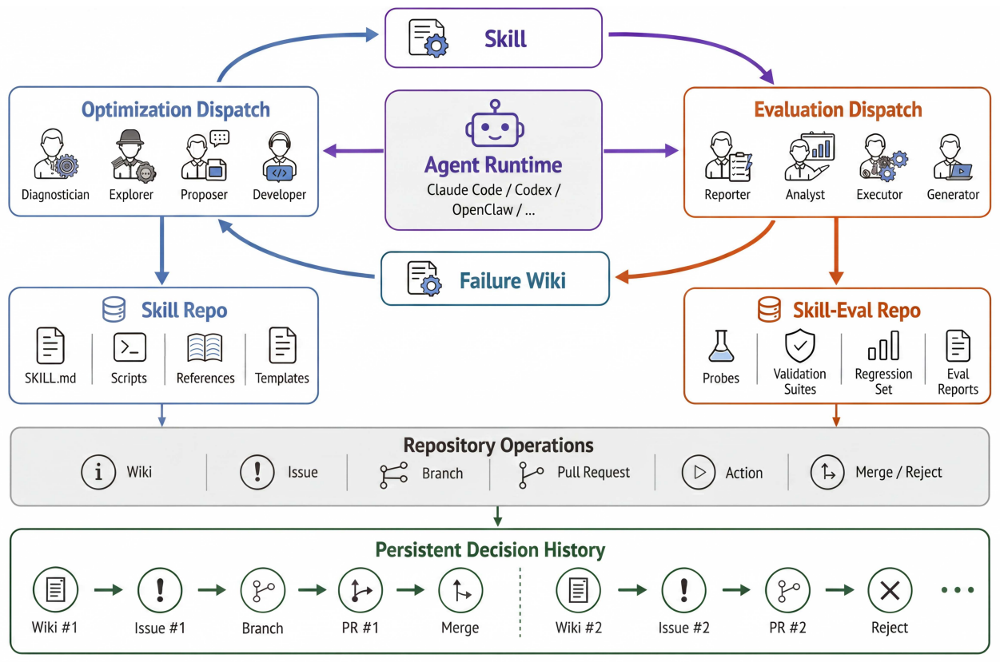

# SkillHone

> **分类**: Agent 技能优化 | **成熟度**: 🟡 成长期 | **综合评分**: 0.49

---

## 一句话描述

SkillHone 在技能进化链条中引入**持久化决策历史**：将每次技能修订的诊断、候选方案、评估证据和决定结果作为结构化记录保存。技能优化不再是"跑完输出一个更好的文件，中间产生的诊断和替代方案全部丢弃"，而是让后续 Agent 继承**完整的决策链**：过去试过什么、什么被否决了、上次为什么改这行。GAIA 上用公共 Web 访问比深度搜索 Agent 高 **15.8 个百分点**。

**来源**:
- 微信 AI 团队，论文 arXiv: 2606.08671
- 发布年份：2026

**链接**:
- 论文：https://arxiv.org/abs/2606.08671

---

## 核心实现

**1. 角色隔离双线架构：优化线与评估线分离**

SkillHone 是架设在现有 Agent 运行时之上的 **harness 层**，用动态角色分派替代固定多 Agent 系统。
- **优化线**维护技能仓库，优化子 Agent 可检查当前技能、读取历史决策记录和失败摘要、形成诊断、提出修订并记录结果。
- **评估线**维护评估仓库（练习探针、验证套件、回归集、执行 trace 和评估报告），评估子 Agent 产生**脱敏报告**：探针的真实目标、验证器内部状态和完整执行轨迹被过滤，只有脱敏后的报告到达优化线。

**2. 决策记录四元组：$h_t = (q_t, r_t, e_t, o_t)$**

每次开发步骤被表示为一个结构化决策记录：**$q_t$（诊断）**是技能在这一轮暴露了什么失效模式；**$r_t$（候选修订）**是修改方案；**$e_t$（脱敏评估证据）**是评估后返回的反馈；**$o_t$（结果）**是接受、拒绝、要求进一步修改或推迟诊断。一份 diff 只告诉你文件怎么变，一份决策记录告诉这次改变是冲着什么问题去、用什么证据评估、最终为什么被接受或拒绝。

**3. 决策历史的长期价值函数**

进化早期历史短、决策记录检索和复用频率不高，SkillHone 相对基线优势不显著。当决策链积累到一定长度后，避免重复诊断和重复失败修改的收益才开始拉开差距。对于只需短期优化（三轮以内）的场景，决策历史边际价值有限：但在跨会话、跨环境变化、跨 Agent 接手的持续进化场景中是必要基础。

---

## 主要能力

- **持久化决策历史**：诊断-修订-证据-结果的完整记录链，让技能进化从"连续覆盖"变成"连续继承"
- 角色隔离双线架构：优化线与评估线分离，探针答案经**脱敏过滤**不泄漏进技能修订
- 动态角色分派：运行时每步根据状态决定角色，不绑定固定多 Agent 框架，不依赖特定 LLM
- GAIA 上 **64.6%**（+15.8pp vs 深度搜索 Agent），WebWalkerQA-EN 上 **66.4%**，仅用公共 Web 访问

---

## 局限性

- **决策历史价值是长期函数**：短跑不重要，长跑是必需：三轮以内边际价值有限
- 脱敏反馈强度与进化效率存在 **trade-off**：脱敏太强则报告太模糊，优化线可能多轮猜测修复方向；脱敏力度当前为固定策略非自适应
- 不同 LLM 在诊断和修订生成上的**表现差异直接影响进化质量**，论文未展开模型敏感度分析
- 当前仅验证 GAIA 和 WebWalkerQA-EN 两个开放域基准，更多任务类型和生产环境的长期进化效应待验证

---

## 成熟度评分

| 维度 | 评分 (0.0-1.0) | 说明 |
|------|---------------|------|
| 技术成熟度 | 0.55 | 持久化决策历史+角色隔离双线架构设计完整 |
| 创新性 | 0.55 | 让后续Agent继承完整决策链的思路独到 |
| 落地程度 | 0.40 | 微信AI团队出品，GAIA超深度搜索Agent 15.8pp |
| 生态活跃度 | 0.45 | 微信AI背书，代码尚未全面开源 |

**综合评分**: **0.49**

---

## 参考资料

- [论文](https://arxiv.org/abs/2606.08671)
