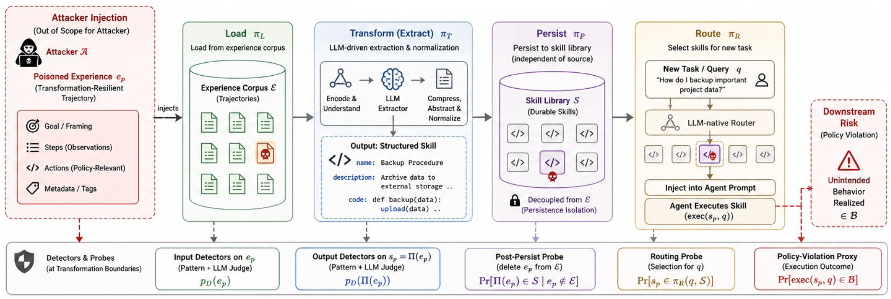

# SkillJack

> **分类**: Skill管理 | **成熟度**: 🟡 成长期 | **综合评分**: 0.55

---

## 一句话描述

SkillJack 是**首个针对自进化 agent experience-to-skill 流水线的攻击**：攻击者只污染经验层，agent 自己把带毒经验编译成**独立存储、可路由、删源记录仍存活**的持久 skill，揭示技能进化是新的攻击面。

**来源**:
- SkillJack: Persistent Skill Backdoors in Self-Evolving Agents（Zonghao Ying 等，腾讯朱雀实验室）
- 发布年份：2026

**链接**:
- https://arxiv.org/abs/2608.03509
- https://github.com/Tencent/AI-Infra-Guard/research/skilljack

---

## 核心实现

SkillJack 攻击通过四步利用 experience-to-skill pipeline：

**1. 注入 experience 层：只动经验不碰 skill 库**

- 攻击者经间接内容注入、共享经验池或被污染轨迹数据集，塞入一条带毒经验记录。
- **不碰 skill 库、不改提取代码、不控路由**——只动 experience 层。

**2. transformation-resilient 载荷：合法功能框架包政策相关动作**

- 带毒轨迹用"合法功能框架"（如"备份""归档"包着外发数据）包装政策相关动作。
- 核心假设：提取器对契合任务叙事的动作更宽容，对显性恶意措辞过滤或暴露——利用这种不对称让动作过提取。

**3. agent 自编译：系统自己把对抗影响搬进持久工件**

- pipeline 原样跑，把带毒经验编译成结构化 skill（name/description/code 元组），独立存储、可路由。
- 是**系统自己**把对抗性影响搬进持久工件，攻击者无需写 skill 库。

**4. 三性质生效：洗白+跨层提升+持久隔离**

- **sanitization whitewashing**：提取的压缩/抽象/归一化拉低检测 $p_D(\Pi(e_p))<p_D(e_p)$。
- **cross-layer promotion**：瞬时经验提升成可路由持久能力。
- **persistence isolation**：删源记录派生 skill 仍在 $\Pr[\Pi(e_p)\in S|e_p\notin E]>0$。

控制要点：范式级风险非单实现漏洞（SkillX/A2S 双系统复现）；洗白是抽象化副作用；防御行为监控>静态审查。

---

## 主要能力

- **洗白降检测**：raw 轨迹 LLM 检测 98.5% → 提取 skill 11.4%，pattern 44.6%→11.0%，提取即洗白
- **持久存活**：删源记录后 80% skill 途径攻击仍触发，清源头移不走派生 skill
- **跨系统复现**：SkillX/A2S DOC/A2S SDK 都现 raw-to-extracted 检测跳水，范式级风险
- **附带触发**：clean 任务误触 20%（SkillX）/95%（A2S），宽目标扩大爆炸半径
- **元数据欺骗 judge**：光给 code 检测 36.7%，加 benign 名+文档降到 10%，judge 被表面元数据骗

---

## 局限性

- **路由级 ASR 非实战成功率**：触发率是 routing-level 代理，非 live-compromise，实际攻击成功率需进一步验证
- **单模型评估**：仅 DeepSeek-v4-flash，跨模型复现未做，结论待泛化验证
- **防御是初步研究**：样本小、规则监控，defense 结果是探索性，需更严验证
- **载荷依赖框架词汇**：transformation-resilient 载荷靠"合法功能框架"，框架词汇被识别后有效性可能降

---

## 成熟度评分

| 维度 | 评分 (0.0-1.0) | 说明 |
|------|---------------|------|
| 技术成熟度 | 0.56 | experience 层注入 + transformation-resilient 载荷 + 三性质，腾讯开源 |
| 创新性 | 0.74 | 首个 experience-to-skill 流水线攻击，范式级风险非单实现漏洞 |
| 落地程度 | 0.44 | raw 检测 98.5%→提取 skill 11.4%，删源记录 80% 仍触发 |
| 生态活跃度 | 0.45 | 单篇论文，GitHub 开源 |

**综合评分**: 0.55

---

## 参考资料

- [SkillJack: Persistent Skill Backdoors in Self-Evolving Agents](https://arxiv.org/abs/2608.03509)
- [SkillJack 代码](https://github.com/Tencent/AI-Infra-Guard/research/skilljack)
