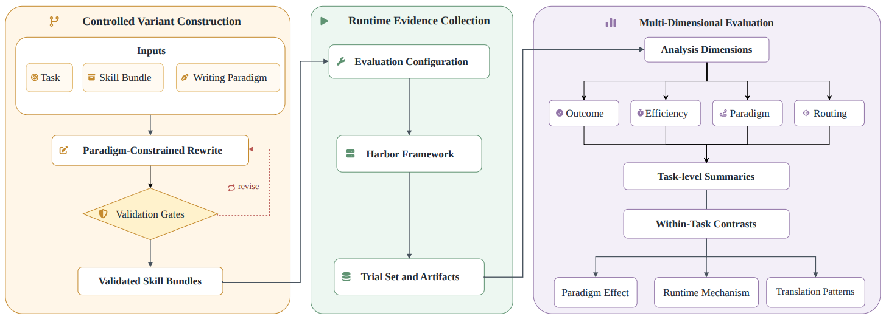

# SkillJuror

> **分类**: Agent 技能召回 | **成熟度**: 🟡 成长期 | **综合评分**: 0.52

---

## 一句话描述

SkillJuror 通过 **82 个任务、1,230 次控制试验**，将技能的组织方式（**扁平单文件 vs 渐进式展开多文件**）确立为一个**独立的可测量实验变量**：同样的知识内容、不同的组织方式，Agent 在执行中的资源触达从 **1.18→3.85**、有效资源吸收从 **1.33→3.92**，但通过率仅提升 **+4.1%**。行为层面的系统性变化在纯 pass/fail 指标中不可见。

**来源**:
- 同济、上交、中山和上海创新研究院，论文 arXiv: 2606.11543
- 发布年份：2026

**链接**:
- 论文：https://arxiv.org/abs/2606.11543
- 代码：https://github.com/zhiyuchen-ai/skill-juror

---

## 核心实现

**1. 构造性控制实验设计：串行生成链条确保归因可靠**

先创建一个**扁平 Baseline**：将源技能中所有功能性内容压平到一个文件里。再从这个 Baseline 出发，把同样内容按结构拆分成轻量入口+多个按需加载的参考文件组成**渐进式展开（PD）变体**。PD 不是从原始源技能独立写出的：它是对 Baseline 的约束式重组。串行生成链条保证两组变体知识内容完全相同，让"差异来自结构而非内容"的归因牢固。82 个 SkillsBench 任务，每个任务跑 **5 轮**，总计 **1,230 次试验**，基座模型固定为 GPT-5.4。

**2. 三层验证关卡 + 运行时控制**

构造完成的变体通过三层检查才进入执行评估：
- **确定性门控**程序化检查目录布局、文件路径、资源可达性和行为单元 diff；
- **基于 Rubric 的语义审计**自动扫描变体是否保留了任务范围、执行约束、输入输出契约；
- **人工审核覆盖**处理验证异常。运行时控制方面，所有任务-范式组合在同一 Harbor 沙箱、同一 Agent harness、同一超参数下执行，唯一变量是暴露给 Agent 的技能产物。

**3. 行为层与结果层的分离发现**

行为层差异是数量级的：Agent 每个轨迹平均触达的独立技能资源从 1.18 跳到 3.85，有效资源吸收事件从 1.33 跳到 3.92。结果层仅有 **+4.1%** 增益且分布不均：核心障碍是"不知道怎么做"的任务 PD 优势明显，核心障碍是"做出来必须精确匹配规范"的任务 PD 边际收益有限。**两层的分离意味着只看 pass rate 会丢失完整的信号层。**

---

## 主要能力

- 首次将技能**组织方式**确立为可隔离、可控制、可测量的独立实验变量
- 构造性控制实验设计（串行生成 + 三层验证 + 运行时固定）实现高归因置信度
- 揭示**行为层与结果层分离**：行为层系统性变化（资源触达 3.85×、有效吸收 3.92×）仅部分转化为 pass rate
- 提供对技能作者的直接指导：**PD 不是普适最优**，任务属性决定组织方式何时有用

---

## 局限性

- 仅测了 **Baseline vs PD 一组对照**，其他组织维度（按操作类型分区、按执行阶段分区、混合扁平与渐进）在框架射程内但未实验
- 有效资源吸收（ERU）的判定依赖 **LLM Judge**，对"有效"的定义在语义模糊边界上可能产生偏差
- 组织方式效果可能**依赖基座模型能力**：论文固定 GPT-5.4，不擅长自主导航文件系统的模型在 PD 下可能退化
- 82 个任务全部来自 SkillsBench，更广泛的技能生态中组织方式效应的泛化性待验证

---

## 成熟度评分

| 维度 | 评分 (0.0-1.0) | 说明 |
|------|---------------|------|
| 技术成熟度 | 0.55 | 82任务1230次控制试验，实验设计严谨 |
| 创新性 | 0.55 | 将组织方式确立为独立实验变量的视角独特 |
| 落地程度 | 0.45 | 论文阶段，结论尚未被其他团队独立验证 |
| 生态活跃度 | 0.50 | 同济+上交+中山联合出品，有开源代码 |

**综合评分**: **0.52**

---

## 参考资料

- [论文](https://arxiv.org/abs/2606.11543)
- [代码](https://github.com/zhiyuchen-ai/skill-juror)
