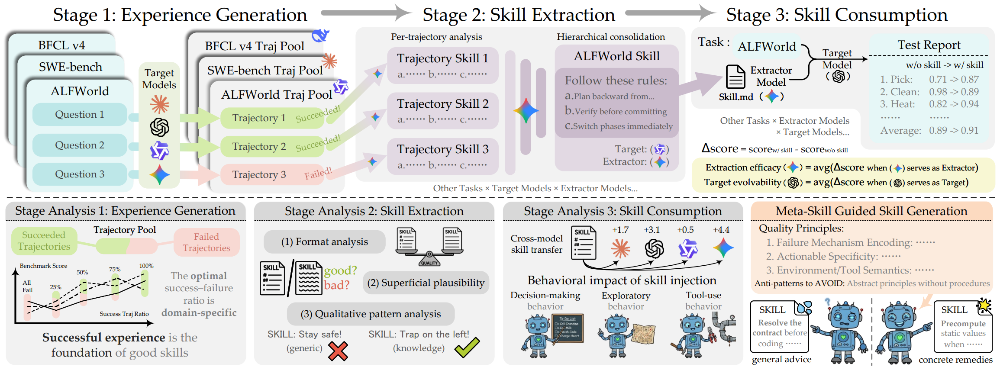

# SkillLens

> **分类**: Skill 评测 | **成熟度**: 🟡 成长期 | **综合评分**: 0.60

---

## 一句话描述

**SkillLens** 首次将技能生成从黑盒拆解为三阶段可独立诊断的白盒——**经验生成 → 技能提取 → 技能消费**——提出提取效能（EE）和目标可进化性（TE）两个互补指标，系统化回答：模型自己提炼的技能到底有没有用、谁来提炼最有效、跨模型迁移靠不靠谱。核心发现：技能提取能力和消费能力是**两个独立维度**，且跟模型规模无关。

**来源**:
- 学术论文：微软研究院 + 复旦大学 + 上海交通大学联合研究
- 发布年份：**2026**

**链接**:
- 论文链接：https://arxiv.org/abs/2605.23899

---

## 核心实现

**1. 三阶段拆解：把技能生成从黑盒变成白盒**

SkillLens 将技能全链路拆为三段并让每个阶段可以被独立诊断。
- **阶段一：经验生成**，目标模型 M 在训练任务上跑，产出包含成功和失败轨迹的经验池。
- **阶段二：技能提取**，提取器 E 从经验池中蒸馏技能，提取框架刻意最小化（仅逐轨迹分析 + 层级合并），不做任何领域特化或启发式过滤，所有抽象决策全留给提取器自己做。
- **阶段三：技能消费**，同一个目标模型 M 装上技能在留存测试任务上评估，技能效用 = 有技能时的分数减去没技能时的分数。这个设计让"谁提得好"和"谁用得好"可以被分开度量——提取效能（EE）衡量一个提取器跨不同目标模型的平均产出质量，目标可进化性（TE）衡量一个目标模型从不同提取器产出的技能中平均获益多少。

**2. 六个关键实验发现**

- **发现一**：模型生成的技能平均有用，但存在系统性负迁移，相当比例的技能装上后反而让模型表现变差，且不是偶然噪音。
- **发现二**：好的提取器不一定是好的消费者，A 模型帮别人提的技能比帮自己提的更好，但 A 模型自己使用技能时受益很少，提取能力和消费能力是两个独立维度。
- **发现三**：EE 和 TE 跟模型参数规模之间没有单调关系，一个中等规模的模型可能比一个大模型产出更有用的技能。
- **发现四**：经验池的成功轨迹比例、轨迹多样性、失败案例覆盖范围，比提取方法本身更能预测技能最终好不好用。
- **发现五**：好技能的共同特征，明确的触发条件、清晰的步骤顺序、标注的常见陷阱、可操作的具体指令；烂技能的共性——内容太抽象、过度依赖示例、缺少错误处理。
- **发现六**：技能跨模型迁移极不稳定，同一份技能装给不同模型效果天差地别，因为不同模型对同一份技能的解读方式完全不同。

**3. Meta-Skill：从研究发现到可操作的技能生成指引**

论文将全部发现浓缩为一份 **Meta-Skill**：不是给 Agent 用的技能，是给技能提取器用的技能。它指导提取器在生成技能时：
- 从成功轨迹提炼具体可操作的步骤而非泛泛原则；
- 从失败轨迹提炼明确的触发条件和边界 case；
- 给每个步骤标注前置条件、预期结果和常见陷阱；避免过长的示例段。
- 加上这份 Meta-Skill 后提取器产出的技能在多领域上一致提升，负迁移大幅减少。

---

## 主要能力

- **三阶段白盒诊断**：将技能生成从"最终 Agent 变没变强"的模糊信号拆解为经验池质量、提取器能力、消费者能力三个独立账本
- **EE/TE 双指标量化**：分别度量提取器的跨模型泛化产出能力和目标模型吸收技能的潜力，两个维度相互独立且与模型规模无关
- **技能负迁移的系统性暴露**：25% 的技能导致表现下降，且无法靠阅读技能文本判断哪个更好
- **Meta-Skill 实践指南**：从研究发现中提炼可操作的技能生成指引，直接改善提取器产出质量并减少负迁移
- **经验池-技能质量因果关系揭示**：经验池的多样性比提取方法本身更能预测最终技能质量

---

## 局限性

- 仅覆盖 Skill 生命周期的评测维度，不提供自动化优化方案（需搭配 SkillOpt）
- EE/TE 指标计算成本较高，需多模型多任务组合评测
- 论文阶段，无公开代码/工具

---

## 成熟度评分

| 维度 | 评分 (0.0-1.0) | 说明 |
|------|---------------|------|
| 技术成熟度 | 0.60 | 论文+实验验证充分+开源代码+官网，三阶段框架完整 |
| 创新性 | 0.85 | 首次系统性拆解Skill生命周期+EE/TE双指标+Meta-Skill，开创性强 |
| 落地程度 | 0.40 | 有代码但仍在研究阶段，需搭配其他工具工程化 |
| 生态活跃度 | 0.55 | 微软背书+GitHub开源+CSDN解读，与SkillOpt形成组合拳 |

**综合评分**: 0.59

---

## 参考资料

- [论文](https://arxiv.org/abs/2605.23899)
- [官网](https://microsoft.github.io/SkillLens/)
- [代码](https://github.com/microsoft/SkillLens)
- [深度剖析](https://blog.csdn.net/chendongqi2007/article/details/161570103)
